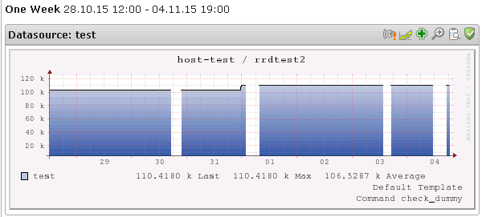

# How come there are empty gaps in the graph of a service?

## Question

* * * * *

How come there are empty gaps in the graph of a service, such as seen in the screenshot below?

## Answer

* * * * *

### Reasons...

1. Some sort of error in the [backend graphing process](How_is_performance_data_transformed_into_graph_data_).
2. Checks have been executed during these gaps, but the resulting performance data which contains the graphed value was just 0.
3. Checks have been executed during these gaps, but there was no performance data among the check results. This might be related to the check returning a non-OK result (UNKNOWN, probably).
4. The check was handled by a merlin poller node, which for instance had a hardware failure and went down, and the master node was not set up to perform a takeover of the check. Thanks to pollers' backlog capabilities this should not happen in case of a temporary network failure between the poller and the master.
5. A long check interval was used for this service, for instance 120 minutes, and due to naemon being reloaded/restarted (e.g. as a new object configuration is saved), the check scheduling is reset. This could result in the next planned check being farther away than it was planned for before the restart/reload (but also earlier than planned for). In this 120 minutes check interval-case, this could result in a one-time interval anywhere between a minute and up to four hours.
6. The check period for this service, i.e. the time period used for determining when and when not to run checks for this service, was not defined as 24x7, and resulted in checks only being executed at certain points in time.
7. A service dependency was set up which froze the execution of the check.

8. Some other setting prohibited the check from running, such as active checks being temporarily disabled for the check

### RRD, minimal heartbeat and check intervals

What's important to be aware of is that RRD files (which is used for the graphing), contains calculated averages of all the inserted values, and in most cases you won't notice that a check skipped a beat, the graph will just be smoothed out. And not just only in case of one skipped beat actually, in the default configuration of OP5 Monitor, the "minimal heartbeat" is set to 8460 seconds, i.e. 2 hours and 21 minutes, which is the maximum amount of time between two inserted data points, where it is still allowed to calculate an average value.

In other words, if a performance data value for a check was generated and inserted into the RRD file at 07:00, and then there wasn't any new performance data inserted until 09:00 – the graph still shouldn't display any gap (given that the inserted values were \>0). If you look at the graph just before the new insert at 09:00, the graph will however only show data up until 07:00, and then the gap is filled out once the clock hits 09:00.

But then there's the other scenario, where you've had data inserted into the graph all night, for instance every two hours between 23:00 and 07:00 (because the check interval was set to two hours), but for some reason the check at 09:00 doesn't go off. Instead, the check goes off at 10:00, which results in an insert into the RRD file three hours since the last insert, which is more seldom than the minimal heartbeat time, resulting in no average being calculated, and later that day the graph would show a large gap between 07:00 and 10:00.

Basically, performance data being generated too seldom results in strange-looking graphs, or even completely blank graphs, should the check interval always be longer than the time of the minimal heartbeat.

#### Setting the minimal heartbeat for RRD files

The minimal heartbeat is set per graph, statically. It can be configured for *new* graphs via the *RRD\_HEARTBEAT *setting in the */opt/monitor/etc/pnp/process\_perfdata.cfg* configuration file. No need to restart or reload anything – the next time a completely new graph is created, e.g. as you create a new host/service, the minimal heartbeat will be set accordingly within this RRD file.

To modify the minimal heartbeat value for existing graphs, you have to:

1. Locate the graph in the */opt/monitor/op5/pnp/perfdata *directory tree, where a separate directory is found for each host, and then an RRD for every service and data source (given that you are running RRD in MULTI mode – contact OP5 Support to find out more).
2. In case the RRD file is located in the current working directory as *service\_ds.rrd*, and the minimal heartbeat should be set to 86400 (a full day), you would run this command:
    `rrdtool tune service_ds.rrd --heartbeat 1:86400`

### Troubleshooting

So where to start, troubleshooting-wise?

- Reason \#1 in the list above, is probably the case if a service has been graphing for a long period of time, and then suddenly completely stopped graphing for several days.
- If the gaps are pretty short, just couple of minutes long, or at most two hours, it is quite likely that zeroes are sometimes being inserted into the graph (reason \#2), since missed heartbeats won't be seen, as described above.
- In case the gaps are longer, at least two hours long, you are quite likely affected by any of the other reasons, \#3 through \#8 (although it could still be \#1 or \#2 as well, unfortunately).

If you're not getting any obvious alerts that could help you understand why a graph looks like it does, you'd probably want to get to know whether a check is run properly, if it's run as often as expected and required, and what sort of performance data it outputs at a certain point in time. This can be achieved by setting up some debug-logging using *pwrap*, which is described [in this HOWTO](https://kb.op5.com/display/HOWTOs/Troubleshooting+argument+parsing).

But what if the checks seems to run, and generate valid performance data? Then you're back at reason \#1 again, and the [backend graphing process](How_is_performance_data_transformed_into_graph_data_) is important to understand.
