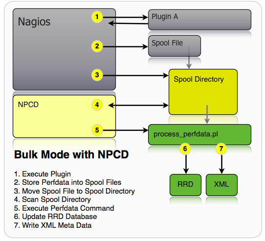

# How is performance data transformed into graph data?

## Question

* * * * *

How is performance data (aka. perfdata) transformed into graph data, backend-wise?

## Answer

* * * * *

The image shows how the data comes from the plugin and the way to the rrd and xml files.

1.  A check plugin is run, and it outputs data on stdout, which is called the *plugin output*. The initial and primary part of this data is called the *status information*, and the data right next to this (following a *|* character, if any) – that's the performance data. Its format is described in the [Monitoring Plugins Development Guidelines](https://www.monitoring-plugins.org/doc/guidelines.html#AEN201).
    The excerpt below shows how to look up the most recent performance data for a given service check, while logged on to your op5 Monitor server via SSH.
    `$ mon query ls services -c perf_data host_name='web-server-01' description='HTTP Server'time=0.083036s;;;0.000000 size=396B;;;0 `
2.  Given that performance data processing is enabled in the naemon (nagios) configuration file (*process\_performance\_data=1* in */opt/monitor/etc/naemon.cfg*), and also given that the check plugin output actually contained some performance data, this data, and some other metadata, is appended to the */opt/monitor/var/service-perfdata* or */opt/monitor/var/host-perfdata* files, depending on whether this performance data was related to a service or a host check. In some systems these files could be located elsewhere, which is determined by looking at naemon's *service\_perfdata\_file* and *host\_perfdata\_file* settings.
    Below is an example of what the appended data looks like.
    \$ tail -n1 /opt/monitor/var/service-perfdataDATATYPE::SERVICEPERFDATA TIMET::1446496143 HOSTNAME::web-server-01 SERVICEDESC::HTTP Server SERVICEPERFDATA::time=0.083036s;;;0.000000 size=396B;;;0 SERVICECHECKCOMMAND::check\_http HOSTSTATE::UP HOSTSTATETYPE::HARD SERVICESTATE::OK SERVICESTATETYPE::HARD
3.  To further process these files, the files are periodically moved into the */opt/monitor/var/spool/perfdata *directory. The interval for this action depends on what naemon's *service\_perfdata\_file\_processing\_interval* and *host\_perfdata\_file\_processing\_interval* settings are set to, which by default is 15 (seconds).
    The triggered processing action is decided by naemon's *service\_perfdata\_file\_processing\_command* and *host\_perfdata\_file\_processing\_command *settings. The default values for these settings are *process-service-perfdata *and *process-host-perfdata*, respectively, which refers to ordinary commands in naemon, just like you'd set up for your checks.
    The excerpt below shows how to look up your current action commands, while logged on to your op5 Monitor server via SSH.
    `$ mon query ls commands -c line name=process-service-perfdata`
    /bin/mv /opt/monitor/var/service-perfdata /opt/monitor/var/spool/perfdata/service-perfdata.\$TIMET\$\$ mon query ls commands -c line name=process-host-perfdata/bin/mv /opt/monitor/var/host-perfdata /opt/monitor/var/spool/perfdata/host\_perfdata.\$TIMET\$This is also the default values for these commands in op5 Monitor. \$TIMET\$ is a naemon macro that translates into current unixtime, which means that the /opt/monitor/var/spool/perfdata/ directory will end up with files named e.g. service-perfdata.1446484226. 
4.  Meanwhile, npcd is processing files found in the spool directory. Every 15 seconds (by default, set via sleep\_time setting in /opt/monitor/etc/pnp/npcd.cfg), this daemon looks for matching files in the spool directory, and for every match the process\_perfdata.pl script is executed. 
5.  Once *process\_perfdata.pl* has started executing, it reads the given perfdata spool file, and line by line, it locates related host/service RRD files found in the */opt/monitor/op5/pnp/perfdata* directory tree, and then queries the *rrdcached* daemon, asking it to insert the new performance data into the related RRD file. The RRD files are round robin databases, small file-based databases, that contains the data used for displaying the various graphs in op5 Monitor.
    Successfully parsed spool files are deleted, while files that failed processing somehow are renamed and then left in the spool directory. A simple way of seeing the spool files come and go is by executing the following command:
    `watch -n0.5 ls -l /opt/monitor/var/spool/perfdata`
6.  Once rrdcached has received the new update request, it performs some sanity checks, making sure that the RRD file is compatible and finally it updates the file. If the sanity checks fail, this should be seen in syslog (/var/log/messages). If it works out correctly, the update is inserted into the journal, and then finally the RRD file should be updated on disk within 30 minutes, or straight away if the related graph data is requested in op5 Monitor, i.e. due to a graph being dispalyed.

### In case of running merlin peers/pollers

What about the performance data generated by checks executed by peers and pollers? How does that graph data end up on other peers/masters?

 

1.  The poller/peer executes a check plugin.
     
2.  The result of this check, including the status information and the performance data, is sent to peers and/or masters via the merlin protocol.
3.  Merlin on the corresponding peer/master receives the check result, and it inserts this into the locally running naemon, just like if this naemon on this node had just run the check itself, resulting in all the steps described below being performed on this node as well.

