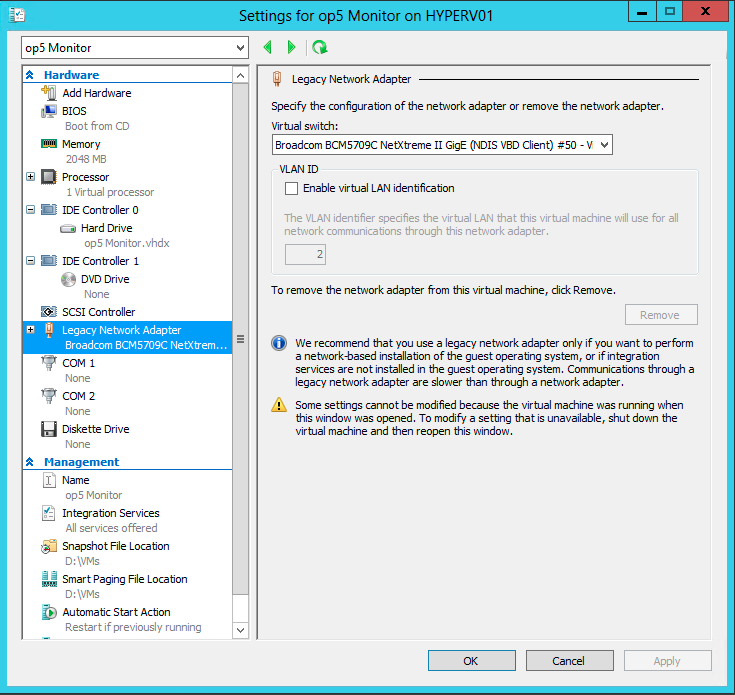

# Install op5 system in an Hyper-V environment

## Question

* * * * *

How do I install op5 system in an Hyper-V environment?

I get an error message saying "Unable to open input kickstart file: Could not open/read file:///tmp/buildnet"

## Answer

* * * * *

The only thing that need to be changed from a standard VM is the network adapter. Use a legacy network adapter.

 

