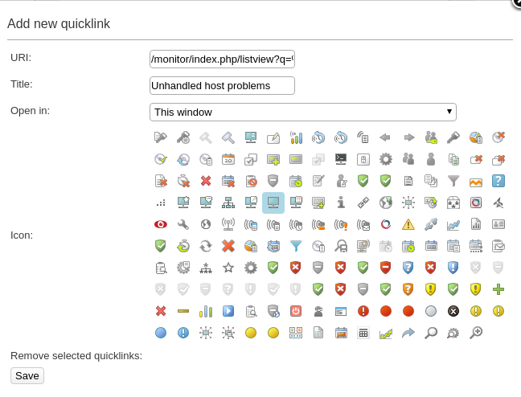

# Quicklinks for unhandled host/service problems

## I just updated to Monitor \>= 7.3.15, where did the shield icons for unhandled host/service problems go?

* * * * *

## The two shield icons on the top bar of the web gui caused a lot of performance problems in large environments, and it was decided that they should be removed. Some people liked having them there as shortcuts however, so this article will show you how to restore the shortcut-function, even if they won't display any actual status information anymore.

* * * * *

 

Start by clicking the chain icon at the top bar.


 

This will pop up a window, that allows you to set the description of the shortcut, an URI, and select an icon.



Now, set a title, pick an icon, and set the URI for the host quicklink to:

**Unhandled host problems URI**

``` {.bash data-syntaxhighlighter-params="brush: bash; gutter: false; theme: Confluence" data-theme="Confluence" style="brush: bash; gutter: false; theme: Confluence"}
/monitor/index.php/listview?q=%5Bhosts%5D%20state%20!%3D%200%20and%20acknowledged%20%3D%200%20and%20scheduled_downtime_depth%20%3D%200 
```

 

When done, click Save, and then repeat the process for the unhandled service problems where the URI should be:

**Unhandled service problems URI**

``` {.bash data-syntaxhighlighter-params="brush: bash; gutter: false; theme: Confluence" data-theme="Confluence" style="brush: bash; gutter: false; theme: Confluence"}
/monitor/index.php/listview?q=%5Bservices%5D%20state%20!%3D%200%20and%20acknowledged%20%3D%200%20and%20scheduled_downtime_depth%20%3D%200%20and%20host.scheduled_downtime_depth%20%3D%200
```

 

The end result will be two added quicklinks at the top bar that can be used as shortcuts to quickly reach each view.


