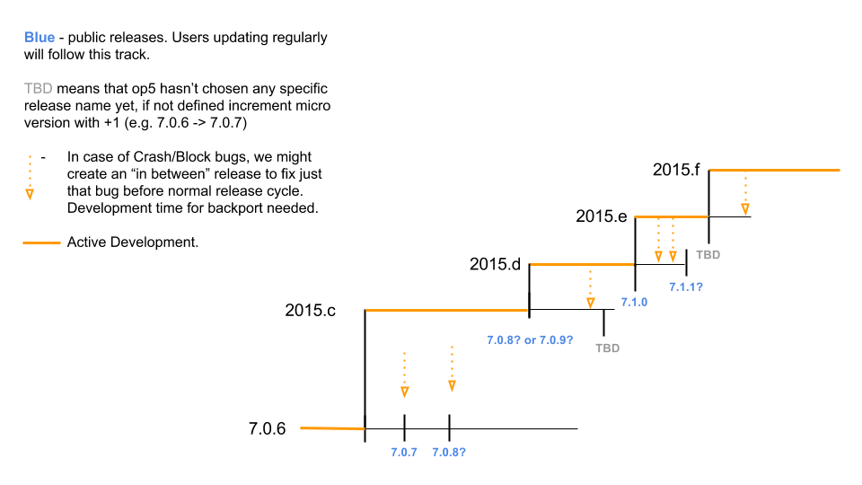

# Version numbers

 

## Background

I often receive questions about the version numbers used in OP5 Monitor. With the introduction of a continuous release plan, there have been some changes to the numbering system so this article's purpose is to further inform users about the meaning of our version numbers. Therefore, I will explain why micro releases may, in the future, contain new functionality and behavioral changes

## Continuous release allows us to improve responsiveness and quality for our customers

As a product-driven company, OP5 strives to continuously review how we deliver solutions to our customers and develop strategically, based on those analyses. During the last 2 years, we’ve embraced an agile development model. As a result, every iteration of OP5 development delivers a new version of OP5 Monitor. OP5 has also worked actively with quality processes and support systems, like Continuous Integration. 

The purpose of these activities has been to get early feedback and to add more functions and fixes for our customers at a higher speed, with even better quality.

As a next step, we want to make it possible for our customers to get the new version of OP5 Monitor after every iteration, which is known as Continuous release.

 

## Why?

op5 simply wants to deliver customer value faster. With small incremental changes, we can:

-   Get new features and fixes out as soon as they’re ready
-   Respond faster to feedback from customers and partners
-   Shorten the timespan from “idea” to “supported function”

Before Continuous release, it could take up to one year for an idea that was prioritized to be implemented in the product. Now that time is much shorter, to a maximum of two months. It also enables us to re-prioritize our development plan, act on unplanned events, security issues, bugs or RFE with a minimum MTTR (mean time to resolve).

 

## How?

As a part of the continuous release plan, we will publish a new release every iteration, approximately every month. During the summer holidays, Christmas and similar there will of course be longer delays between releases. To get the latest and greatest, just use the built-in update tool, yum or downloadable tarball. So in short, use the same methods as previously, the only difference is that instead of introducing many new features in a big chunk, you’ll get a few per release instead.

# Version numbers

The version number consists of three digits (one.two.three) and in some cases, four numbers (one.two.three.four).

one = major version

two = minor version

three = micro version

four = build version

op5 continuously introduces new releases, which are normally considered micro releases. Build versions are sometimes used if the micro release does not fulfill our internal QA and a new build has to be created. The releases can contain bug fixes **and** change of functions, or one or the other. When there have been enough micro releases that changed the user experience significantly, OP5 decides to publish it as a minor release. A rule of thumb is that minor releases come out 1-2 times a year and major releases occur every second year.

As an example, we decided while developing version 2015.c that the next version, 2015.d, would instead be a minor release: version 7.1.

## Versioning

With a new release pattern, we have to change our versioning handling, especially before the release is done. When we plan a new release, a new function or fix will be handled in an iteration. At that time, we don’t know what version number that iteration will have before it’s released. Fixes for blocks or crash bugs will be pushed in between the iteration releases. As a solution, during development, we will name the iteration release according to the current year, plus a letter. The first iteration is called 2015.a, the next is 2015.b, then 2015.c and so on. Next year, the first iteration will be 2016.a. 

**
**

**As an example:**

Currently we’re working on a release that will be public in June 2015 called **2015.c**. The current version of op5 Monitor is 7.0.7. We will probably introduce an additional bugfix release before June, which then becomes OP5 Monitor 7.0.8 – that means the 2015.c release will likely become OP5 Monitor 7.0.9. However, if a crash bug shows up after 7.0.8 implementation, we must fix that and release 7.0.9 with a fix. This affects 2015.c, which will likely then become version 7.0.10 on release. If we would have called the 2015.b version “7.0.6” during development and suddenly it becomes “7.0.7” on release, there would be a lot of unnecessary confusion!

 

