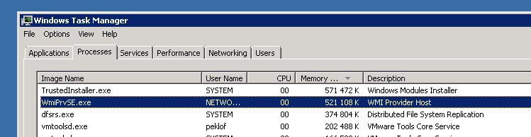

# WMI query had problems - NT code 0x800705af

## Question

* * * * *

WMI monitoring returns an error message similar to what is seen below. Why is this and how can it be fixed?

** **

**`$ /opt/plugins/check_wmi_plus.pl -H hostname -m checkdrivesize -u username -p password -a C -w _Used%=10 -c _Used%=20`**

`UNKNOWN - The WMI query had problems. The error text from wmic is: [librpc/rpc/dcerpc_connect.c:337:dcerpc_pipe_connect_ncacn_ip_tcp_recv()] failed NT status (c00000b5) in dcerpc_pipe_connect_ncacn_ip_tcp_recv`

`[librpc/rpc/dcerpc_connect.c:828:dcerpc_pipe_connect_b_recv()] failed NT status (c00000b5) in dcerpc_pipe_connect_b_recv`

`[wmi/wmic.c:212:main()] ERROR: Retrieve result data.`

`NTSTATUS: NT code 0x800705af - NT code 0x800705af`

## Answer

* * * * *

Due to a memory leak in the WMI functions in Windows 2008 and Windows 7, the system resources may be exhausted in the Windows system, resulting in the error message found above.

It has been seen that *systeminfo* and *wmic *commands executed via the command prompt fails in case this issue is present, displaying error messages such as:

`The paging file is too small for this operation to complete.`

Looking at the process list in the Windows system, it can be determined that the WmiPrvSE.exe process has allocated unusually large amounts of memory.

**A simple restart of the Windows server *temporarily* resolves the issue**, or possibly by restarting the *Windows Management Instrumentation* (Winmgmt) service.

More information and a hotfix can be found at this [page](http://support.microsoft.com/kb/981314).

