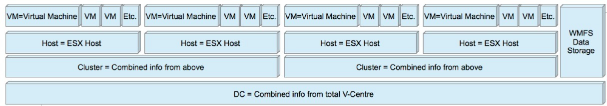

# What can you monitor in a VMware Server/cluster?

**A general description of supported commands and sub-command for OP5 Monitor 5.x and 6.x**

Level = status source

VM – Virtual Machine

Host – ESX host

Cluster – Combined info from VM & Host

DC – Combined info from V-center

**Note**: For install and detailed arguments - please see["Monitoring VMware" ](https://kb.op5.com/x/J4IK)

* * * * *

 

**
**

|:--|
|**Level**

**Command**

**Sub-command**

**Additional Options**|VM

\* cpu - shows cpu info

 

 |VM

 

+ usage - CPU usage in percentage

 |VM

 

+ usagemhz - CPU usage in MHz

 |VM

 

+ wait - CPU wait time in ms

 |VM

 

+ ready - CPU ready time in ms

 |VM

 

\^ all cpu info(no thresholds)

 |VM

\* mem - shows mem info

 

 |VM

 

+ usage - mem usage in percentage

 |VM

 

+ usagemb - mem usage in MB

 |VM

 

+ swap - swap mem usage in MB

 |VM

 

+ swapin - swapin mem usage in MB

 |VM

 

+ swapout - swapout mem usage in MB

 |VM

 

+ overhead - additional mem used by VM Server in MB

 |VM

 

+ overall - overall mem used by VM Server in MB

 |VM

 

+ active - active mem usage in MB

 |VM

 

+ memctl - mem used by VM memory control driver(vmmemctl) that controls ballooning

 |VM

 

\^ all mem info(except overall and no thresholds)

 |VM

\* net - shows net info

 

 |VM

 

+ usage - overall network usage in KBps(Kilobytes per Second)

 |VM

 

+ receive - receive in KBps(Kilobytes per Second)

 |VM

 

+ send - send in KBps(Kilobytes per Second)

 |**Level**

**Command**

**Sub-command**

**Additional Options**|VM

\* net - shows net info

\^ all net info(except usage and no thresholds)

 |VM

\* io - shows disk I/O info

 

 |VM

 

+ usage - overall disk usage in MB/s

 |VM

 

+ read - read latency in ms (totalReadLatency.average)

 |VM

 

+ write - write latency in ms (totalWriteLatency.average)

 |VM

 

\^ all disk io info(no thresholds)

 |VM

\* runtime - shows runtime info

 

 |VM

 

+ con - connection state

 |VM

 

+ cpu - allocated CPU in MHz

 |VM

 

+ mem - allocated mem in MB

 |VM

 

+ state - virtual machine state (UP, DOWN, SUSPENDED)

 |VM

 

+ status - overall object status (gray/green/red/yellow)

 |VM

 

+ consoleconnections - console connections to VM

 |VM

 

+ guest - guest OS status, needs VMware Tools

 |VM

 

+ tools - VMWare Tools status

 |VM

 

+ issues - all issues for the host

 |VM

 

\^ all runtime info(except con and no thresholds)

 |Host

\* cpu - shows cpu info

 

 |Host

 

+ usage - CPU usage in percentage

quickstats - switch for query either PerfCounter values or Runtime info|Host

 

+ usagemhz - CPU usage in MHz

quickstats - switch for query either PerfCounter values or Runtime info|Host

 

\^ all cpu info

quickstats - switch for query either PerfCounter values or Runtime info|Host

 

 

 |**Level**

**Command**

**Sub-command**

**Additional Options**| 
\* mem - shows mem info

 

 |Host

 

+ usage - mem usage in percentage

quickstats - switch for query either PerfCounter values or Runtime info|Host

 

+ usagemb - mem usage in MB

quickstats - switch for query either PerfCounter values or Runtime info|Host

 

+ swap - swap mem usage in MB

listvm - turn on/off output list of swapping VM's|Host

 

+ overhead - additional mem used by VM Server in MB

 |Host

 

+ overall - overall mem used by VM Server in MB

 |Host

 

+ memctl - mem used by VM memory control driver(vmmemctl) that controls ballooning

o listvm - turn on/off output list of ballooning VM's|Host

 

\^ all mem info(except overall and no thresholds)

 |Host

\* net - shows net info

 

 |Host

 

+ usage - overall network usage in KBps(Kilobytes per Second)

 |Host

 

+ receive - receive in KBps(Kilobytes per Second)

 |Host

 

+ send - send in KBps(Kilobytes per Second)

 |Host

 

+ nic - makes sure all active NICs are plugged in

 |Host

 

\^ all net info(except usage and no thresholds)

 |Host

\* io - shows disk io info

 

 |Host

 

+ aborted - aborted commands count

 |Host

 

+ resets - bus resets count

 |Host

 

+ read - read latency in ms (totalReadLatency.average)

 |Host

 

+ write - write latency in ms (totalWriteLatency.average)

 |Host

 

+ kernel - kernel latency in ms

 |Host

 

+ device - device latency in ms

 |Host

 

+ queue - queue latency in ms

 |Host

 

\^ all disk io info

 |Host

\* vmfs - shows Datastore info

 

 |Host

 

+ (name) - free space info for datastore with name (name)

used - output used space instead of free| 

 

 

breif - list only alerting volumes| 

 

 

regexp - whether to treat name as regexp| 

 

 

blacklistregexp - whether to treat blacklist as regexp| 

 

 

b - blacklist VMFS's| 

 

 

T (value) - timeshift to detemine if we need to refresh|Host

 

\^ all datastore info

used - output used space instead of free| 

 

 

breif - list only alerting volumes|**Level**

**Command**

**Sub-command**

**Additional Options**|Host

\* vmfs - shows Datastore info

 

blacklistregexp - whether to treat blacklist as regexp| 

 

 

b - blacklist VMFS's| 

 

 

T (value) - timeshift to detemine if we need to refresh|Host

\* runtime - shows runtime info

 

 |Host

 

+ con - connection state

 |Host

 

+ health - checks cpu/storage/memory/sensor status

listitems - list all available sensors(use for listing purpose only)|Host

 

 

blackregexpflag - whether to treat blacklist as regexp|Host

 

 

b - blacklist status objects|Host

 

+ storagehealth - storage status check

blackregexpflag - whether to treat blacklist as regexp|Host

 

 

b - blacklist status objects|Host

 

+ temperature - temperature sensors

blackregexpflag - whether to treat blacklist as regexp|Host

 

 

b - blacklist status objects|Host

 

+ sensor - threshold specified sensor

 |Host

 

+ maintenance - shows whether host is in maintenance mode

 |Host

 

+ list(vm) - list of VMWare machines and their statuses

 |Host

 

+ status - overall object status (gray/green/red/yellow)

 |Host

 

+ issues - all issues for the host

b - blacklist issues|Host

 

\^ all runtime info(health, storagehealth, temperature and sensor are represented as one value and no thresholds)

 |Host

\* service - shows Host service info

 

 |Host

 

+ (names) - check the state of one or several services specified by (names), syntax for (names):\<service1\>,\<service2\>,...,\<serviceN\>

 |Host

 

\^ show all services

 |Host

\* storage - shows Host storage info

 

 |Host

 

+ adapter - list bus adapters

b - blacklist adapters|Host

 

+ lun - list SCSI logical units

b - blacklist LUN's|**Level**

**Command**

**Sub-command**

**Additional Options**|Host

\* storage - shows Host storage info

+ path - list logical unit paths

b - blacklist paths|Host

 

\^ show all storage info

 |Host

\* uptime - shows Host uptime

 

 |Host

\* device - shows Host specific device info

 

quickstats - switch for query either PerfCounter values or Runtime info|Host

 

+ cd/dvd - list vm's with attached cd/dvd drives

listall - list all available devices(use for listing purpose only)|DC

\* cpu - shows cpu info

 

 |DC

 

+ usage - CPU usage in percentage

quickstats - switch for query either PerfCounter values or Runtime info|DC

 

+ usagemhz - CPU usage in MHz

quickstats - switch for query either PerfCounter values or Runtime info|DC

 

\^ all cpu info

quickstats - switch for query either PerfCounter values or Runtime info|DC

\* mem - shows mem info

 

 |DC

 

+ usage - mem usage in percentage

quickstats - switch for query either PerfCounter values or Runtime info|DC

 

+ usagemb - mem usage in MB

quickstats - switch for query either PerfCounter values or Runtime info|DC

 

+ swap - swap mem usage in MB

 |DC

 

+ overhead - additional mem used by VM Server in MB

 |DC

 

+ overall - overall mem used by VM Server in MB

 |DC

 

+ memctl - mem used by VM memory control driver(vmmemctl) that controls ballooning

 |DC

 

\^ all mem info(except overall and no thresholds)

 |DC

\* net - shows net info

 

 |DC

 

+ usage - overall network usage in KBps(Kilobytes per Second)

 |DC

 

+ receive - receive in KBps(Kilobytes per Second)

 |DC

 

+ send - send in KBps(Kilobytes per Second)

 |DC

 

\^ all net info(except usage and no thresholds)

 |DC

\* io - shows disk io info

 

 |DC

 

+ aborted - aborted commands count

 |DC

 

+ resets - bus resets count

 |**Level**

**Command**

**Sub-command**

**Additional Options**|DC

 

+ read - read latency in ms (totalReadLatency.average)

 |DC

 

+ write - write latency in ms (totalWriteLatency.average)

 |DC

 

+ kernel - kernel latency in ms

 |DC

 

+ device - device latency in ms

 |DC

 

+ queue - queue latency in ms

 |DC

 

\^ all disk io info

 |DC

\* vmfs - shows Datastore info

 

 |DC

 

+ (name) - free space info for datastore with name (name)

used - output used space instead of free|DC

 

 

breif - list only alerting volumes|DC

 

 

regexp - whether to treat name as regexp|DC

 

 

blacklistregexp - whether to treat blacklist as regexp|DC

 

 

b - blacklist VMFS's|DC

 

 

T (value) - timeshift to detemine if we need to refresh|DC

 

\^ all datastore info

used - output used space instead of free|DC

 

 

breif - list only alerting volumes|DC

 

 

blacklistregexp - whether to treat blacklist as regexp|DC

 

 

b - blacklist VMFS's|DC

 

 

T (value) - timeshift to detemine if we need to refresh|DC

 

 

 |DC

 

 

 |DC

\* runtime - shows runtime info

 

 |DC

 

+ list(vm) - list of VMWare machines and their statuses

 |DC

 

+ listhost - list of VMWare esx host servers and their statuses

 |DC

 

+ listcluster - list of VMWare clusters and their statuses

 |DC

 

+ tools - VMWare Tools status

b - blacklist VM's|DC

 

+ status - overall object status (gray/green/red/yellow)

 |DC

 

+ issues - all issues for the host

b - blacklist issues|**Level**

**Command**

**Sub-command**

**Additional Options**|DC

\* runtime - shows runtime info

\^ all runtime info(except cluster and tools and no thresholds)

 |DC

\* recommendations - shows recommendations for cluster

 

 |DC

 

+ (name) - recommendations for cluster with name (name)

 |DC

 

\^ all clusters recommendations

 |Cluster

\* cpu - shows cpu info

 

 |Cluster

 

+ usage - CPU usage in percentage

 |Cluster

 

+ usagemhz - CPU usage in MHz

 |Cluster

 

\^ all cpu info

 |Cluster

\* mem - shows mem info

 

 |Cluster

 

+ usage - mem usage in percentage

 |Cluster

 

+ usagemb - mem usage in MB

 |Cluster

 

+ swap - swap mem usage in MB

listvm - turn on/off output list of swapping VM's|Cluster

 

+ memctl - mem used by VM memory control driver(vmmemctl) that controls ballooning

listvm - turn on/off output list of ballooning VM's|Cluster

 

\^ all mem info(plus overhead and no thresholds)

 |Cluster

\* cluster - shows cluster services info

 

 |Cluster

 

+ effectivecpu - total available cpu resources of all hosts within cluster

 |Cluster

 

+ effectivemem - total amount of machine memory of all hosts in the cluster

 |Cluster

 

+ failover - VMWare HA number of failures that can be tolerated

 |Cluster

 

+ cpufainess - fairness of distributed cpu resource allocation

 |Cluster

 

+ memfainess - fairness of distributed mem resource allocation

 |Cluster

 

\^ only effectivecpu and effectivemem values for cluster services

 |Cluster

\* runtime - shows runtime info

 

 |Cluster

 

+ list(vm) - list of VMWare machines in cluster and their statuses

 |Cluster

 

+ listhost - list of VMWare esx host servers in cluster and their statuses

 |Cluster

 

+ status - overall cluster status (gray/green/red/yellow)

 |Cluster

 

+ issues - all issues for the cluster

b - blacklist issues|Cluster

 

\^ all cluster runtime info

 |**Level**

**Command**

**Sub-command**

**Additional Options**|Cluster

\* vmfs - shows Datastore info

 

 |Cluster

 

+ (name) - free space info for datastore with name (name)

used - output used space instead of free|Cluster

 

 

breif - list only alerting volumes|Cluster

 

 

regexp - whether to treat name as regexp|Cluster

 

 

blacklistregexp - whether to treat blacklist as regexp|Cluster

 

 

b - blacklist VMFS's|Cluster

 

 

T (value) - timeshift to detemine if we need to refresh|Cluster

 

\^ all datastore info

used - output used space instead of free|Cluster

 

 

breif - list only alerting volumes|Cluster

 

 

blacklistregexp - whether to treat blacklist as regexp|Cluster

 

 

b - blacklist VMFS's|Cluster

 

 

T (value) - timeshift to detemine if we need to refresh|

**
**

**
**

