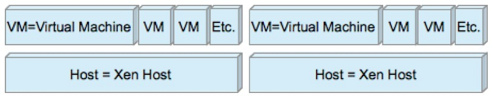

# What can you monitor on a Xen virtual server/host?

### **An overview of supported commands and sub-command for op5 Monitor 5.x and 6.x**

VM – Virtual Machine

Host – Xen host

 

* * * * *

|:--|
|**Level**

**Command**

**Sub-command**|VM

\* cpu - shows cpu info

 |VM

 

+ \<number\> - CPU core usage|VM

 

\^ all cpu info|VM

\* mem - shows mem info

 |VM

 

+ allocated - allocated memory for VM in MB|VM

 

+ ballooned - target memory for VM balloon driver in MB|VM

 

+ internal - memory usage as reported by guest OS in MB|VM

 

\^ all mem info|VM

\* net - shows net info

 |VM

 

+ usage - overall usage of network(send + receive) in KB/s|VM

 

+ errors - overall network errors(txerrs + rxerrs)|VM

 

+ send - overall transmit in KB/s|VM

 

+ receive - overall receive in KB/s|VM

 

+ txerrs - overall transmit errors per second/s|VM

 

+ rxerrs - overall receive errors per second/s|VM

 

\^ all net info|VM

\* io - shows disk I/O info

 |VM

 

+ usage - overall disk usage in MB/s|VM

 

+ latency - overall latency in ms|VM

 

+ read - overall disk read in MB/s|VM

 

+ write - overall disk write in MB/s|VM

 

+ read\_latency - overall disk read latency in ms|VM

 

+ write\_latency - overall disk write latency in ms|**Level**

**Command**

**Sub-command**|VM

 

\^ all io info|Host

\* cpu - shows cpu info

 |Host

 

+ usage - overall CPU usage as percentage|Host

 

+ loadavg - CPU load average|Host

 

+ \<number\> - CPU core usage|Host

 

\^ all cpu info|Host

 

 |Host

\* mem - shows mem info

 |Host

 

+ usage - memory usage in MB|Host

 

+ free - free memory in MB|Host

 

+ xapiusage - memory used by xapi daemon's in MB|Host

 

+ xapifree - free memory available to xapi daemon's in MB|Host

 

+ xapilive - live memory used by xapi daemon's in MB|Host

 

+ xapiallocation - memory allocation done by xapi daemon's MB|Host

 

\^ all mem info|Host

\* net - shows net info

 |Host

 

+ usage - overall usage of network(send + receive) in KB/s|Host

 

+ errors - overall network errors(txerrs + rxerrs)|Host

 

+ send - overall transmit in KB/s|Host

 

+ receive - overall receive in KB/s|Host

 

+ txerrs - overall transmit errors per second/s| 

 

+ rxerrs - overall receive errors per second/s| 

 

\^ all net info|Host

\* io - shows disk io info

 |Host

 

+ cachesize - cache size of the IntelliCache in B|Host

 

+ cachemisses - misses per second of the IntelliCache|Host

 

+ cachehits - hits per second of the IntelliCache|Host

 

\^ all io info|Host

\* time - shows time difference info

 |Host

 

+ time - time difference of Citrix and check\_xenpai hosts|Host

 

+ localtime - time difference of Citrix(time in local timezone) and check\_xenpai hosts|Level

Command

Sub-command|Host

\* time - shows time difference info

+ \<number\> - time difference of Citrix host and custom value|Host

 

\^ all time info|Host

\* list - list available VM's

 |Session

\* listhost - list attached Hosts

 |Session

\* listpool - list available Pools

 |Session

\* list - list available VM's

 |

 

 

