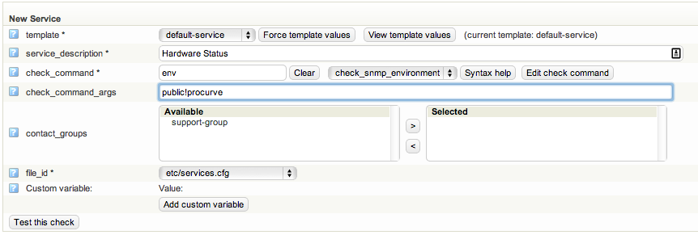

# Add support for network equipment hardware monitoring

Version

This article was written for version 6.2 of Monitor, it could work on both lower and higher version if nothing else is stated.

This will guide you through the steps to add hardware monitoring for Cisco, Procurve, Extreme network, Juniper, Blue Coat and Citrix Netscaler network equipment.

1. Go to OP5 Monitor Configuration | Commands
2. Add a new command:
    **command\_name:** check\_snmp\_environment
    **command\_line:** \$USER1\$/check\_snmp\_environment -H \$HOSTADDRESS\$ -2 -C \$ARG1\$ -T \$ARG2\$ -f
3. Save the configuration

After these steps add the check to a host. In the check command arguments add SNMP community name as the first argument and the hardware type as argument two. Please see the syntax help for more information on supported hardware.

This is an example on how to monitor a HP Procurve using the SNMP community name "public".

**check\_command:** check\_snmp\_environment
**check\_command\_args:** public!procurve

