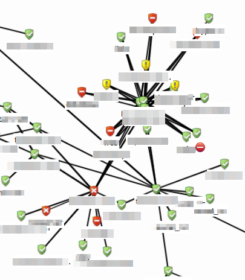
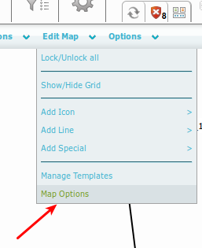
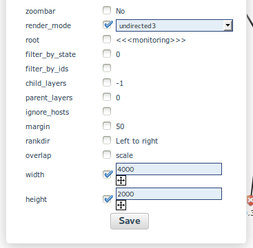
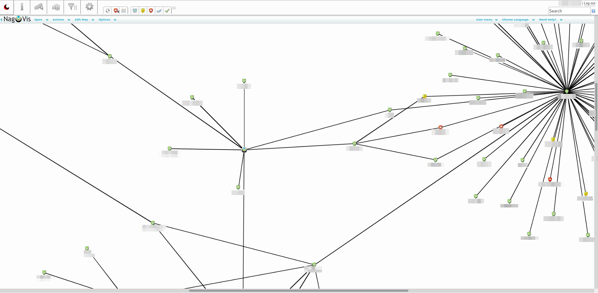

# Configuring NagVis automap for large environments

Version

This article was written for version 7.0.2 of op5 Monitor, it could work on both lower and higher version if nothing else is stated.

Articles in the Community-Space are not supported by op5 Support.

# Introduction

The NagVis automap included with *op5 Monitor* is a great tool for visualizing the parent-child relationship of hosts in the monitoring system.
This map is however configured to a static size and can get a bit unreadable once you have added more hosts with multiple parents and children.

In this how-to we will look at configuring the automap for large environments and replicate some of the functionality from the deprecated Hypermap feature.

*The automap in an environment with a lot of host relationships
*

# Configuration

Open the NagVis map called "Automap", hover over the "Edit map" menu and select "Map options" button

Scroll down the options list to "render\_mode" and set it to "unidirect3".
You should can also change the "width" and "height" options to reconfigure the size of your map

 

This should render a cleaner and more spread out map with your hosts and their relationships

 

