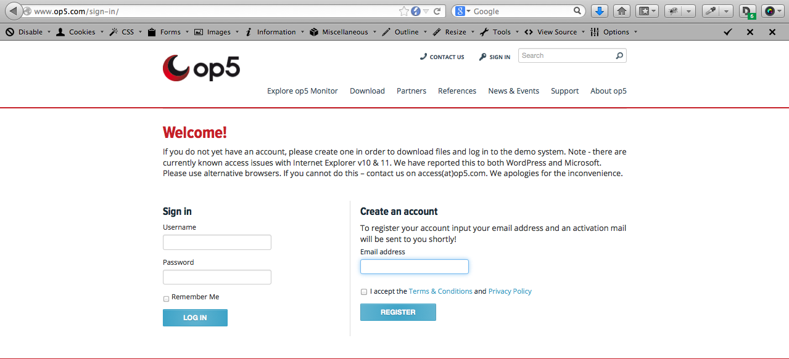
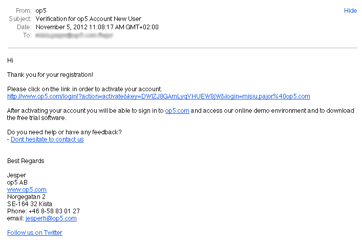
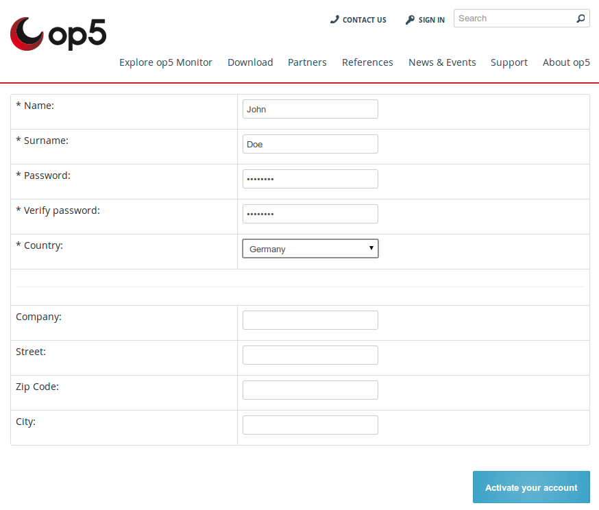
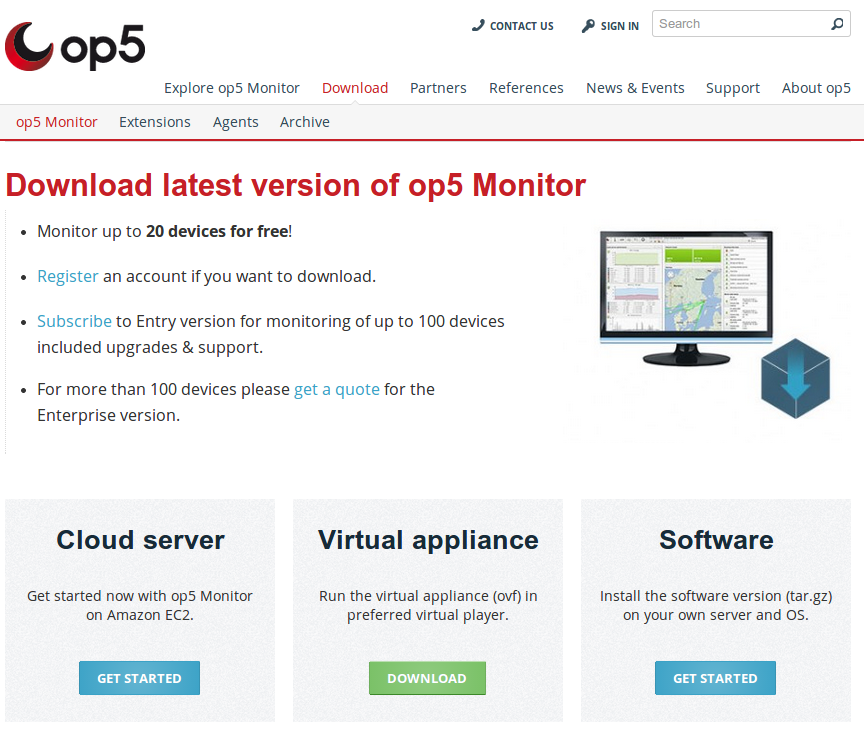
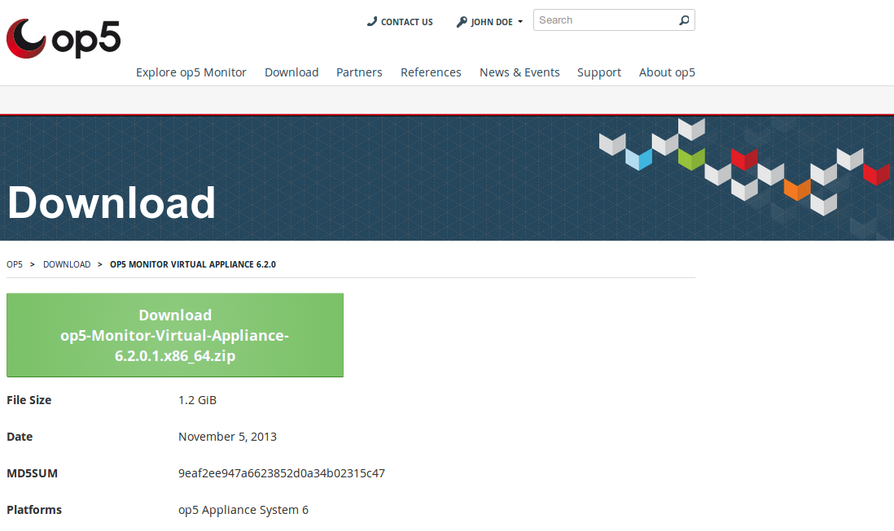
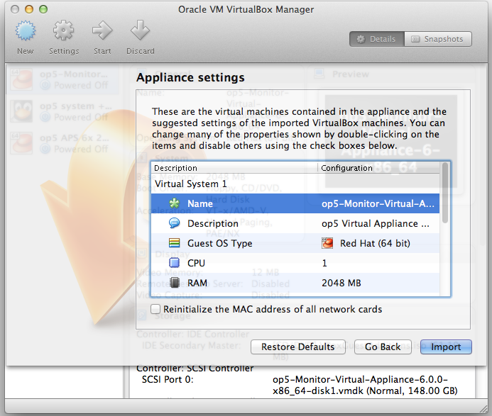
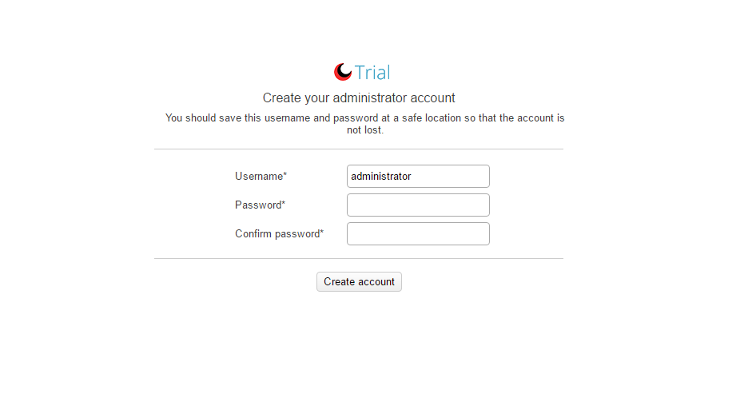

# Getting started with OP5 Monitor

- [Introduction](#Gettingstartedwithop5Monitor-Introduction)
- [Create your OP5 account](#Gettingstartedwithop5Monitor-Createyourop5account)
- [Downloading the trial image](#Gettingstartedwithop5Monitor-Downloadingthetrialimage)
- [Starting the trial image with the help of VirtualBox](#Gettingstartedwithop5Monitor-StartingthetrialimagewiththehelpofVirtualBox)
- [Exploring the OP5 Monitor User Interface](#Gettingstartedwithop5Monitor-Exploringtheop5MonitorUserInterface)

[OP5 Monitor: Open Source Network Monitoring](#Gettingstartedwithop5Monitor-OP5Monitor:OpenSourceNetworkMonitoring)

## Introduction

Welcome to op5! We are glad that you found your way here. Spend a few minutes going through this brief getting started guide to learn the basics of our main product OP5 Monitor. This guide will teach you how to create an account with us, downloading the trial-image of OP5 Monitor and how to run the image with the help of the virtualization product *VirtualBox*.

 If you have already registered for an OP5 account on [www.op5.com](http://www.op5.com/), you can skip the following step. To login using your OP5 account, navigate to [www.op5.com/login](http://www.op5.com/login)

## Create your OP5 account

Creating an account on OP5 is quick, free, and non-intrusive, so it’s easy to use your account details to get access to all the OP5 online resources such as live demo, downloads and forums. Navigate to [www.op5.com](http://www.op5.com/) and press the “Sign In” button; then press *Sign Up* as showed on the image below.

Tick the box "I accept the Terms & Conditions and Privacy Policy" and fill in your e-mail address and you will recieve and activation e-mail shortly.

Follow the link in the verification email or paste it in your web browser and fill in the required fields to complete your registration

Press the activation button and you are registered and able to download software.

## Downloading the trial image

Navigate to *Download* ** in the menu, locate *Virtual Appliance* and press *Download* as shown on the image below

Proceed by pressing the *Download* button and save the file to your computer. Once it has finished downloading unzip the ZIP file to your desktop.

op5 Monitor only supports 64 bit processor architecture.

## Starting the trial image with the help of VirtualBox

In order to start OP5 Monitor with the help of VirtualBox you will need to installVirtualBox. You can download the appropriate installation file that suits your environment by navigating to: <https://www.virtualbox.org/wiki/Downloads> and downloading the setup file to your computer. After the download has finished you will need to install VirtualBox and then run VirtualBox.

Now when you have VirtualBox installed and running. In the menu, choose: *File -\>* *Import Appliance* to start the import of the OP5 Monitor trial Image. In the new window choose the OVF-file (OVF stands for Open Virtualization Format, read more about it on **[wikipedia](http://en.wikipedia.org/wiki/Open_Virtualization_Format)**), which is located in the folder that you unzipped earlier to your desktop. Proceed by pressing *Continue* followed with *Import* in the next window.

****

Now it's time to start our virtual instance of OP5 Monitor Appliance. This can be done by right-clicking on it and pressing *Start –* which will start the OP5 Monitor Virtual Appliance and show you a console of the virtual instance.

****

****

****

The ip-address shown on the above image is the URL you can navigate to with your preferred browser. In my case, I would navigate to [https://172.27.76.66/](http://kb.op5.com) to access the OP5 Portal page, then I click the OP5 Monitor-logo.

You will be prompted to create an account with administrator privileges the first time you access OP5 Monitor.

****

## Exploring the OP5 Monitor User Interface

Now that you are ready to explore the OP5 Monitor User Interface you can read through the OP5 Monitor User Manual which can be found here: [http://www.op5.com/manual](http://www.op5.com/manuals)[s](http://www.op5.com/manuals) – we highly recommend you to read through the basics of OP5 Monitor User Manual and OP5 Monitor Administrator Manual.

# OP5 Monitor: Open Source Network Monitoring

[OP5 ](https://www.op5.com/)is the preferred Open Source Networking & Server Monitoring tool for large multi-national companies in over 60 markets. If you would like to experience OP5 Monitor you can get started here, alternatively, if you prefer to get more hands on you can Download OP5 Monitor for free.
