# Getting started with OP5 Monitor from Amazon Web Services Marketplace

A very easy way of getting started with OP5 Monitor is to deploy a server in the cloud, in this case in the Amazon Web Services cloud.

This article aims to get you from the Marketplace all the way through to having a Monitor system configured and monitoring a service.

Let's get started!

## Preparations

1.  First, you will need to create an Amazon account, by [going to the Marketplace](https://aws.amazon.com/marketplace) and clicking "Create a new account".
    You may have an account already, if you've for example used Amazon for shopping before, or already use the Amazon Web Services cloud, and then you can just click "Sign in" instead.
    It will look something like this:

    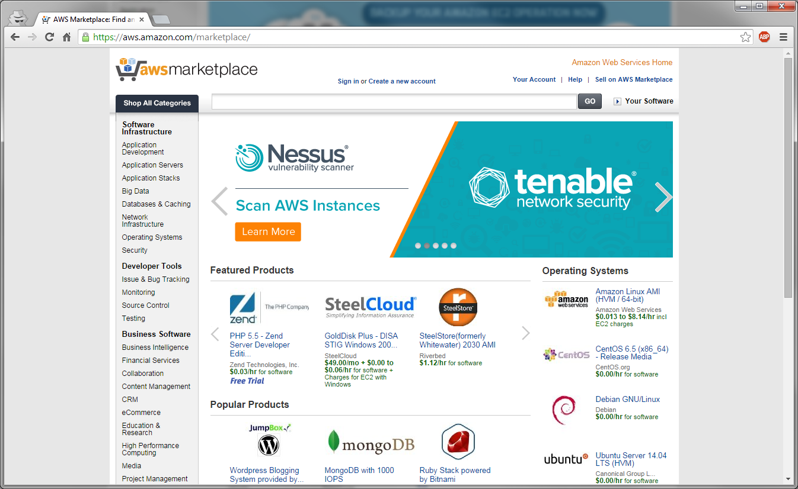

2.  Once you've created an account or signed in, search for "op5" in the Marketplace search box. Click on the "op5 Monitor full test version" search result. You will then arrive at this page:  

3.  Click "Continue", and you will arrive at this page:
    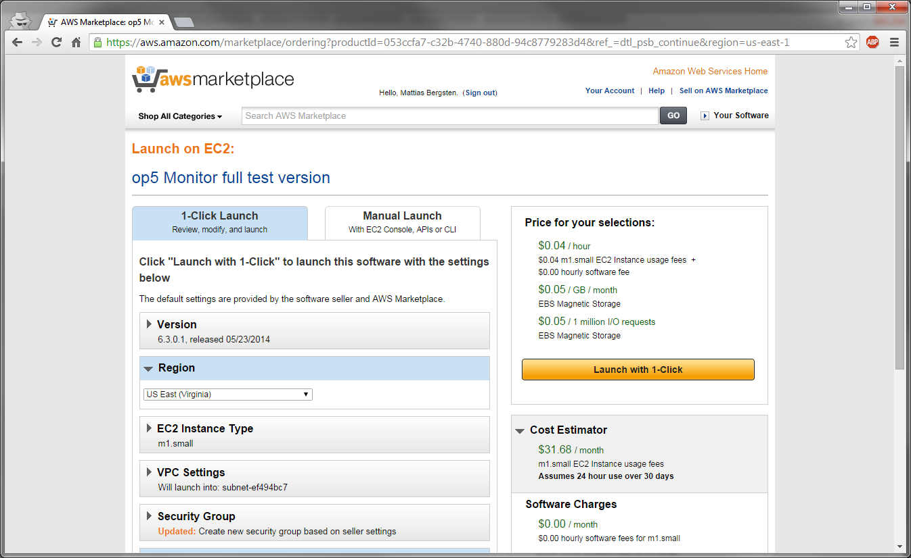
4.  Here, you will need to choose in which region you want the server to run. In determining which region to choose, consider where your monitoring targets are located - either you choose the one that is
    \* geographically closest to where you are
    or
    \* geographically closest to the things you are going to be monitoring
    Which one you choose depends on many things - network distance, latency, closeness to a particular hosting facility or user base, etc - but generally speaking, placing it close to where you are is a good idea.
    Then scroll down, and unless you've previously provisioned servers in the Amazon Web Services Cloud, you will see this:
    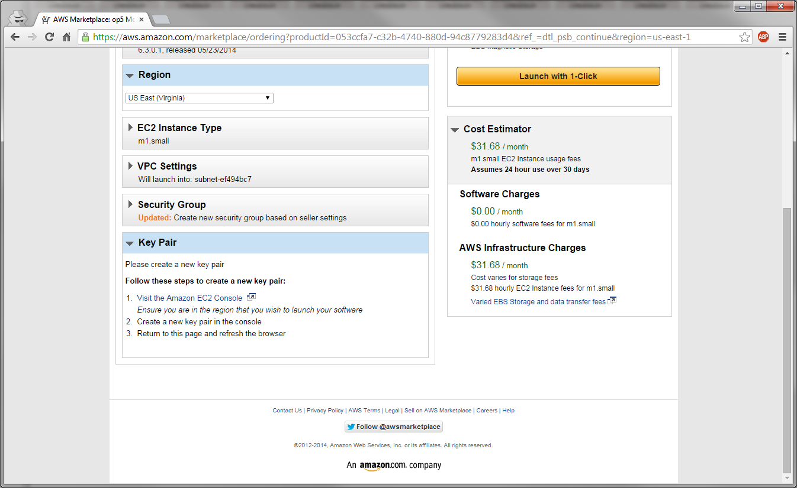
5.  A key pair is used to access your Amazon Web Services instances via SSH, and you will need one for advanced administration of the Monitor machine.
    Click the link to visit the Amazon EC2 Console. A new tab will open, looking like this:
    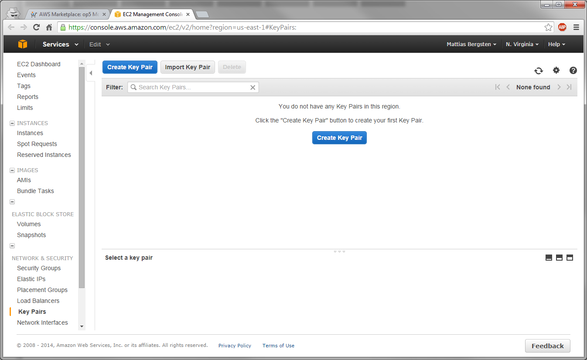
6.   Click "Create key pair" and give your new keypair a name that you will use to identify it within Amazon Web Services. Once you've created your keypair, a download will start for a file named \<your-keypair-name\>.pem.
    **Save this file in a secure place** - it is the only way you can administer your instance, and you **can't recover it if you lose it**!
    You will be taken back to the key pair inventory, which will look something like this:
    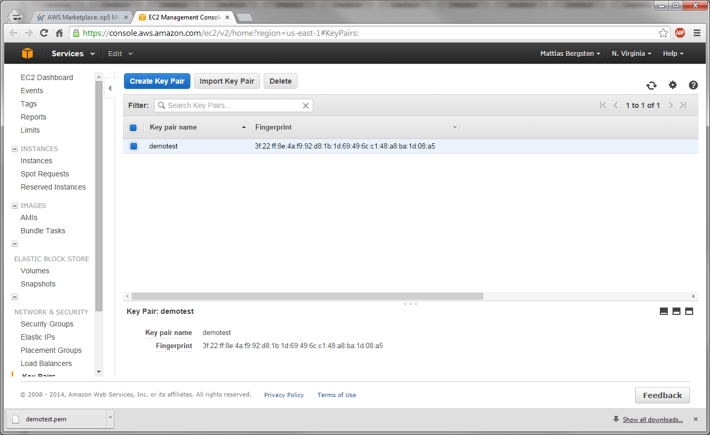
7.  You can now close the EC2 Management Console tab, bringing you back to the AWS Marketplace tab. If you reload the page, you'll notice that it has now discovered your new keypair and looks like this:
    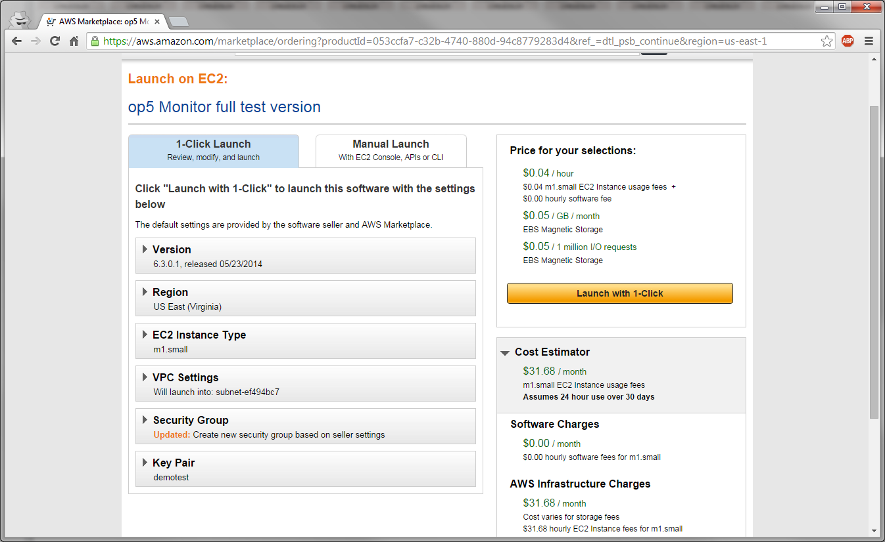
8.  Once you have a key pair specified, click "Launch with 1-Click". This brings you to a screen looking a lot like this one:
    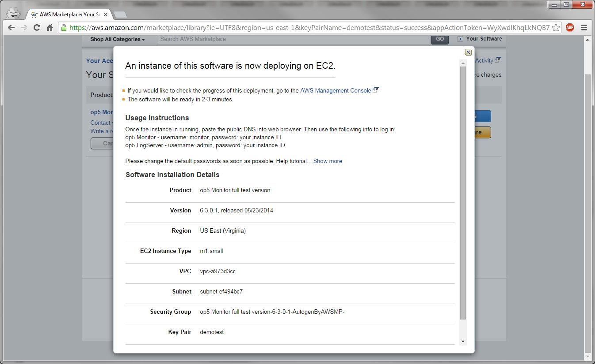
9.  Close this popup with the X icon in the top-right corner of the popup. This will bring you to this page:
    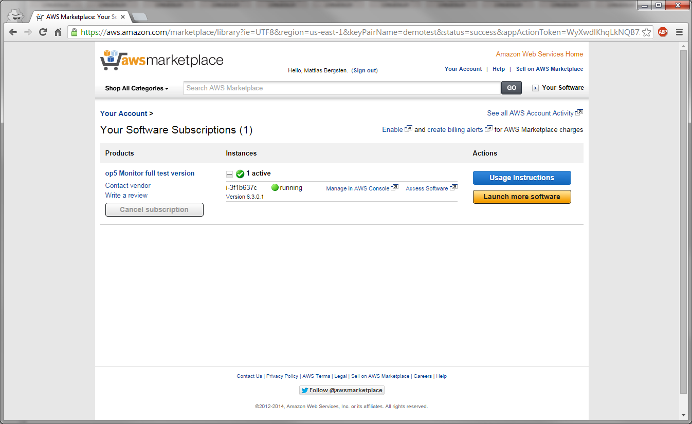
10. You now have an instance of OP5 Monitor running on the Amazon Web Services Cloud!
    In order to be able to log in to your new, fresh instance, click "Manage in AWS Console". This will bring you to a page much like this:
    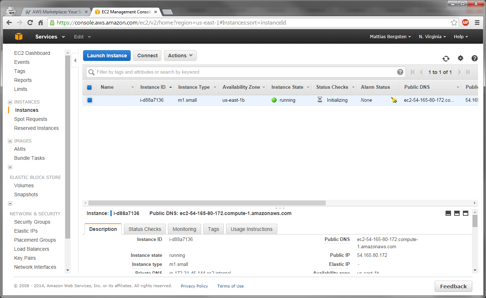
11. Here, you have two details that you will need in order to log into your new instance - the **Instance ID**, which in my case is *i-d88a7136*, and the **Public DNS**, which in my case is *ec2-54-165-80-172.compute-1.amazonaws.com*.
    In order to log in to your new instance, copy the Public DNS, open a new tab in your browser and paste it into the address bar, followed by Enter.
    If you want more information on how to use the Amazon Web Services Cloud, [this](http://aws.amazon.com/documentation/gettingstarted/) contains all the information you need to get started. 

# Getting started with OP5 Monitor

1.  When you've pasted the Public DNS into the address bar and pressed Enter, you will be sent to this page:
    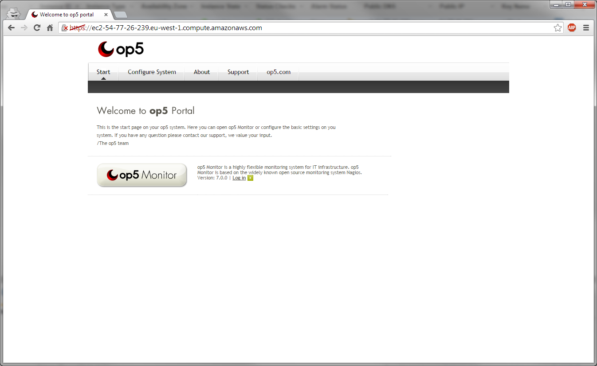
2.   Click the OP5 Monitor button, which brings you to this page:
    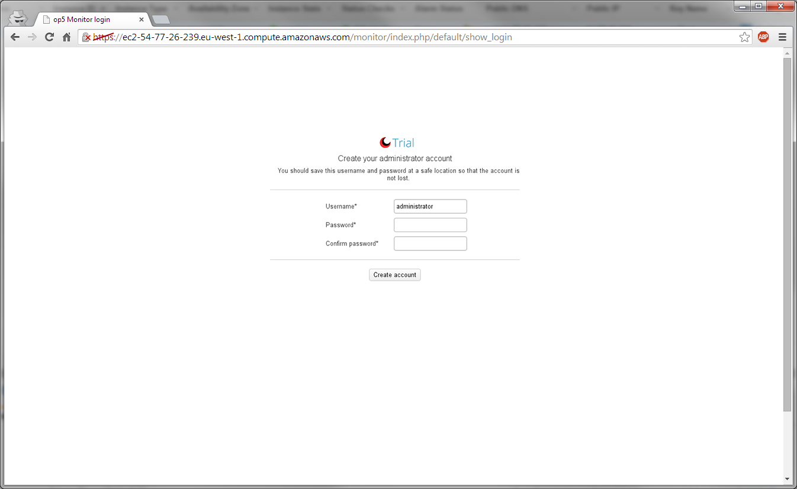
3.  You will be prompted to create an account with administrator privileges the first time you access OP5 Monitor. Input username and password and click Create account, which brings you to this page:
    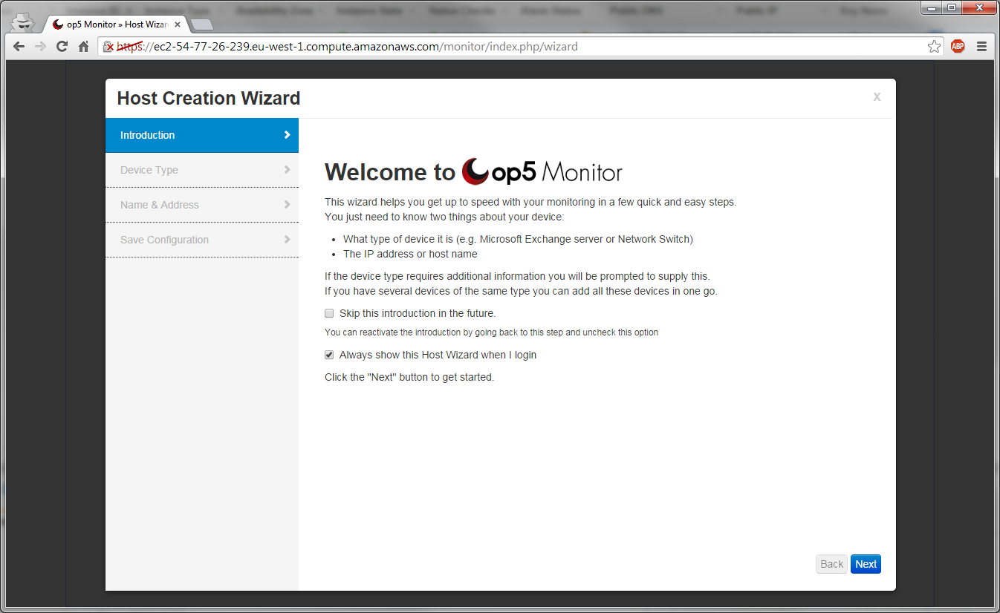
4.  This is the Host Wizard, the first thing you encounter when you log into Monitor (unless you later turn it off by unchecking "Always show this Host Wizard when I login"). Click Next, which brings you to this page:
    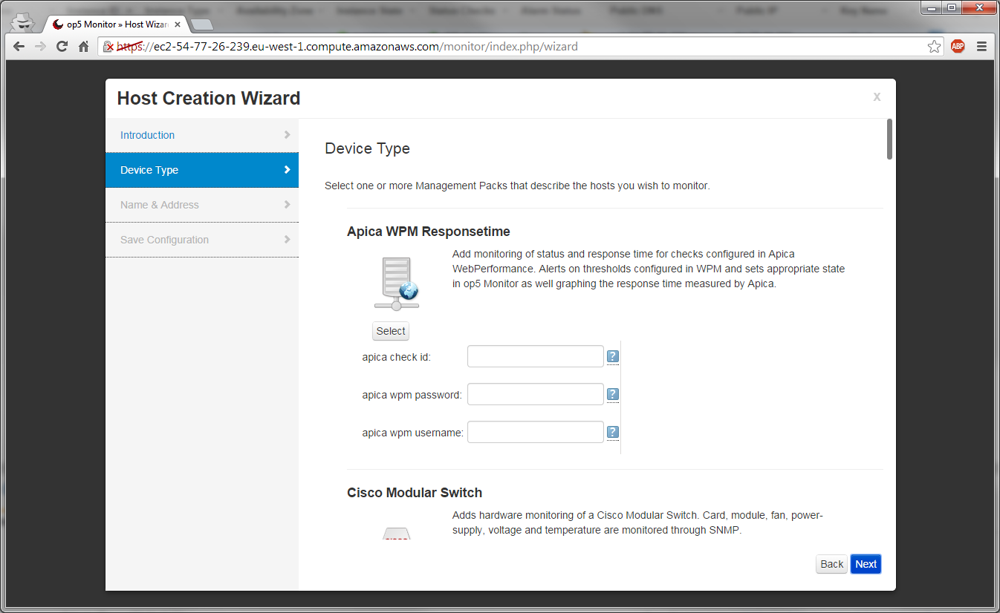
5.  This is the Device Type page of the Host Wizard, where you choose the type of the device you want to monitor. Me, I scroll down a bit, selecting "Web Server", which makes the page look like this:
    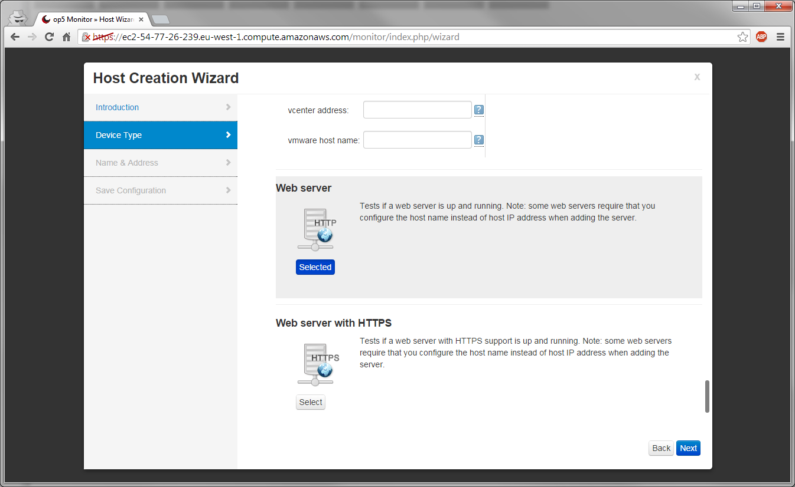
6.  I then click Next, which brings me to this page:
    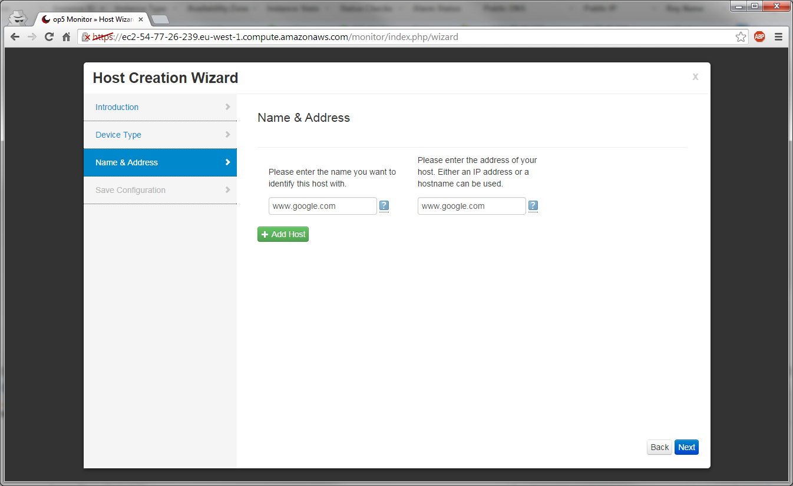
7.  Here, I type in the details of the server I want to monitor - in this case, I want to monitor the web server [www.google.com,](http://www.google.com,) referring to it as [www.google.com.
    ](http://www.google.com.)If I wanted to add more web servers, I'd just click "+ Add Host", and more fields would appear.
    I then click Next, which brings me to this page:
    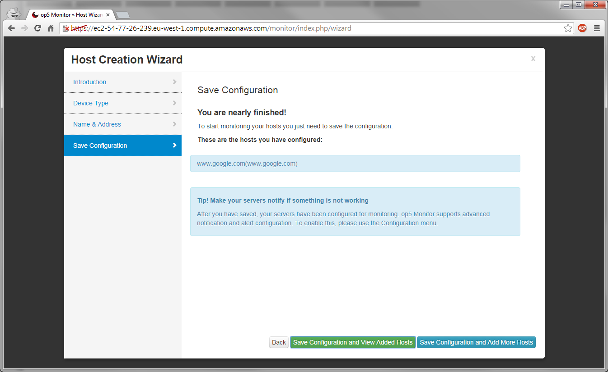
8.  Here, I have a choice of either saving my configuration and going on to view the new hosts that I've added, or saving my configuration and going back to adding more hosts through the wizard.
    Me, I'm happy with what I've done, and click "Save Configuration and View Added Hosts", which after some processing brings me to this page:
    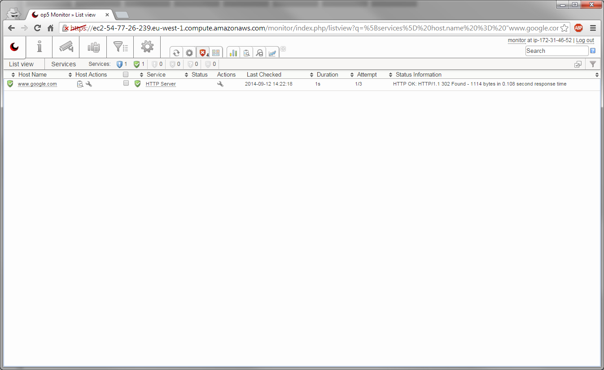
9.  Voila! You have now added your first host and your first service into your very own instance of OP5 Monitor, running on the Amazon Web Services Cloud!

 

Further reading

For more information about OP5 Monitor and tips about using the various features, here are some links to resources to learn more:
[OP5 Monitor Documentation](https://kb.op5.com/display/DOC)
[HOWTOs](https://kb.op5.com/display/HOWTOs)
[FAQs](https://kb.op5.com/display/FAQ) 

