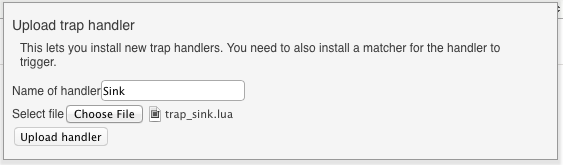
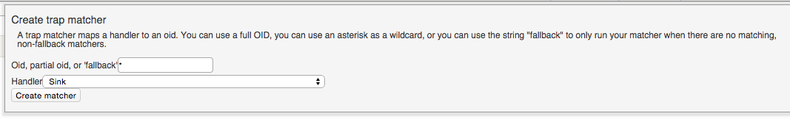
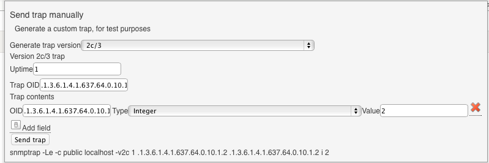
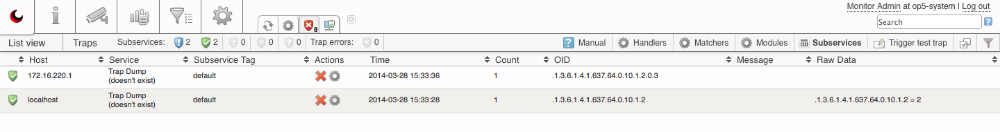

# Getting started with op5 Trapper

# Introduction

This HOWTO will describe how to start receiving SNMP-traps in 4 steps by using a simple and generic rule to list all incoming traps, but not taking any action on them.
This is a great way to start learning op5 Trapper and to verify that traps are getting to your server as they should and how they look like, before taking actions on specific traps and sending out alerts.

# Prerequisites

-   op5 Monitor version 6.3 or later, including a license allowing Trapper.
-   A host in Monitor set up with the same address as the source of your test traps (localhost in the example below).
-   A service in Monitor named *Trap Dump* on the host described above.

# Instructions

### 1 - Sign on to op5 Monitor

Sign on to op5 Monitor and then go to Trapper via the Monitor option in the main menu.

### 2 - Create a simple "catch all" rule

Go to "Handlers" and then "New Handler", call it Sink, and upload this LUA code: [trap\_sink.lua](attachments/6193568/6422589.lua)

Once the handler has been uploaded, go to "Matchers" and then "New Matcher". We should match on all OIDs (\*) and use our newly created handler *Sink*.

### 3 - Send a test trap

Go to "Subservices" and then "Trigger test trap". Now enter these values:

-   **Uptime:** 1
-   **Trap OID:** .1.3.6.1.4.1.637.64.0.10.1.2
-   **Trap contents**
    -   **OID:** .1.3.6.1.4.1.637.64.0.10.1.2
    -   **Type:** Integer
    -   **Value:** 2

 

### 4 - Watch your traps appear in the list view.

Debugging trap related issues

If you have root shell access to the host system running op5 Monitor, you can run the command stated below to follow the log output from the *trapper-collector* service, to make sure that traps are received correctly.

`tail -f /var/log/messages | grep trapper-collector`

 

### Read more...

-   [How to configure op5 Trapper Extension (Cisco handler) (Advanced)](How_to_configure_op5_Trapper_Extension_Cisco_handler_) 
-   [Trapper manual](https://kb.op5.com/display/DOC/op5+Trapper+Manual)

 

