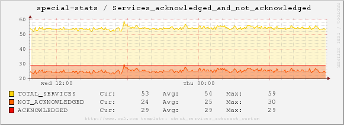
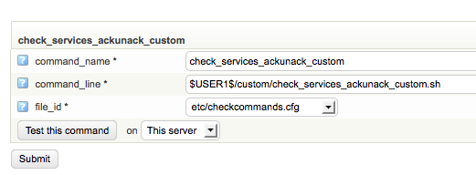

# Graphing total services that are acknowledged / not acknowledged in OP5 Monitor

Version

This article was written for version 7.x of OP5 Monitor, it could work on both lower and higher version if nothing else is stated.

Articles in the Community-Space are not supported by OP5 Support.

## About this article

This article shows how to graph the total amount of services (excluding those that are in scheduled downtime, state = ok and in\_notification\_period = 1) in OP5 Monitor. This is really handy if you want to follow up on number of incidents in your environment over time and how how incidents gets handled over time in an nice graph.

 

Example from our demo system: [Graphing of acknowledged and unacknowleged alerts](https://demo.op5.com/monitor/index.php/extinfo/details?host=special-stats&service=Services%20acknowledged%20and%20not%20acknowledged)



## Create the plugin

This script or plugin will query livestatus to get the information needed to create the graph

**/opt/plugins/custom/check\_services\_ackunack\_custom.sh**

``` {.bash data-syntaxhighlighter-params="brush: bash; gutter: false; theme: Confluence" data-theme="Confluence" style="brush: bash; gutter: false; theme: Confluence"}
#!/bin/bash
states=`cat <<EOF | unixcat /opt/monitor/var/rw/live
GET services
Filter: scheduled_downtime_depth = 0
Filter: host_scheduled_downtime_depth = 0
Filter: in_notification_period = 1 
Filter: state != 0
Stats: state < 5 # all services
Stats: state = 0 # services in ok state
Stats: state = 1 # services in warning state
Stats: state = 2 # services in critical state
Stats: state = 3 # services in unknown state
Stats: acknowledged = 0 # unpack
Stats: acknowledged = 1 # unacked
EOF
`
result=$(echo $states | awk -F";" '{print "TOTAL_SERVICES="$1";""NOT_ACKNOWLEDGED="$6";""ACKNOWLEDGED="$7}')
echo "OK - Graphed service statistics|$result"
exit 0
```

## Create a new check\_command to use our newly created plugin



## Create a custom pnp template for a nicer performance graph

By default OP5 Monitor will create a graph for you using a generic template. But you probably want to create a more attractive graph to show and for this we will create our own template.

**\# /opt/monitor/op5/pnp/templates/check\_services\_ackunack\_custom.php**

``` {.php data-syntaxhighlighter-params="brush: php; gutter: false; theme: Confluence" data-theme="Confluence" style="brush: php; gutter: false; theme: Confluence"}
<?php
/*
License: GPL
Copyright (c) 2009 OP5 AB
Author: Mattias Ryrlen <dev@op5.com>
Contributor(s): Joerg Linge <joerg.linge@pnp4nagios.org>
For direct contact with any of the OP5 developers send a mail to dev@op5.com
Discussions are directed to the mailing list op5-users@op5.com,
see http://lists.op5.com/mailman/listinfo/op5-users
This program is free software; you can redistribute it and/or modify
it under the terms of the GNU General Public License version 2 as
published by the Free Software Foundation.
This program is distributed in the hope that it will be useful,
but WITHOUT ANY WARRANTY; without even the implied warranty of
MERCHANTABILITY or FITNESS FOR A PARTICULAR PURPOSE.  See the
GNU General Public License for more details.
You should have received a copy of the GNU General Public License
along with this program.  If not, see <http://www.gnu.org/licenses/>.
Requires:
  pnp4nagios 0.4.14+
  enable_recursive_template_search enabled in configfile
  check_esx3.pl from http://git.op5.org/git/?p=nagios/op5plugins.git;a=summary
*/
$color_list = array(
                    1 => "#fed409", // Yellow
                    2 => "#ff6600", // Orange
                    3 => "#ee0a04", // Red
                    4 => "#007dd0", // Blue
                    5 => "#ff6600", // Orange
                    6 => "#a4a4a4", // Grey                    
                    7 => "#ff6600", // Orange
                    8 => "#a4a4a4", // Grey
                    9 => "#336633", // darker green
                    10 => "#0f0f0f", // Very dark gray
                );
$opt[1] = '';
$def[1] = '';
$filled = 0;
$base   = "1024";
$cdef   = "";
$vlabel = "";
$coloridx = 0;
// Specific settings based on first DataSource, if we want to customize it.
switch ($NAME[1]) {
    case "cpu_usage":
        $vlabel = "Percent";
        $opt[1] .= "--lower-limit=0 --upper-limit=105 ";
        break;
    case "mem_usage":
        $vlabel = "Percent";
        $opt[1] .= "--lower-limit=0 --upper-limit=105 ";
        break;
    case "net_receive":
        $color[1] = '#56a901';
        $color[2] = '#007dd0';
        $vlabel = "Kb/sec";
        break;
    case "cpu_usagemhz":
        $vlabel = "CPU Usage";
        $filled = 1;
        break;
    default:
        $filled = 1;
        break;
}
if (!empty($color) && is_array($color)) {
    $color_list = $color;
}
$opt[1] .= " --imgformat=PNG --title=\" $hostname / $servicedesc\" --base=$base --vertical-label=\"$vlabel\" --slope-mode ";
$opt[1] .= "--watermark=\"http://www.op5.com template: $TEMPLATE[1]\" ";
$opt[1] .= "--units-exponent=0 ";
for ($i = 1; $i <= count($DS); $i++) {
    $def[1] .= "DEF:ds$i=$rrdfile:$DS[$i]:AVERAGE " ;
    $def[1] .= "CDEF:var$i=ds$i ";
    /* If we have few datasources we fill the area below with a semitransparent version of basecolor
       This makes the graph look more "modern" */
    if ($coloridx == count($color_list)) {
        $coloridx = 1;
    } else {
        $coloridx++;
    }
    if ($filled || count($DS) <= 3) {
        $def[1] .= "AREA:var$i". $color_list[$coloridx] . "32 ";
    }
    $def[1] .= "LINE1:var$i" . $color_list[$coloridx] . "FF:\"$NAME[$i]\t\" ";
    $def[1] .= "GPRINT:var$i:LAST:\"Cur\\:%8.lf $UNIT[$i]\" ";
    $def[1] .= "GPRINT:var$i:AVERAGE:\"Avg\\:%8.lf $UNIT[$i]\" ";
    $def[1] .= "GPRINT:var$i:MAX:\"Max\\:%8.lf $UNIT[$i]\\n\" ";
}
for ($i = 1; $i <= count($DS); $i++) {
    if ($UNIT[$i] == "%%") {
        $UNIT[$i] = "%";
    }
    if (isset($WARN[$i]) && $WARN[$i] != "") {
        $def[1] .= "HRULE:$WARN[$i]#FFFF00:\"Warning ($NAME[$i])\: " . $WARN[$i] . " " . $UNIT[$i] . " \\n\" " ;
    }
    if (isset($CRIT[$i]) && $CRIT[$i] != "") {
        $def[1] .= "HRULE:$CRIT[$i]#FF0000:\"Critical ($NAME[$i])\: " . $CRIT[$i] . " " . $UNIT[$i] . " \\n\" " ;
    }
}
```

 

 

 

 

