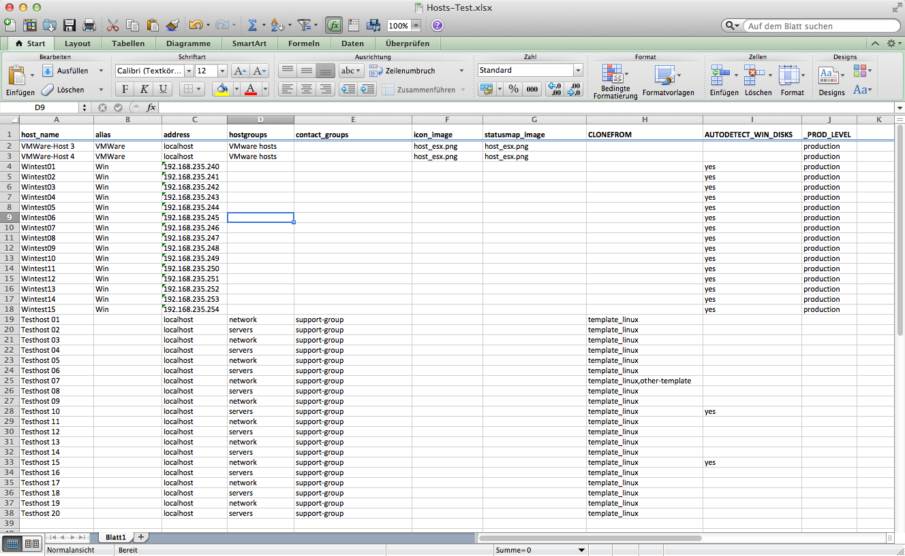

# Host-import via Excel with service objects cloning and auto-detection of disks

This how-to is shipped as a courtesy to op5 customers. Contents of this how-to is not supported by op5 support.

# op5Monitor-Excel-Import 

This program is intended to bulk-import hosts into a op5 Monitor installation using the op5 Monitor's HTTP API. It reads an Excel-file (.xlsx format, introduced in Excel 2007) line-by-line. The first line is interpreted as the header line. The headings have to conclude with Naemon/Nagios Core's host object attribute names, such as "address", "alias", "hostgroups", "parents", ... in order to create the host objects. Each column of the Excel file has to use either one of the below listed header captions as a heading or one of the following special headings:

-   a custom host variable in the `_VARIABLENAME` form
-   the word `CLONEFROM`
-   the word `AUTODETECT_WIN_DISKS`

Even if the heading is defined for a certain column, you can leave the cell empty for one of several hosts. In this case the script will act as if the corresponding column would not exist at all.



# Command line arguments

-   `-h, --help` print this help messages
-   `-d, --debug` print very detailed debugging information on the screen while executing program
-   `-s, --save` Save all changes to op5 Monitor API after executing the program
-   `-S, --saveonly` ONLY save changes. Intended to be used to save changes issued by the script when executing it without the "--save" parameter
-   `-c <config_file>, --config <config_file>` specify the configuration file to use. Default is to search for one in the path /opt/api-scripts/api-scripts.config.yml
-   `-x <Excel-File>, --excelfile <Excel-File>` specify the Excel-File needed to feed this program with informations about the hosts to add to op5 Monitor.
-   `-o, --overwrite-existing `overwrite objects in case they already exist. The default behavior is to skip these objects.

# Excel file column headers

The script is meant to be installed directly on the op5 Monitor host. This means, the Excel file generated by the customer has to be transferred to the op5 Monitor server.

## Scalar column headers

The following header captions can be used for scalar type attributes. These attributes can contain a single string or number as an value. Please note Excel's behavior of automatically reformatting strings when an inappropriate cell formatting is set. Especially, IP addresses tend to get misformatted when using the "standard" cell formatting in Excel (it is recommended to use "Text" as cell formatting instead).

-   `host_name`
-   `alias`
-   `address`
-   `action_url`
-   `icon_image`
-   `statusmap_image`
-   `template`
-   `check_command`
-   `max_check_attempts`
-   `check_interval`
-   `retry_interval`
-   `check_period`
-   `notification_interval`
-   `notification_period`
-   `display_name`
-   `check_command_args`
-   `freshness_threshold`
-   `event_handler`
-   `event_handler_args`
-   `low_flap_threshold`
-   `high_flap_threshold`
-   `first_notification_delay`
-   `icon_image_alt`
-   `notes`
-   `notes_url`

The only required attributes that have to be to be in order to create a host correctly, are the "host\_name" and "address" attributes.

## Array-style column headers

Some of the header captions can be used for multi-value options. Every of the cells may contain a single word or value, but also a list of values, separated by commas. This way, for example you can add two host groups by using the "network,servers" notation. The array-style column headers are the following ones:

-   `hostgroups`
-   `flap_detection_options`
-   `parents`
-   `contact_groups`
-   `notification_options`
-   `children`
-   `contacts`
-   `stalking_options`

None of these attributes are required.

## BOOLean column headers

Some of the host object attributes that can be used as headings for the columns in the Excel file are
booleans. They can have a "true" or a "false" value. You can use the content "1", "true" or "yes" as a value to set the cell to "true", all other content will set the cell to "false" and an empty cell will make the script NOT pass this attribute to op5 Monitor which means that the default value will be used. The following header captions are the booleans:

-   `active_checks_enabled`
-   `passive_checks_enabled`
-   `event_handler_enabled`
-   `flap_detection_enabled`
-   `process_perf_data`
-   `retain_status_information`
-   `retain_nonstatus_information`
-   `notifications_enabled`
-   `obsess`
-   `obsess_over_host`
-   `check_freshness`

None of these attributes are required.

# Cloning of service checks from specific hosts

If the special word `CLONEFROM` is found as a header for any of the columns and the value of the corresponding cell for the specific host that is to be added is set to "true", "1" or "yes", all service check objects that are directly attached to the host object(s) defined in the `CLONEFROM` cell for the specific host (comma-notation can be used to list several source hosts) are cloned to the newly created host.

Please note that only `DIRECTLY` attached service objects are cloned, not those that are attached to a host group object to which the host object belongs.

# Automatic detection and adding of Windows Disk usage checks

If the special word `AUTODETECT_WIN_DISKS` is found as a header for any of the columns and the value of the corresponding cell for the specific host that is to be added is set to "true", "1", or "yes", the host object's address will be connected through the "`check_nrpe`" check plugin to ask the NSClient++ agent on the remote Windows host for available Windows disk drives (C:, D: etc.) that are of type "fixed" (normal hard drives, no CDROMs etc.). For each of the disk drives detected on the remote host, a corresponding service check is automatically added.

Please note that this feature starts the NRPE client locally. Master/Poller environments are not (yet) supported. If the monitored Windows host is not directly reachable via check\_nrpe from the machine where this program is installed, the automatic detection and adding of Disk Drive service checks will not work.

# Configuration File

By default, the configuration file is searched in the path */opt/api-scripts/api-scripts.config.yml*. The
configuration file is a representation of a hash data structure, noted in the YAML format. The default configuration file looks as follows:

**config file**

``` {.bash data-syntaxhighlighter-params="brush: bash; gutter: true; theme: Confluence" data-theme="Confluence" style="brush: bash; gutter: true; theme: Confluence"}
---
op5api:
  server: localhost
  user: monitor
  password: monitor
  authentication_realm: op5 Monitor API Access
  ssl_verify_hostname: false
excel_import:
  check_nrpe_path: /opt/plugins/check_nrpe
  check_nrpe_use_ssl: false
  windows_disk_checks:
    check_command: check_nrpe_win_drivesize
    service_description: Disk %s utilization
    check_command_args: Drive=%s MaxWarn=80% MaxCrit=90%
    template: default-service
```

The configuration values should be self-explaining. Under the `op5api` section the credentials and server address of the op5 Monitor installation is configured. The `excel_import` section configures all specific options for this program to work. Under the sub-section `windows_disk_checks` the options for the automatically added Windows Disk Usage service checks are set.

# Program installation

## RPM installation (on CentOS/RHEL/APS)

You can use the *op5Monitor-Excel-Import-\<VERSION\>-installer.tar.gz* package to do a one-step installation:

Just unpack the file somewhere on your APS/Linux, change into the created directory and execute the `./install.sh` script.

A local repository containing the needed additional rpm files (Perl modules) is automatically created. Afterwards the script's rpm file is installed under */opt/api-scripts*.

## Manual installation

If you have a CentOS installation with enabled EPEL repositories, you can just pick the rpm file and do a `yum localinstall`.

In any other case you can use the distribution tarball *op5Monitor-Excel-Import-\<VERSION\>.tar.gz.* You will have to take care about the dependencies yourself and make sure the following Perl modules are installed on your system:

-   LWP
-   JSON::PP
-   URI::Escape
-   Getopt::Long
-   YAML
-   List::MoreUtils
-   Spreadsheet::XLSX
-   Text::Iconv
-   File::Basename

# Download

-   Latest release via git: git clone <https://github.com/op5/op5Monitor-Excel-Import>
-   Example Excel file to use: [Hosts-Example.xlsx](attachments/7176286/7471114.xlsx)
-   Installer package including all dependencies: [op5Monitor-Excel-Import-0.4.2-installer.tar.gz](https://github.com/op5/op5Monitor-Excel-Import/raw/master/distribution/op5Monitor-Excel-Import-0.4.2-installer.tar.gz)
-   RPM file for manual installation: [op5Monitor-Excel-Import-0.4.2-1.el6.noarch.rpm](https://github.com/op5/op5Monitor-Excel-Import/raw/master/distribution/op5Monitor-Excel-Import-0.4.2-1.el6.noarch.rpm)
-   Distribution tarball: [op5Monitor-Excel-Import-0.4.2.tar.gz](https://github.com/op5/op5Monitor-Excel-Import/raw/master/distribution/op5Monitor-Excel-Import-0.4.2.tar.gz)

 

