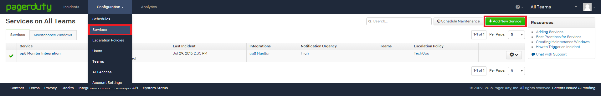
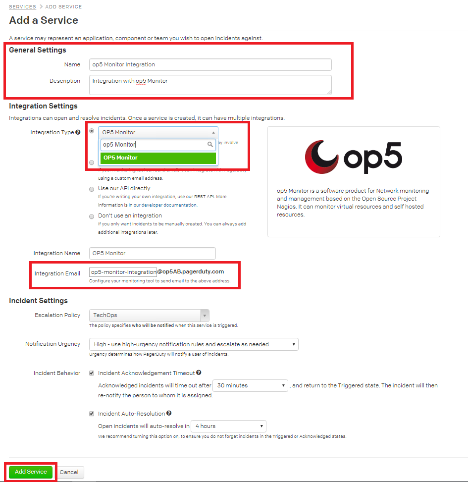
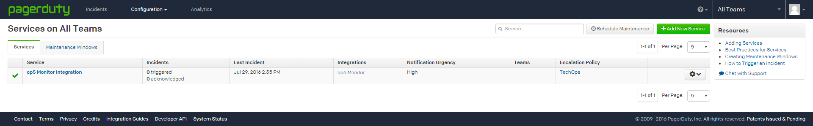
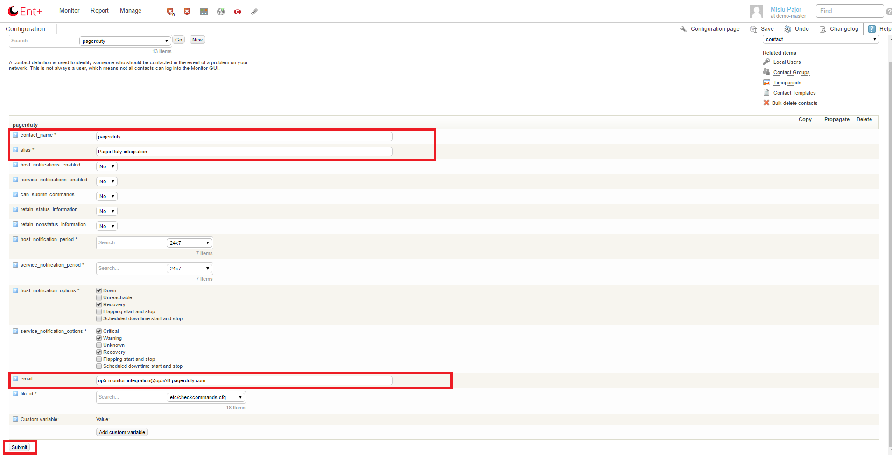

# How to Integrate OP5 with PagerDuty

Support information

This article was written for version 7.2.9 of OP5 Monitor, it could work on both lower and higher version if nothing else is stated. The PagerDuty integration and it's dependencies are third-party add ons and is not officially supported by OP5 AB.  If you need a supported integration between OP5 Monitor and PagerDuty please [contact us!](https://www.op5.com/about/contact-us/)

By integrating PagerDuty into your existing OP5 Monitoring solution, you can have OP5 Monitor alerts go directly to the the right person who can solve the issue.

## In PagerDuty

1. From the **Configuration** menu select **Services**
2. Click on **+Add New Service** button
    
3. Fill in a name and description in the **General Section**. (eg. "op5 Monitor Integration" and description "Integration with OP5 Monitor")
4. Select **OP5 Monitor** in the **Integration Type** drop down menu.
5. Make a note of the integration Email that will be automatically filled in for you. This is the email we will be using to integrate OP5 Monitor with PagerDuty in the next upcoming steps.
    
6. Now press **Add Service** to save your service and you will be presented with the below on your screen. That's all on PagerDuty, let's move on to create a contact in OP5 Monitor where we will be using that** Integration Email** you noted down in step 5.
    

## In OP5 Monitor

Now, in order to tie PagerDuty with OP5 Monitor we will be creating a PagerDuty contact in OP5 Monitor. The contact will have the **Integration Email** you noted down earlier set to it.

1. From the **Manage** menu select **Configuration** and click on **Contacts**
2. Create a new contact, give it a name, alias and set the email to the **Integration Email** you noted down. In this *example* I'll use <op5-monitor-integration@op5AB.pagerduty.com> (ps. do not use this email, use the one you noted down in step 5.)
3. Press **Submit** and proceed with saving your changes.
    
4. Finally, in order for OP5 Monitor to forward alerts to PagerDuty we must assign this newly created contact to a host or specific services.
5. That's all. You should now start seeing incidents in PagerDuty as soon as OP5 Monitor generates an alert. If you want to simulate an alert then consider using the check\_dummy check command on a service.
