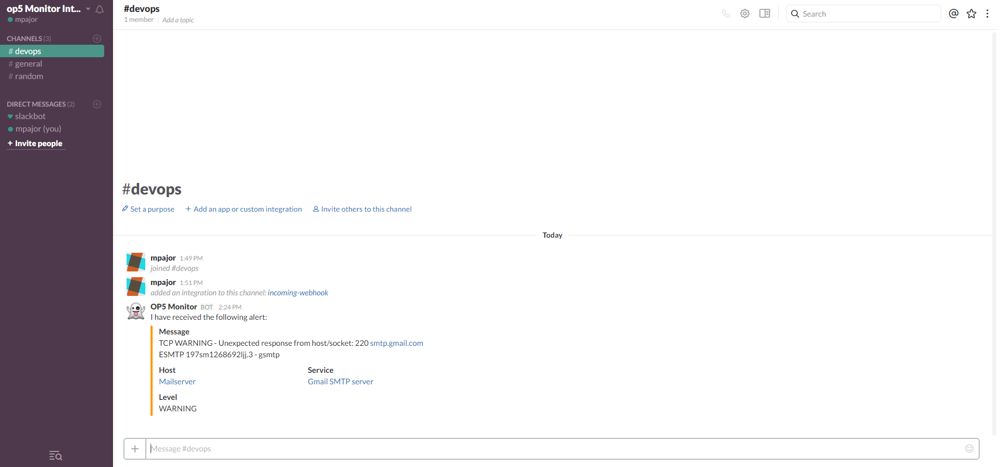
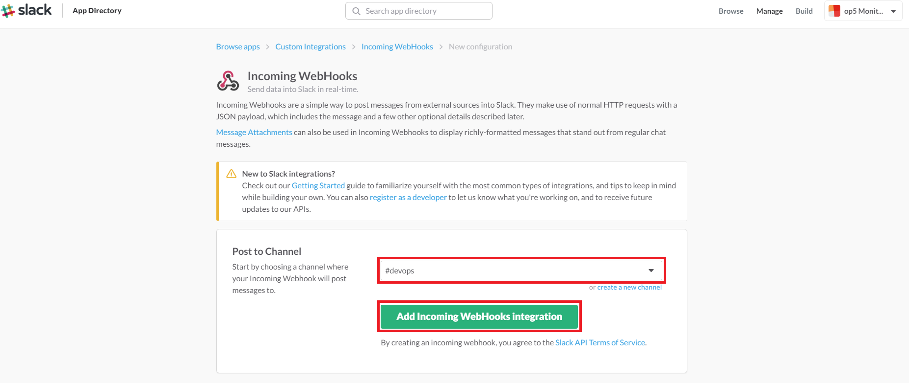
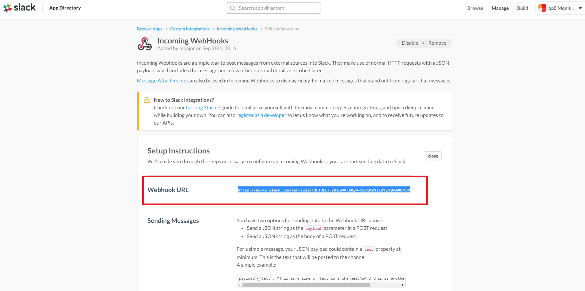
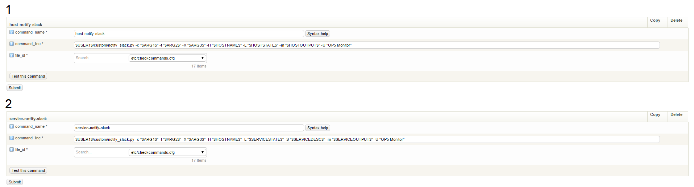

# How to Integrate OP5 with Slack

Support information

This article was written for version 7.2.9 of OP5 Monitor, it could work on both lower and higher version if nothing else is stated. The Slack integration and it's dependencies are third-party add ons and is not officially supported by OP5 AB.  If you need a supported integration between OP5 Monitor and Slack please [contact us!](https://www.op5.com/about/contact-us/)

By integrating Slack into your existing OP5 Monitoring solution, you can have OP5 alerts sent directly to your teams Slack channel. See the screenshot below for the end result.

## Screenshots

 



 

## In Slack

1.  Go to <https://api.slack.com/apps?new_app=1>
2.  Create a *Incoming WebHook* and tie it to your teams channel, like for example \#devops
    
3.  Make a note of the Webhook URL, this is your token we will be using later.
    

## In OP5 Monitor

Now, in order to tie Slack with OP5 Monitor we will need to configure the following:

1.  Uploading the slack plugin onto your OP5 server
2.  Create check commands (host-notify-slack and service-notify-slack)
3.  Create a Slack contact

### Uploading the Slack plugin onto your OP5 server

Upload the plugin **[notify\_slack.py](attachments/18317692/18481451.py)** attached in this article to your OP5 server(s) into the directory: **/opt/plugins/custom/**

Change the permissions on the notify\_slack.py file to 744, by issuing the command: chmod 744 /opt/plugins/custom/notify\_slack.py

### Create check commands (host-notify-slack and service-notify-slack)

The slack integration is tied to check commands, that is later tied to your Slack contact we will be creating in the last step.

1.  From the **Manage** menu select **Configuration** and click on **Commands**
2.  Configure two check commands, one named host-notify-slack and service-notify-slack with the settings as described below**
    **

 

``` {.bash data-syntaxhighlighter-params="brush: bash; gutter: false; theme: Confluence" data-theme="Confluence" style="brush: bash; gutter: false; theme: Confluence"}
host-notify-slack
command_name: host-notify-slack
command_line: $USER1$/custom/notify_slack.py -c "$ARG1$" -t "$ARG2$" -X "$ARG3$" -H "$HOSTNAME$" -L "$HOSTSTATE$" -m "$HOSTOUTPUT$" -U "OP5 Monitor"

service-notify-slack
command_name: service-notify-slack
command_line: $USER1$/custom/notify_slack.py -c "$ARG1$" -t "$ARG2$" -X "$ARG3$" -H "$HOSTNAME$" -L "$SERVICESTATE$" -S "$SERVICEDESC$" -m "$SERVICEOUTPUT$" -U "OP5 Monitor"
```

 



### Create a Slack contact

1.  From the **Manage** menu select **Configuration** and click on **Contacts**
2.  Create a new contact, give it a name like for example: Slack
3.  Set host\_notification\_cmds, host\_notification\_cmds\_args and service\_notification\_cmds, service\_notification\_cmds\_args as described below.

 

 

``` {.bash data-syntaxhighlighter-params="brush: bash; gutter: false; theme: Confluence" data-theme="Confluence" style="brush: bash; gutter: false; theme: Confluence"}
host_notification_cmds: host-notify-slack
host_notification_cmds_args: "<#channel>"!"<token/webhook_url>"!"https://url-to-op5"
 
service_notification_cmds: service-notify-slack
service_notification_cmds_args: "<#channel>"!"<token/webhook_url>"!"https://url-to-op5"
 
Here's an example from our OP5 Monitor environment:
host_notification_cmds: host-notify-slack
host_notification_cmds_args: "#devops"!"https://hooks.slack.com/services/TXXXX/B2XXXX/EflrMrZTNlOKEbXXXXXXR"!"https://demo.op5.com"
 
service_notification_cmds: service-notify-slack
service_notification_cmds_args: "#devops"!"https://hooks.slack.com/services/TXXXX/B2XXXX/EflrMrZTNlOKEbXXXXXXR"!"https://demo.op5.com"
```

 

# **That's it!**

Finally, in order for OP5 Monitor to forward alerts to Slack you must assign the "Slack" contact you created earlier as a contact to a host or specific services.

