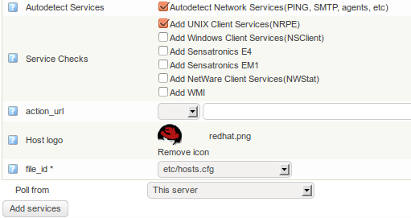
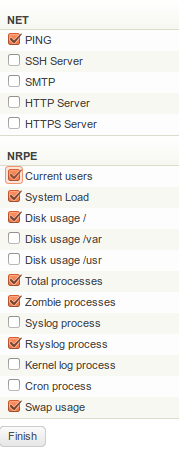

# How to Monitor Redhat Enterprise Linux Server (RHEL)

The purpose of this article is to describe how [op5 Monitor](http://www.op5.com/network-monitoring/op5-monitor/) can be used  for monitoring of a RHEL server. We will write some examples of basic monitoring and show you how to continue and monitor more.

## Watch the HOWTO video:

Click to watch monitoring of Linux servers with OP5 Monitor

**Monitoring Linux servers with OP5 Monitor:**

In this video we will give you a quick tour covering Linux server and application monitoring. OP5 Monitor provides you the ability to keep an eye on various aspects of the Linux ecosystem such as KVM virtual machines, the JBOSS application server, MySQL databases and things like disk usage, system load, available updates and similar. OP5 Monitor is a great fit for Linux monitoring since it’s built on top of flexible and proven open source software.

Prerequisites

Download NRPE client from our [download area](http://www.op5.com/download-op5-monitor/agents/) and install it on your server. You can follow the installation [manual](http://www.op5.com/manuals/extras/op5_NRPE_2.7_manual.pdf "NRPE manual")even if it’s not written for the version of NRPE you run.

## Adding the server and basic checks

Now are you ready to add your new RHEL server to OP5 Monitor.

Login to your OP5 Monitor and go to *‘Configure’ -\> ‘Add New hosts’*

Fill in all information about your server and  in the *‘Service Checks’* section, select ‘*Add UNIX Client Services(NRPE)’.* Then click on *‘Add services’.  *This will scan your server for some basic checks.

In the next window you will get a list of services. Choose ‘*Select all’* or individuals depending of your needs. Then click on *‘Finish’.
*

Network checks “Net”  example

- Ping
- SSH Server
- HTTP Server
- HTTPS Server
- MySQL

NRPE agent checks example

- Current users
- System load
- Disk usage
- Total processes
- Zombie Processes
- Rsyslog Process
- Swap usage

* *

Press Finish to save your changes.

Done

Note: You may need to do minor changes to the services you add, depending on how your server is configured.

## Additional checks

There are many checks and plugins from OP5 or Nagios Exchange community that could meet your needs. On op5.com you can find many resources like manuals, FAQ’s, webcasts and how-to’s on how to efficiently monitor a range of various hardware, services or applications in your Redhat environment.

### Some resources examples

JMX aplication server: [Jboss Monitoring with check\_jmx](Jboss_Monitoring_with_check_jmx)

HP/Compaq servers: [Monitoring HP/Compaq servers](Monitoring_HP_Compaq_servers)

RHEV 2: [How to monitor a KVM installation](How_to_monitor_a_KVM_installation)

IPMI sensor: [How to Monitor a Server with Enhanced IPMI sensor](How_to_Monitor_a_Server_with_Enhanced_IPMI_sensor)

Webinject: [Monitoring websites with webinject](Monitoring_websites_with_webinject)

FAQ – search for: [Redhat](https://kb.op5.com/dosearchsite.action?queryString=Redhat%20AND%20RHEL%20OR%20%22Red%20Hat%22&startIndex=0&where=FAQ)

op5 supported plugins: [Plugins](https://kb.op5.com/display/PLUGINS)

## Inspiration

If you are in need of some inspiration we recommend you to browse our [live demo-environment](https://demo.op5.com/monitor/index.php/default/show_login). The live demo reflects an real environment that is currently in production.

## Need assistance?

Please do not hesitate to contact our support if you have any questions or feedback in regards to the how-to’s or plug-ins.
