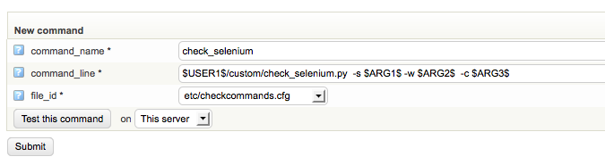
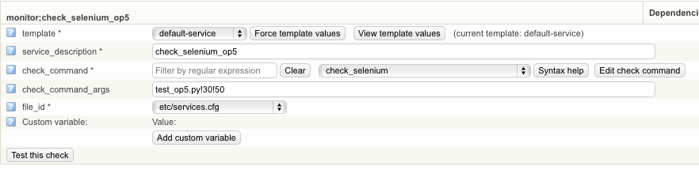
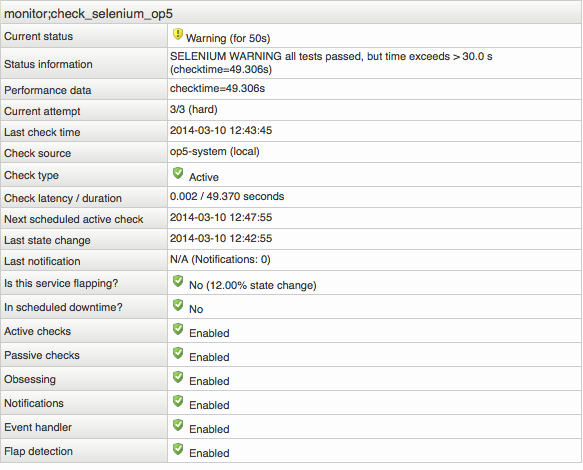

# How to add Selenium tests to OP5 Monitor

Version

This article was written for version 6.2 of OP5 Monitor, it could work on both lower and higher version if nothing else is stated. The OP5 Monitor 6.2 appliance was downloaded from [www.op5.com](http://www.op5.com.). This article also assumes that you have installed the OP5 license so that you have access to the OP5 repos. Articles in the Community-Space are not supported by OP5 Support.

# Purpose

Selenium automates browsers. It is for automating web applications for testing purposes, but is certainly not limited to just that.

# Prerequisites

-   Basic knowledge about Linux systems. 
-   Basic knowledge about Selenium. Needed to run automated web browser tests.  <http://docs.seleniumhq.org/docs/>
-   Basic knowledge about Xvfb. Needed to run firefox without a graphical environment. <http://en.wikipedia.org/wiki/Xvfb>
-   Firefox with selenium IDE plugin (not on OP5 Monitor). This is used to record and save selenium tests. <http://docs.seleniumhq.org/docs/>
-   Installed OP5 license.
-   Internet access. 
-   SSH and root access to the OP5 Monitor system.
-   Ongoing monitoring of the OP5 Monitor system's CPU and memory resources. Unlike ordinary service checks, Selenium tests will use a lot of memory and CPU resources.

# Install and configure necessary packages on OP5 Monitor

### Download and install java openjdk-1.8.0.

Used to run the selenium-server jar file.

``` {.bash data-syntaxhighlighter-params="brush: bash; gutter: false; theme: Confluence" data-theme="Confluence" style="brush: bash; gutter: false; theme: Confluence"}
yum install -y java-1.8.0
```

### Download the Selenium-Server jar file.

This jar file is the selenium-server itself.

``` {.bash data-syntaxhighlighter-params="brush: bash; gutter: false; theme: Confluence" data-theme="Confluence" style="brush: bash; gutter: false; theme: Confluence"}
mkdir -p /opt/plugins/custom/selenium/tests
curl https://selenium-release.storage.googleapis.com/2.53/selenium-server-standalone-2.53.1.jar -o /opt/plugins/custom/selenium/selenium-server-standalone.jar
```

### Download and install Xvfb.

You do not need a graphical to run selenium test when using Xvfb.

 

``` {.bash data-syntaxhighlighter-params="brush: bash; gutter: false; theme: Confluence" data-theme="Confluence" style="brush: bash; gutter: false; theme: Confluence"}
yum install -y xorg-x11-server-Xvfb
```

 

### Download and install Firefox.

Used together with Xvfb and selenium to start Firefox with a virtual display.

``` {.bash data-syntaxhighlighter-params="brush: bash; gutter: false; theme: Confluence" data-theme="Confluence" style="brush: bash; gutter: false; theme: Confluence"}
yum install -y firefox
```

### Download the init scripts for selenium and Xvfb.

Create two new files in the /etc/init.d/ directory called xvfb and selenium containing the script data found below.

**xvfb**  Expand source

``` {.bash data-syntaxhighlighter-params="brush: bash; gutter: true; theme: Confluence; collapse: true" data-theme="Confluence" style="brush: bash; gutter: true; theme: Confluence; collapse: true"}
#!/bin/bash
#
# Thanks to Dan Straw
# http://www.danstraw.com/ #
# listOfProcesses   Start Xvfb
# chkconfig: 2345 95 05
# description: Starts Xvfb, needed by Selenium
# processname: Xvfb
### BEGIN INIT INFO
# Provides: Xvfb
# Required-Start:
# Required-Stop:
# Default-Start: 2 3 4 5
# Default-Stop: 0 1 6
# Short-Description: Xvfb
# Description:      Xvfb
### END INIT INFO
XVFB=/usr/bin/Xvfb
XVFBARGS=":99 -nolisten tcp -fbdir /var/run"
PIDFILE=/var/run/xvfb.pid
case "$1" in
    start)
        echo -n "Starting virtual X frame buffer: Xvfb"
        nohup $XVFB $XVFBARGS &
    ;;
    stop)
        echo -n "Stopping virtual X frame buffer: Xvfb"
        pkill -9 Xvfb
        echo "."
    ;;
    restart)
        $0 stop
        $0 start
    ;;
    *)
        echo "Usage: /etc/init.d/xvfb {start|stop|restart}"
        exit 1
esac
exit 0
```

 

**selenium**  Expand source

``` {.bash data-syntaxhighlighter-params="brush: bash; gutter: true; theme: Confluence; collapse: true" data-theme="Confluence" style="brush: bash; gutter: true; theme: Confluence; collapse: true"}
#!/bin/bash
#
#
### BEGIN INIT INFO
# Provides: selenium
# Required-Start: $local_fs $network $syslog selenium
# Required-Stop: $local_fs $syslog
# Default-Start: 2 3 4 5
# Default-Stop: 0 1 6
# Short-Description: Selenium
# Description:       Selenium
### END INIT INFO
export CLASSPATH=/opt/plugins/custom/selenium
case "${1:-''}" in
'start')
        nohup env DISPLAY=:99 /usr/bin/java -jar /opt/plugins/custom/selenium/selenium-server-standalone.jar > /var/log/selenium/selenium-output.log 2> /var/log/selenium/selenium-error.log &
        echo "Starting Selenium..."
#####env DISPLAY=:0.0 firefox &
env DISPLAY=:99 firefox &
        error=$?
        if test $error -gt 0
        then
            echo "${bon}Error $error! Couldn't start Selenium!${boff}"
        fi
    ;;
    'stop')
        echo "Stopping Selenium..."
pkill -9 java
pkill -9 firefox
    ;;
    *)      # no parameter specified
        echo "Usage: $SELF start|stop|restart|reload|force-reload|status"
        exit 1
    ;;
esac
```

Make sure that the files are executable.

``` {.bash data-syntaxhighlighter-params="brush: bash; gutter: false; theme: Confluence" data-theme="Confluence" style="brush: bash; gutter: false; theme: Confluence"}
chmod 755 /etc/init.d/selenium
chmod 755 /etc/init.d/xvfb
```

### Create log directory for Selenium

``` {.bash data-syntaxhighlighter-params="brush: bash; gutter: false; theme: Confluence" data-theme="Confluence" style="brush: bash; gutter: false; theme: Confluence"}
mkdir /var/log/selenium
```

### Download the Python based selenium plugin. 

This plugin is run by OP5 Monitor.

``` {.bash data-syntaxhighlighter-params="brush: bash; gutter: false; theme: Confluence" data-theme="Confluence" style="brush: bash; gutter: false; theme: Confluence"}
wget -O check_selenium.tar.gz https://exchange.icinga.org/exchange/check_selenium.py/files/526/check_selenium.tar-gz
tar -xzvf check_selenium.tar.gz
mv check_selenium.py /opt/plugins/custom
```

### Change test case directory

The path to the directory storing the selenium test case files is set in the *check\_selenium.py* check plugin script.

Edit the file */opt/plugins/custom/check\_selenium.py* using a text editor.

Locate the test\_dir variable definition and update it like this:

``` {.bash data-syntaxhighlighter-params="brush: bash; gutter: false; theme: Confluence" data-theme="Confluence" style="brush: bash; gutter: false; theme: Confluence"}
test_dir="/opt/plugins/custom/selenium/tests"
```

### Download and install the python selenium module.

Used by the check\_selenium.py plugin.

``` {.bash data-syntaxhighlighter-params="brush: bash; gutter: false; theme: Confluence" data-theme="Confluence" style="brush: bash; gutter: false; theme: Confluence"}
yum install python-pip
pip install selenium==2.53.1
```

### Add xvfb and selenium start at boot.

If for whatever reason you decide to reboot OP5 Monitor.

``` {.bash data-syntaxhighlighter-params="brush: bash; gutter: false; theme: Confluence" data-theme="Confluence" style="brush: bash; gutter: false; theme: Confluence"}
chkconfig --add /etc/init.d/xvfb
chkconfig --level 2345 xvfb on
chkconfig --add /etc/init.d/selenium
chkconfig --level 2345 selenium on
```

### Start xvfb and then selenium.

``` {.bash data-syntaxhighlighter-params="brush: bash; gutter: false; theme: Confluence" data-theme="Confluence" style="brush: bash; gutter: false; theme: Confluence"}
/etc/init.d/xvfb start
/etc/init.d/selenium start
```

# How to create test cases used by OP5 Monitor

Download and install the selenium IDE plugin for firefox from <http://release.seleniumhq.org/selenium-ide/2.5.0/selenium-ide-2.5.0.xpi>

You can do this on any machine running firefox in a graphical environment and then move the recordings to the OP5 Monitor.

When you have recorded what you want to test go to File -\> Export Test Case As -\> Python 2 / unittest / Remote Control and save the file.

Copy the file to OP5 Monitor and to your test\_dir directory, default located at /opt/plugins/custom/selenium/tests/.

# Configuring OP5 Monitor to use the plugin and test case.

### Add the command on OP5 Monitor

-   Configure -\> Commands
-   command\_name = check\_selenium
-   command\_line = \$USER1\$/custom/check\_selenium.py  -s \$ARG1\$ -w \$ARG2\$  -c \$ARG3\$ 

-   Submit and then save the configuration.



### Add the service on OP5 Monitor

-           Configure -\> Edit host monitor -\> Go -\> Services for host monitor 
-            service description = check\_selenium\_op5 (a description related to what sort of test is performed)
-            check\_command = check\_selenium
-            check\_command\_args = script\_name!sec-warn!sec-crit
-            Submit and then save the configuration.



### What it looks like in OP5 Monitor



### Troubleshooting and help

If you have trouble getting the headless browser (i.e. Firefox) to work, try typing (in shell) export DISPLAY=:99 and manually re-run the test. If that works, add the following line (after imports) to your check\_selenium.py

    os.environ["DISPLAY"] = ":99"

If your monitor servers has a proxy but your tests are to a system that needs to bypass the proxy, try prepending you manual check command in shell with http\_proxy="" , if that works, add the following line (after imports) to your check\_selenium.py

    os.environ["http_proxy"] = ""

 

