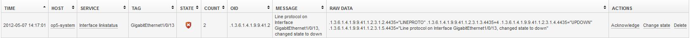

# How to configure OP5 Trapper Extension (Cisco handler)

The purpose of this document is to describe how to configure OP5 Trapper. In the example below we show you how to do this for Cisco devices but can be used as a template for other devices as well or be extended to handle additional types and events.

## Prerequisites

-   OP5 Monitor with OP5 Trapper Extension
-   A Cisco device configured to send traps to OP5 Monitor and with trap type set as "syslog"

 

To Configure a Cisco device to send traps to OP5 Monitor and with type "syslog" as covered in this example do the following:

 

``` {.bash data-syntaxhighlighter-params="brush: bash; gutter: false; theme: Confluence" data-theme="Confluence" style="brush: bash; gutter: false; theme: Confluence"}
# snmp-server enable traps
# snmp-server host monitor-server-ip public snmp syslog
```

 

## OP5 Monitor and OP5 Trapper configuration:

-   #### OP5 Monitor:

Create a destination host and service for your traps, this service need to be added manually for this example to work. You also need to disable active checks as traps are handled as passive results from trapper.

In this example trap-handler (rule) we have a host called "op5-system" which has a service named "Interface linkstatus".

 

-   #### Trapper Extension:

Log on to your server using ssh and create the directory where you will place your rules:

``` {.bash data-syntaxhighlighter-params="brush: bash; gutter: false; theme: Confluence" data-theme="Confluence" style="brush: bash; gutter: false; theme: Confluence"}
# mkdir /opt/trapper/share/addons/cisco-syslog
```

 

Next we'll create a file containing our trapper-handler in your favorite editor, we use "vi" in this example:

``` {.bash data-syntaxhighlighter-params="brush: bash; gutter: false; theme: Confluence" data-theme="Confluence" style="brush: bash; gutter: false; theme: Confluence"}
# vi /opt/trapper/share/addons/cisco-syslog/cisco-syslog.lua
```

 

Paste the following code to our newly created file:

``` {.bash data-syntaxhighlighter-params="brush: bash; gutter: false; theme: Confluence" data-theme="Confluence" style="brush: bash; gutter: false; theme: Confluence"}
-- Handle result.host in a few different ways, uncomment the one that suits you best
-- trap.host as FQDN and you only want to use hostname from the string:
-- result.host = string.match(trap.host, '^([%w-%d]+)%.') or trap.host
-- trap.host ha FQDN and you only want hostname as well as to use UPPERCASE as configured in Monitor:
-- result.host = string.gsub(string.match(trap.host,'^([%w-%d]+)\.'), '%l+', string.upper)
-- trap host as FQDN and this is how you defined your hosts in Monitor.
result.host = trap.host
log('Trap from: ' .. trap.host)
log('Resulting host: ' .. result.host)
for k, v in pairs(trap.fields) do
    if string.match(k,'^\.1\.3\.6\.1\.4\.1\.9\.9\.41\.1\.2\.3\.1\.3\.(%d+)$') then
    log('Trap severity is: ' .. tostring(v))
        if v == 8 or v == 7 or v == 6 then
            result.state = STATE.OK
        elseif v == 5 then
            result.state = STATE.WARNING
        elseif v == 4 or v == 3 or v == 2 or v == 1 then
            result.state = STATE.CRITICAL
        end
        log('Severity to state: ' .. result.state)
    elseif string.match(k,'^\.1\.3\.6\.1\.4\.1\.9\.9\.41\.1\.2\.3\.1\.4\.(%d+)$') then
    log('Trap type is: ' .. tostring(v))
        if v == "UPDOWN" then
            result.service = "Interface linkstatus"
        elseif v == "DUPLEX_MISMATCH" then
            result.service = "Interface duplex status"
        elseif v == "LOOPGUARD_UNBLOCK" or v == "LOOPGUARD_BLOCK" then
            result.service = "Spanning tree notification"
        elseif v == "CONFIG_I" then
            result.service = "Config changes"
        elseif v == "CPUHOG" or v == "STATE" then
            result.service = "IPSLA notification"
        elseif v == "ALLDEADSERVER" or v == "SESSION_STATUS" or v == "STACK_LINK_CHANGE" or v == "PING_CONFLICT" or v == "VTP_PRIMARY_SERVER_CHG" or v == "DOMAINMISMATCH" or v == "THRESHOLD_VIOLATION" or v == "PKT_REPLAY_ERR" or v == "SPANTREE" then
            result.service = "All traps"
        else
            result.service = "All traps"
        end
        log('Result service is: ' .. result.service)
    elseif string.match(k,'^\.1\.3\.6\.1\.4\.1\.9\.9\.41\.1\.2\.3\.1\.5\.(%d+)$') then
        local message = v
        log('Trap message is: ' .. message)
        result.message = message
        if string.find(v,'[%u%l+]+Ethernet[%d+/%d+/%d+]+') then
            result.tag = (string.sub(v, string.find(v,'[%u%l+]+Ethernet[%d+/%d+/%d+]+')))
        elseif
            string.find(v,'%u%l[%d+/%d+/%d+]+') then
            result.tag = (string.sub(v, string.find(v,'%u%l[%d+/%d+/%d+]+')))
        else
            result.tag = "default"
        end
        log('Tag matching: ' .. result.tag)
    end
end
```

And save your handler-file with :wq

*Note: This handler, when loaded in OP5 Trapper will match all traps of the type (Cisco Syslog MIB) and set severity in Monitor as stated in our rule (severity 1-4 we set as CRITICAL, 5 as WARNING and 6-8 as OK-state)*

 

Now we need to tell OP5 trapper to create our handler:

``` {.bash data-syntaxhighlighter-params="brush: bash; gutter: false; theme: Confluence" data-theme="Confluence" style="brush: bash; gutter: false; theme: Confluence"}
# /opt/trapper/bin/traped create handler cisco-syslog
```

 

Update the handler from the file we created earlier:

``` {.bash data-syntaxhighlighter-params="brush: bash; gutter: false; theme: Confluence" data-theme="Confluence" style="brush: bash; gutter: false; theme: Confluence"}
# /opt/trapper/bin/traped update cisco-syslog < /opt/trapper/share/addons/cisco-syslog/cisco-syslog.lua
```

 

To verify your handler was created simply use the command "list handlers":

``` {.bash data-syntaxhighlighter-params="brush: bash; gutter: false; theme: Confluence" data-theme="Confluence" style="brush: bash; gutter: false; theme: Confluence"}
# /opt/trapper/bin/traped list handlers
cisco-syslog
```

*Note: At this stage we have our handler loaded but it will not match on any incoming traps yet so we need to tell trapper which trap-OIDs should be associated with this handler (In most cases you probably have several handlers for different types of devices)*

 

Create a bind between the trap OID and our cisco-syslog handler:

``` {.bash data-syntaxhighlighter-params="brush: bash; gutter: false; theme: Confluence" data-theme="Confluence" style="brush: bash; gutter: false; theme: Confluence"}
# /opt/trapper/bin/traped bind .1.3.6.1.4.1.9.9.41.2* cisco-syslog
```

 

And verify that your handler is associated correctly:

``` {.bash data-syntaxhighlighter-params="brush: bash; gutter: false; theme: Confluence" data-theme="Confluence" style="brush: bash; gutter: false; theme: Confluence"}
# /opt/trapper/bin/traped list matches
.1.3.6.1.4.1.9.9.41.2*          cisco-syslog
```

 

Next restart trapper:

``` {.bash data-syntaxhighlighter-params="brush: bash; gutter: false; theme: Confluence" data-theme="Confluence" style="brush: bash; gutter: false; theme: Confluence"}
# service processor restart
# service collector restart
```

 

Now when you have your handler loaded it's time to test it!

``` {.bash data-syntaxhighlighter-params="brush: bash; gutter: false; theme: Confluence" data-theme="Confluence" style="brush: bash; gutter: false; theme: Confluence"}
# snmptrap -c public -v 2c demo.op5.com "" .1.3.6.1.4.1.9.9.41.2 .1.3.6.1.4.1.9.9.41.1.2.3.1.2.4435 s "LINEPROTO" .1.3.6.1.4.1.9.9.41.1.2.3.1.3.4435 i "4" .1.3.6.1.4.1.9.9.41.1.2.3.1.4.4435 s "UPDOWN" .1.3.6.1.4.1.9.9.41.1.2.3.1.5.4435 s "Line protocol on Interface GigabitEthernet1/0/13, changed state to down"
```

 

Take a look in the OP5 Trapper view in Monitor, you should see a new line as in the screenshot below:



 

This handler has a lot of logging enabled by default so we can follow how a trap is handled (/var/log/messages)

``` {.bash data-syntaxhighlighter-params="brush: bash; gutter: false; theme: Confluence" data-theme="Confluence" style="brush: bash; gutter: false; theme: Confluence"}
Jun 26 11:42:08 demo-master trapper-processor: Received SNMP trap with OID: .1.3.6.1.4.1.9.9.41.2
Jun 26 11:42:08 demo-master trapper-processor: SNMP trap matches handler: cisco-syslog
Jun 26 11:42:08 demo-master trapper-processor: Trap from: demo.op5.com
Jun 26 11:42:08 demo-master trapper-processor: Resulting host: switch1-sth
Jun 26 11:42:08 demo-master trapper-processor: Trap type is: UPDOWN
Jun 26 11:42:08 demo-master trapper-processor: Result service is: Interface linkstatus
Jun 26 11:42:08 demo-master trapper-processor: Trap severity is: 4
Jun 26 11:42:08 demo-master trapper-processor: Severity to state: 2
Jun 26 11:42:08 demo-master trapper-processor: Trap message is: Line protocol on Interface GigabitEthernet1/0/13, changed state to down
Jun 26 11:42:08 demo-master trapper-processor: Tag matching: GigabitEthernet1/0/13
Jun 26 11:42:08 demo-master trapper-processor: SNMP trap handler executed.
Jun 26 11:42:08 demo-master trapper-processor: The state of Interface linkstatus at switch1-sth is now CRITICAL
Jun 26 11:42:08 demo-master trapper-processor: Message: Line protocol on Interface GigabitEthernet1/0/13, changed state to down
Jun 26 11:42:08 demo-master trapper-processor: Context is {}
```

Log explained in more detail:

-   Received SNMP trap with OID: .1.3.6.1.4.1.9.9.41.2
    -   Trap OID
-   SNMP trap matches handler: cisco-syslog
    -   Matched handler
-   Trap from: demo.op5.com
    -   Trap sending device or host (info from trap-daemon)
-   Resulting host: switch1-sth
    -   device to host mapping (if other than trap.host)
-   Trap type is: UPDOWN
    -   Trap type (Cisco syslog)
-   Result service is: Interface linkstatus
    -   Trap type to service mapping
-   Trap severity is: 4
    -   Actual severity in the original trap
-   Severity to state: 2
    -   How we translate trap-severity to OP5 Monitor severity (0=OK, 1=WARNING, 2=CRITICAL, 3=UNKNOWN)
-   Trap message is: Line protocol on Interface GigabitEthernet1/0/13, changed state to down
    -   Trap message
-   Tag matching: GigabitEthernet1/0/13
    -   Not covered in this howto, please see trapper manual. 
-   SNMP trap handler executed.
-   The state of Interface linkstatus at switch1-sth is now CRITICAL
    -   OP5 Monitor status change (and not just trapper state change for a specific "tag")
-   Message: Line protocol on Interface GigabitEthernet1/0/13, changed state to down
    -   Resulting status output in OP5 Monitor.

 

If we take a look in OP5 Monitor log files /opt/monitor/var/nagios.log you will see the result submitted by trapper to Monitor and the service will be updated with the actual status:

 

``` {.bash data-syntaxhighlighter-params="brush: bash; gutter: false; theme: Confluence" data-theme="Confluence" style="brush: bash; gutter: false; theme: Confluence"}
[1331841880] EXTERNAL COMMAND: PROCESS_SERVICE_CHECK_RESULT;op5-system;SNMP Traps and Notifications;1;duplex mismatch discovered on FastEthernet0/7 (not full duplex), with op5-system.op5.com GigabitEthernet0/1 (full duplex).
```

*Note: If you see a message below this line saying something similar to “host could not be found/host missing/unknown host” or “service missing/unknown” the problem is most likely caused by the hostname resolved by trapper is not configured in OP5 Monitor or it could be configured using a different name.*

