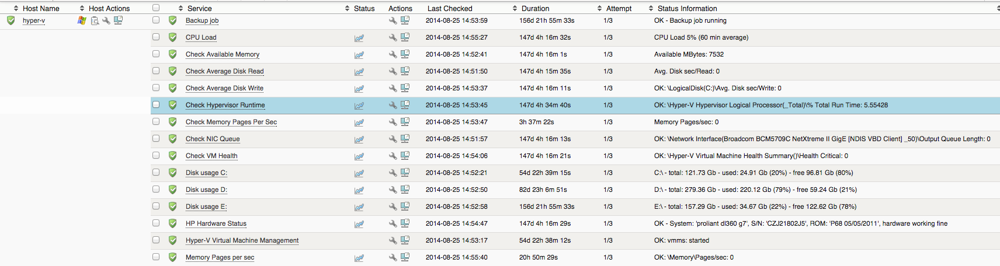

# How to monitor Microsoft Hyper-V

This article describes how to monitor Microsoft Hyper-V.

## Prerequisites

For this how-to to work you need the latest OP5 NSClient++ installed on your Hyper-V server.

## Firewall settings

First off we need to change the firewall settings to allow ICMP ping.

Open cmd on the Windows server and execute:

 

``` {.bash data-syntaxhighlighter-params="brush: bash; gutter: false; theme: Confluence" data-theme="Confluence" style="brush: bash; gutter: false; theme: Confluence"}
netsh advfirewall firewall add rule name="ICMPv4 Inbound" dir=in action=allow enable=yes profile=any localip=any remoteip=any protocol=icmpv4:8,any interfacetype=any edge=yes
```

 

    Another way is to do the host-check with check_nt_clientversion instead which fetches the version of NSClient++ instead of checking ICMP Ping.

## Standard check

First of all we need to monitor the OS as usual:

-   Disk Usage
-   CPU
-   Memory (see below)
-   Swap

## Services

The following Windows services needs to be monitored. Note that all services may not be used depending on the functions that you are using in your Hyper-V environment.

-   Hyper-V Image Management Service (vhdsvc)
-   Hyper-V Virtual Machine Management (vmms)
-   Hyper-V Networking Management Service (nvspwmi)

## Performance Counters

These performance counters will give a you good monitoring of your hypervisor. To monitor guest CPU and memory usage and such, install the agent on the virtual machine and monitor it as any other server.

### check\_vm\_health

**command**: check\_nrpe\_win\_counter

**Arguments**: \\\\Hyper-V Virtual Machine Health Summary()\\\\Health Critical!!MaxCrit=1

**Comment**: Check how many virtual machines that is in critical state. My recommendation is to skip the warning threshold and just use the critical (Therefore the double exclamation marks in the argument).

### check\_perf\_avg\_disk\_read

**command: **check\_nrpe\_win\_counter

**Arguments**: \\\\LogicalDisk(C:)\\\\Avg. Disk sec/Read!MaxWarn=15!MaxCrit=25

**Comment**: System disk + disks with guest needs to be monitored.

-   1ms to 15ms = Healthy
-   15ms to 25ms = Warning or Monitor
-   26ms or greater = Critical, performance will be adversely affected

### check\_perf\_avg\_disk\_write

**command:** check\_nrpe\_win\_counter

**Arguments**: \\\\LogicalDisk(C:)\\\\Avg. Disk sec/Write!MaxWar=15!MaxCrit=25

**Comment**: System disk + disks with guest needs to be monitored, the example is for C:, copy the check and replace C: with the guest disk.

-   1ms to 15ms = Healthy
-   15ms to 25ms = Warning or Monitor
-   26ms or greater = Critical, performance will be adversely affected

### check\_perf\_nic\_queue

**command**: check\_nrpe\_win\_counter

**Arguments**: \\\\Network Interface(Broadcom BCM5709C NetXtreme II GigE [NDIS VBD Client] \_50)\\\\Output Queue Length!MaxWarn=1!MaxCrit=3

**Comment**: The instance name (in this example “Broadcom BCM5709C NetXtreme II GigE [NDIS VBD Client] \_50″ needs to be changed to the network interface instance name of your server, check performance counters for the correct name. This checks the output queue on the NIC.

### check\_perf\_memory\_pages\_per\_sec

**Command**: check\_nrpe\_win\_counter

**Arguments**: \\\\Memory\\\\Pages/sec!MaxWarn=500!MaxCrit=1000

****Comment: ****

-   Less than 500 = Healthy
-   500 – 1000 = Monitor or Caution
-   Greater than 1000 = Critical, performance will be adversely affected

### check\_nrpe\_win\_memory\_physical

**Command**: \$USER1\$/check\_nrpe -H \$HOSTADDRESS\$  -c CheckMem -a ShowAll=long type=physical \$ARG1\$

**Arguments**: MaxWarn=50% MaxCrit=75%

**Comment:** This check command is not in the default setup and has to be created. The check returns the amount of available physical memory in percentage.

-   50% of free memory available or more = Healthy
-   25% of free memory available = Monitor
-   10% of free memory available = Warning
-   Less than 5% of free memory available = Critical, performance will be adversely affected

### check\_perf\_hyperv\_hypervisor\_runtime

 

**Command**: check\_nrpe\_win\_counter

**Arguments**: \\\\Hyper-V Hypervisor Logical Processor(\_Total)\\\\% Total Run Time!MaxWarn=60!MaxCrit=90



## Read more

[Microsoft Hyper-V Monitoring](http://technet.microsoft.com/en-us/library/cc768535%28BTS.10%29.aspx "microsoft hyper-v monitoring link")

[More from MS](http://blogs.msdn.com/b/tvoellm/archive/2009/04/23/monitoring-hyper-v-performance.aspx "microsoft blog on monitoring hyper-v") about monitoring Hyper-V

 

