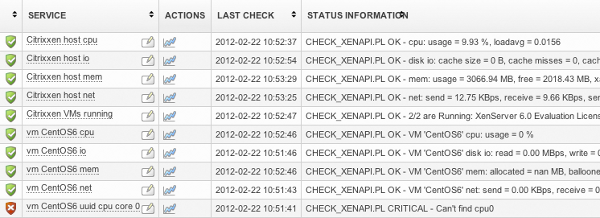

# How to monitor a Citrix XenServer Cluster

The purpose of this article is to describe how-to set up agentless monitoring of a Citrix XenServer using [op5 Monitor](http://www.op5.com/network-monitoring/op5-monitor/). The plugin uses the XEN API to communicate with the XenServer so no changes to the server has to be made.

Through the plugin we can check the following parameters on the host and virtual servers running in the XEN environment.

**Session specific parameters:**

- list hosts
- pool(s) state
- VMs state

**Host specific **parameters**:**

- cpu (total, per core)
- memory
- disk I/O
- network I/O
- VM(s) running on this host
- time difference

**VM specific **parameters**:**

- cpu (total, core)
- memory(allocated, ballooned, internal)
- disk I/O
- network I/O

## Prerequisites

- Make sure you have the latest OP5 plugin package installed. To verify this simply do a “yum update” when logged in to OP5 Monitor via SSH.
- Create a common *user* on your hosts. It will be used by the plugin to communicate with the XEN API on your hosts.
- Add the master host in your cluster environment to OP5 Monitor. All checks in this how-to will ask the master host.
    *Note:* If you need to monitor VMs that is not running on the master host, also add the host that the VM is running on to the OP5 Monitor and add the VM checks to that host.
- Host address in OP5 Monitor must be the IP of the server.

## Check commands

Add the required check commands in your configuration (‘Configure’ -\> ‘Commands’ -\> ‘Add new command‘ -\> ‘Go’).

**Commands for the cluster**

<table>
<colgroup>
<col width="50%" />
<col width="50%" />
</colgroup>
<tbody>
<tr class="odd">
<td align="left"><strong>command_name</strong>
<strong>command_line</strong></td>
<td align="left">check_xenapi_list_host
$USER1$/check_xenapi.pl -S $HOSTADDRESS$ -u $ARG1$ -p $ARG2$ -l listhost</td>
</tr>
</tbody>
</table>

**Commands for the hosts**

<table>
<colgroup>
<col width="50%" />
<col width="50%" />
</colgroup>
<tbody>
<tr class="odd">
<td align="left"><strong>command_name</strong>
<strong>command_line</strong></td>
<td align="left">check_xenapi_host_cpu
$USER1$/check_xenapi.pl -S $HOSTADDRESS$ -u $ARG1$ -p $ARG2$ -H $ARG3$ -l cpu -w $ARG4$ -c $ARG5$</td>
</tr>
</tbody>
</table>

**Commands for the VMs**

<table>
<colgroup>
<col width="50%" />
<col width="50%" />
</colgroup>
<tbody>
<tr class="odd">
<td align="left"><strong>command_name</strong>
<strong>command_line</strong></td>
<td align="left">check_xenapi_vm_cpu
$USER1$/check_xenapi.pl -S $HOSTADDRESS$ -u $ARG1$ -p $ARG2$ -N $ARG3$ -l cpu -w $ARG4$ -c $ARG5$</td>
</tr>
</tbody>
</table>

*Note:*

- It is possible to use the VMs UUID instead of the *name *(short hostname). Add “-U” after “-N \$ARG1\$” and use the UUID as ARG1, ie. ” -N 9789ff86-c909-36a1-0d3d-149fd18c0898 -U”
- For more commands options and details, look at the plugin help.

## Adding the services

Add the required services that you need, (‘Configure’ -\> ‘Host: ‘ -\> ‘Go’ -\> ‘Services for host ‘ -\> ‘Add new service’ -\> ‘Go’):

Please note that these arguments are just examples, you need to adjust them to suite your environment.

**Services for cluster, global**

<table>
<colgroup>
<col width="33%" />
<col width="33%" />
<col width="33%" />
</colgroup>
<tbody>
<tr class="odd">
<td align="left"><strong>service_description</strong>
<strong>check_command</strong>
<strong>check_command_args</strong></td>
<td align="left">host list
 check_xenapi_list_host
username!password</td>
<td align="left">host pool
 check_xenapi_list pool
username!password</td>
</tr>
</tbody>
</table>

**Services for the hosts**

<table>
<colgroup>
<col width="33%" />
<col width="33%" />
<col width="33%" />
</colgroup>
<tbody>
<tr class="odd">
<td align="left"><strong>service_description</strong>
<strong>check_command</strong>
<strong>check_command_args</strong></td>
<td align="left">host1 cpu
check_xenapi_host_cpu
username!password!host1!80!90</td>
<td align="left">host1 core 0
check_xenapi_host_cpu_core
username!password!host1!0!80!90</td>
</tr>
</tbody>
</table>

**Services for VMs**

<table>
<colgroup>
<col width="33%" />
<col width="33%" />
<col width="33%" />
</colgroup>
<tbody>
<tr class="odd">
<td align="left"><strong>service_description</strong>
<strong>check_command</strong>
<strong>check_command_args</strong></td>
<td align="left">vm1 cpu
check_xenapi_vm_cpu
username!password!vm1!80!90</td>
<td align="left">vm1 disk io
check_xenapi_vm_io
username!password!vm1</td>
</tr>
</tbody>
</table>

Save your configuration.

Here is an example of how these checks will look like in production.

## Remarks

This plugin is still under development. More checks will be added. Please send your feedback on [op5 users mailing list.](http://www.op5.com/support/knowledge-base/mailing-list/ "op5 user mailinglist")

All checks have been tested on Citrix XenServer cluster v5.5 and 6.0.

You can see this plugin in use on our [demo](http://demo.op5.com/ "online demo OP5 Monitor") site.
