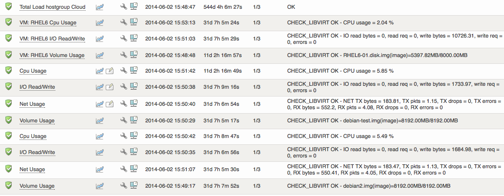

# How to monitor a XEN installation

## Purpose

The purpose of this article is to describe how [op5 Monitor](http://www.op5.com/network-monitoring/op5-monitor/) can be used with the [check\_libvirt](https://kb.op5.com/display/PLUGINS/check_libvirt) plugin for agentless monitoring of resource usage on a XEN installation (excluding Citrix XEN server environment). At the moment the plugin can monitor cpu, memory, disk I/O, network I/O on the guest VM and VM count, storage pool and pool volume on the target host.

## Prerequisites

-   libvirt drivers need to be installed and running on both the op5 monitor server and on the target XEN host(s).
-   The plugin support several transport protocols but ssh is the preferred and will be used in this How-To. You need to setup a password-less communication for the user ‘monitor’ and the user that you will use for the communication between the op5 monitor server and the target XEN host(s).
-   Update op5 Monitor to get the latest plugin packet containing the check\_libvirt plugin.

## Check commands

Add the required check-commands in your configuration (‘Configure’ -\> ‘Commands’ -\> ‘Add new command‘ -\> ‘Go’).

Commands for guest VM’s

command\_name

command\_line

check\_libvirt\_xen\_guest\_cpu

\$USER1\$/check\_libvirt -H xen+ssh://\$ARG1\$@\$HOSTADDRESS\$ -N \$ARG2\$ -l CPU

check\_libvirt\_xen\_guest\_disk\_io

\$USER1\$/check\_libvirt -H xen+ssh://\$ARG1\$@\$HOSTADDRESS\$ -N \$ARG2\$ -l IO

check\_libvirt\_xen\_guest\_mem

\$USER1\$/check\_libvirt -H xen+ssh://\$ARG1\$@\$HOSTADDRESS\$ -N \$ARG2\$ -l MEM

check\_libvirt\_xen\_guest\_net\_io

\$USER1\$/check\_libvirt -H xen+ssh://\$ARG1\$@\$HOSTADDRESS\$ -N \$ARG2\$ -l NET

### Commands for XEN host server

command\_name

command\_line

check\_libvirt\_xen\_host\_running

\$USER1\$/check\_libvirt -H xen+ssh://\$ARG1\$@\$HOSTADDRESS\$ -l LIST

check\_libvirt\_xen\_host\_storage\_pool

\$USER1\$/check\_libvirt -H xen+ssh://\$ARG1\$@\$HOSTADDRESS\$ -l POOL -s \$ARG2\$

check\_libvirt\_xen\_host\_volume

\$USER1\$/check\_libvirt -H xen+ssh://\$ARG1\$@\$HOSTADDRESS\$ -l VOLUME -s \$ARG2\$/\$ARG3\$

check\_libvirt\_xen\_host\_volume\_all

\$USER1\$/check\_libvirt -H xen+ssh://\$ARG1\$@\$HOSTADDRESS\$ -l VOLUME

Note: \$ARG1\$ macro in the command\_line to refer to the user you will use to connect to the XEN host server, the \$HOSTADDRESS\$ refer to the XEN host and the \$ARG2\$ refer to the guest VM-name.

## Adding the services

Some services examples:

Add the required services that you need, (‘Configure’ -\> ‘Host: ‘ -\> ‘Go’ -\> ‘Services for host ‘ -\> ‘Add new service’ -\> ‘Go’):

Please note that these arguments are just examples, you need to adjust them to suite your environment.

### Services for guest VM

service\_description

check\_command

check\_command\_args

Note

VM dell-sth1 CPU Usage

check\_libvirt\_xen\_guest\_cpu

root!dell-sth1

\*

VM dell-sth1 Mem Usage

check\_libvirt\_xen\_guest\_mem

root!dell-sth1

\*

VM dell-sth1 Disk IO Usage

check\_libvirt\_xen\_guest\_disk\_io

root!dell-sth1

\*

VM dell-sth1 Net Usage

check\_libvirt\_xen\_guest\_net\_io

root!dell-sth1

\*

### Services for XEN host server

service\_description

check\_command

check\_command\_args

Note

xen-sth storage pool usage

check\_libvirt\_xen\_host\_storage\_pool

root!default

\*

xen-sth dell-sth1 volume usage

check\_libvirt\_xen\_host\_volume

root!dell-sth1!default

\*

xen-sth all volume usage

check\_libvirt\_xen\_host\_volume\_all

root

\*

xen-sth running vm list

check\_libvirt\_xen\_host\_running

root

\*

\* Note: No warning or critical arguments are used in these examples. The plugin does however support thresholds.

## How it looks like in monitor

## Remarks

-   These check command has been tested on CentOS v5.5 and XEN v3.0 installation. It should work with other installations but some minor changes may be needed.
-   Critrix XEN server does not support libvirt. More information about Citrix XEN can be found here: [How to monitor a Citrix XenServer Cluster](How_to_monitor_a_Citrix_XenServer_Cluster)

## Read more

 <http://www.libvirt.org/drvxen.html>

