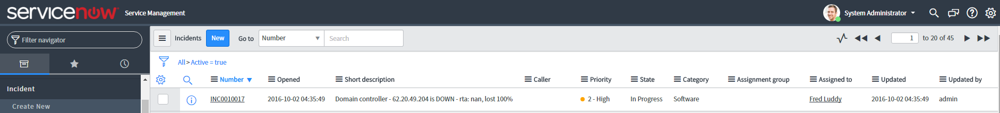
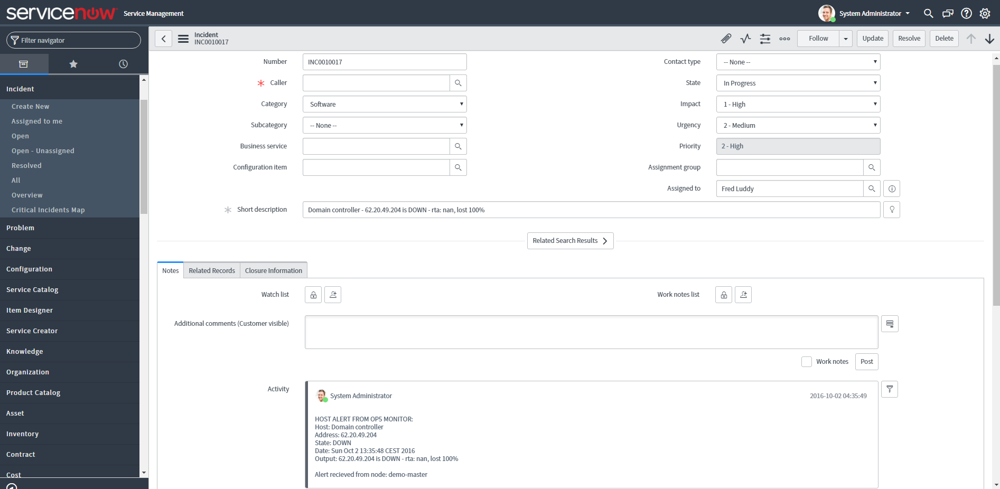
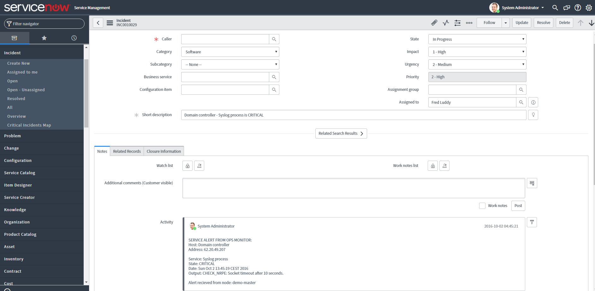
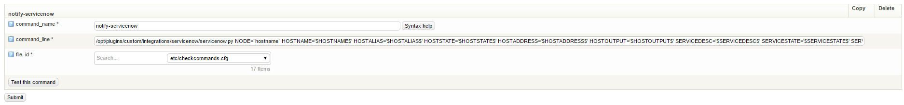

# How to one-way integrate OP5 with ServiceNow

Support information

This article was written for version 7.2.9 of OP5 Monitor and Servicenow Helsinki, it could work on both lower and higher version if nothing else is stated. The ServiceNow integration, the integration pack and it's dependencies are third-party add ons and is not officially supported by OP5 AB.  If you need a supported integration between OP5 Monitor and ServiceNow please [contact us!](https://www.op5.com/about/contact-us/)

 

This integration will enhance ServiceNow incidents with valuable and business critical information. OP5 will automatically create and populate ServiceNow incidents with information that will help you to determinate the root cause of the alert.

It is advised that this integration is used in combination with op5's** Business service management** functionality where focus is on the health and performance of critical business processes such as sales, order processing, production and payroll and how they are connected to underlying IT infrastructure. Instead of just focusing on the status of your server monitoring, printer monitoring, network monitoring, or other technical components. 

**Screenshots:**

Overview of incident created by OP5 Monitor:



Detailed host information for host alerts in the incident:



Detailed service information for service alerts in the incident:



## In OP5 Monitor

In order to tie ServiceNow with OP5 Monitor we will need to configure the following:

1.  Upload the ServiceNow integration pack to your OP5 server
2.  Install python module dependencies 
3.  Configure the integration pack with your settings
4.  Create a check command (notify-servicenow)
5.  Create a ServiceNow contact

 

### Upload the ServiceNow integration pack to your OP5 server

Upload the [ServiceNow Integration Pack](attachments/17664036/18481463.gz) that is attached in this article to your OP5 server(s) into the directory: **/opt/plugins/custom/integrations/servicenow/** - create the directory if needed.

 

### Install python module dependencies

Login as root to your OP5 server and run the following commands in the terminal in order to install the required dependencies:

``` {.bash data-syntaxhighlighter-params="brush: bash; gutter: false; theme: Confluence" data-theme="Confluence" style="brush: bash; gutter: false; theme: Confluence"}
# yum install python-pip
# pip install requests
# pip install pysnow
```

 

### Configure the integration pack with your settings

The integration pack comes with a file named config.py, after uploading this file is located in /opt/plugins/custom/integrations/servicenow/config.py.

Open up the configuration file and set your ServiceNow credentials and other settings that may be of interest, here's an example of the configuration file:

``` {.bash data-syntaxhighlighter-params="brush: bash; gutter: false; theme: Confluence" data-theme="Confluence" style="brush: bash; gutter: false; theme: Confluence"}
servicenow_settings = dict(
    instance = 'devxxx', # the instance name without .service-now.com. This becomes devxxx.service-now.com
    username = 'admin',
    password = 'somepassword'
)

servicenow_fields = dict(
    caller = 'Fred Luddy', # the caller who should be assigned, can be removed/left empty
    category = 'Software', # the category the incidents should be placed in
    location = 'OP5 Monitor', # the location, can be removed/left empty
    severity = '2', # the severity of all incidents sent from OP5
    priority = '1',# the priority of all incidents sent from OP5
    urgency = '2', # the urgency of all incidents sent from OP5
    impact = '1', # the impact of all incidents sent from OP5
    assigned_to = 'Fred Luddy' # the assignee for all incidents, can be removed/left empty
)
```

 

### Create a check command (notify-servicenow)

The ServiceNow integration is dependant on one check command, that is later tied to your ServiceNow contact we will be creating in the last step.

1.  From the **Manage** menu select **Configuration** and click on **Commands**
2.  Create one check command named notify-servicenow with the settings as described below

``` {.bash data-syntaxhighlighter-params="brush: bash; gutter: false; theme: Confluence" data-theme="Confluence" style="brush: bash; gutter: false; theme: Confluence"}
notify-servicenow
command_name: notify-servicenow
command_line: /opt/plugins/custom/integrations/servicenow/servicenow.py NODE=`hostname` HOSTNAME='$HOSTNAME$' HOSTALIAS='$HOSTALIAS$' HOSTSTATE='$HOSTSTATE$' HOSTADDRESS='$HOSTADDRESS$' HOSTOUTPUT='$HOSTOUTPUT$' SERVICEDESC='$SERVICEDESC$' SERVICESTATE='$SERVICESTATE$' SERVICEOUTPUT='$SERVICEOUTPUT$' LONGDATETIME='$LONGDATETIME$'
```



 

### Create a ServiceNow contact

1.  From the **Manage** menu select **Configuration** and click on **Contacts**
2.  Create a new contact, give it a name like for example: ServiceNow
3.  Set host\_notification\_cmds and service\_notification\_cmds as described below

``` {.bash data-syntaxhighlighter-params="brush: bash; gutter: false; theme: Confluence" data-theme="Confluence" style="brush: bash; gutter: false; theme: Confluence"}
host_notification_cmds: notify-servicenow
service_notification_cmds: notify-servicenow
```

# **That's it!**

# Finally, in order for OP5 Monitor to forward alerts as incidents in ServiceNow you must assign the "ServiceNow" contact you created earlier as a contact to a host or specific services.

