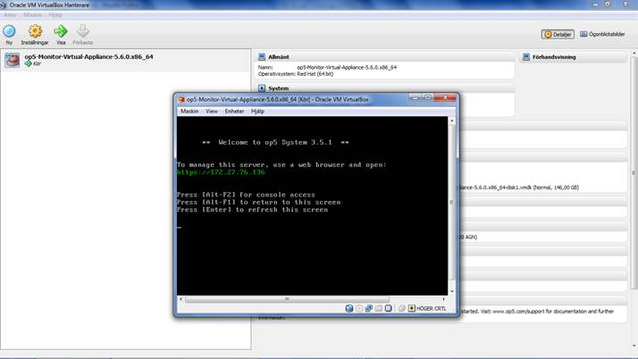

# How to run OP5 Monitor on a Windows PC

Follow these steps to set up OP5 Monitor on a Windows PC. Make sure you are logged in to op5.com, otherwise the download section will not allow you to download the virtual image.

1) Download Virtual Box from:<https://www.virtualbox.org/wiki/Downloads>

2) Select the latest version of”VirtualBox for Windows hosts x86/amd64″

3) Download our Virtual Appliance, Monitor Free from our download section: <http://www.op5.com/get-op5-monitor/download/>

4) Select category “op5 Monitor”,  select OS “Virtual Server (free)” and Arch “x86\_64″

5) Install Virtual Box on any PC with Microsoft Windows

6) Unzip the Virtual Appliance into a Monitor Folder on your PC

7) Start Virtual Box and import the Monitor Virtual Appliance

8) Once the import is complete a screen like this will be shown:

9) Type in the ip address shown in your web browser and log in. You will be prompted to create an account with administrator privileges the first time you access OP5 Monitor.
