# How to succeed with wireless monitoring

-   -   [Preamble](#Howtosucceedwithwirelessmonitoring-Preamble)
-   [Terminology](#Howtosucceedwithwirelessmonitoring-Terminology)
-   [Implementation](#Howtosucceedwithwirelessmonitoring-Implementation)
-   [Monitoring](#Howtosucceedwithwirelessmonitoring-Monitoring)
    -   [Interface Monitoring](#Howtosucceedwithwirelessmonitoring-InterfaceMonitoring)
    -   [Connected Clients](#Howtosucceedwithwirelessmonitoring-ConnectedClients)
    -   [Log Monitoring](#Howtosucceedwithwirelessmonitoring-LogMonitoring)

## Preamble

This document intends to give a basic overview of the common problems with wireless networks. What problems that may occur when administrating  wireless solutions and what to monitor in wireless networks, followed by an example on how to setup a baseline monitoring for a wireless access point.

Today wireless networks are a vital part of a business infrastructure side by side with physical networks and servers. As more devices are connected to the company network, (Laptops, mobile phones, tablets  etc) and as the term Bring your own device (BYOD) gets more common it becomes more important to keep track on the utilization of the wireless network to be able to work proactivly to prevent failures and see bottlenecks in time.

This is a living document and will be updated or reorganized when more content is collected.

This document is a community howto, and is not supported by op5 Support

 

## Terminology

 Client – A wireless device, such as a laptop or tablet, also referred to as host

WAP – Wireless Access Point

Service – Representation of a point of measure in op5 Monitor

Plugin – Small piece of software used by a Check Command to fetch data to a service

Check Command and check command args – The call for execution of a Plugin with certain parameters and settings

op5 Logserver Extension – Centralized logserver used for collecting logs and make them searchable with filters, and to integrate with op5 Monitor

Log filter – Condition based rule to match against incoming logs

## Implementation

 When implementing a new wireless network a site survey should be made to ensure the connectivity, signal blocking by walls, SNR, and Noise generated by surrounding sources in the environment. There are a lot of documentation out there regarding implementing wireless networks, and this article will not cover that.

## Monitoring

 This section will go through some monitoring that can be easily implemented  on a wireless access point to ensure its operational status. There is a lot of measurements that can be done and this text will only cover the baseline with the following parameters:

-   Ping
-   Interface status, errors and traffic (Physical and radio)
-   Connected Clients
-   Failed Authentications

The most basic is of course to check if the device is online and powered on, for that we use a simple PING-check. In op5 Monitor this is the first check that is automatically  added to every host. This document will not go through this step, please refer to [op5 Monitor Administration Manual.](http://op5.com/manuals/)

### Interface Monitoring

 To monitor the interfaces is one of the most basic steps to check on a network device. This gives you the possibility to measure and notify on spikes in traffic. Monitoring the usage on a interface in general makes it possible to do capacity planning before the usage hits the roof. We will also monitor unusual amount of errors/discards, and to check if a interface is up on both the physical interfaces, and since Cisco creates a virtual interface for VLAN’s we can also monitor interface statistics per  VLAN-interface.

So, lets add some interface monitoring.

Use the searchbox to find your device, and click “Go”


When you have entered the configuration page for the host, use the “Related items” menu on your right to “Scan for SNMP interfaces”

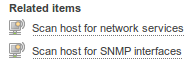

This will give you a menu where you enter your SNMP Community and SNMP version. Select 2c if available on the device. Your selected host is already defined in the “Hosts to scan”-list.

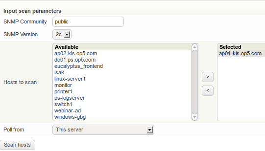

Hit the “Scan hosts” button to do a interface scan of the device.

This will give you a list of active interfaces on that device as shown below, both physical interfaces and per VLAN, if using a Cisco device.

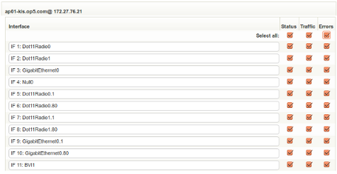

Hit “Add selected services” when you have chosen what interfaces to monitor: 

This will give you information about the number of added services:  

Hit the floppy icon  in the top right corner to save your configuration. This is the first step of a configuration save which is a sanity check of the configuration you have entered. This will give a summary with changelog on your configuration changes.

Select “Yes, save” in this next dialogue.

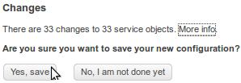

Now, use the search box in the top right corner to find your host with your newly added services


Now you have interface monitoring on all the interfaces on your AP.

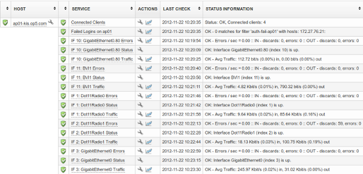

### Connected Clients

 To measure the amount of connected clients can also be a way to be proactive and be able to react before the amount of clients hits the max number of connected clients on your device. The following plugin measures both the 2.4Ghz and the 5Ghz band.

This data is also possible to fetch via snmp via specific OID’s. The difference is that this plugin does a calculation and gives a total summary for both 2.4 and 5Ghz bands.

In this example we use Cisco Aironet 1040 that has a max amount connected clients of 25, so we want to give a warning if we get close to this value.

The plugin check\_cisco\_aironet\_clients used in this example can be found [here](http://exchange.nagios.org/directory/Plugins/Network-Connections%2C-Stats-and-Bandwidth/check_cisco_aironet_clients/details). It is created in perl and should run on any linux distribution with the right dependencies installed, as listed below:

-   perl-Net-MAC
-   perl-Net-Telnet (Dependency of perl-Net-Telnet-Cisco)
-   perl-Net-Telnet-Cisco

To install these on op5 Appliance 6 or CentOS 6 you can download the dependencies from here [cisco-aironet-dependencies.tar.gz](attachments/688559/5242977.gz)

Now when you have all the dependencies on your local computer they must be moved to your op5 Monitor server. SCP is my preferred way of moving files to and from \*NIX systems as it is included in the most distributions and has clients for both Windows and Mac.

My favourite client for windows is WinSCP, that can be found [here](http://winscp.net/eng/download.php).

When these files are on your op5 Monitor server you need to move the plugin file to the correct directory and install the dependencies.

Login via ssh as root and issue the following commands to do this:

``` {.bash data-syntaxhighlighter-params="brush: bash; gutter: false; theme: Confluence" data-theme="Confluence" style="brush: bash; gutter: false; theme: Confluence"}
tar xvzf cisco-aironet-dependencies.tar.gz
perl-Net-MAC-1.5-1.el6.rf.noarch.rpm
perl-Net-Telnet-3.03-2.el6.rfx.noarch.rpm
perl-Net-Telnet-Cisco-1.10-1.2.el6.rf.noarch.rpm

rpm -ivh perl-Net-*
mv check_cisco_aironet_clients.pl /opt/plugins/custom 
chmod +x /opt/plugins/custom/check_cisco_aironet_clients.pl
```

 

Now when the plugin is in place and the dependencies is installed properly let’s add a check to op5 Monitor to give some data from this check with some nice graphs, and thresholds for warning and critical.

Go to the configuration page in the menu, select “Commands” and copy-paste the following:

command\_name:

     check_cisco_aironet_clients

check\_command:

     $USER1$/custom/check_cisco_aironet_clients.pl -H $HOSTADDRESS$ -U $ARG1$ -P $ARG2$ -C -w $ARG3$ -c $ARG4$

Press “Submit” and hit the floppy  in the top right corner, and “Yes, save”.

Now, let’s  put our newly created checkcommand to use, mark  the search box as earlier to find your host, hit the wrench to get to the configuration interface

Press “Services for host”  to get to the interface for services.

Fill in the following values:

-   service\_description: Connected Clients
-   check\_command: check\_cisco\_aironet\_clients
-   check\_command\_args: user!password!warn!crit
    -   This should be your username, password, warning and critical thresholds. As mentioned before the max clients for this device is 25 simultaneous clients. You should change this to what your device supports.

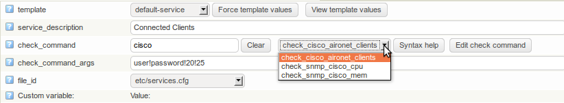

Press “Submit”, the floppy in the top right corner, and “Yes, save”.

Now, back to the status page for the host via the searchbox, and you will have something similar to this to display after some performance data has been gathered.

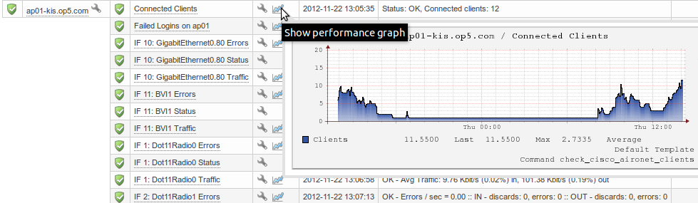

### Log Monitoring

 A great source of information is the system log of a device, since I have not found any usable counter for SNMP to fetch the data from failed authentication tries, so I will get this from the log of the device, which is forwarded to op5 Logserver for easy monitoring.

This section will not cover the configuration of the WAP. Some of the related configuration of op5 Logserver is listed below. For full documentation on op5 Logserver Extension please refer to the manual that can be found [here](http://op5.com/manuals/).

When you have configured your WAP to forward it’s logs and configured your op5 Logserver to communicate with op5 Monitor:

The important settings to set here to preform this task is:

-   Rotate database after x hours – This setting is important because it reflects how long back in time you want to search, both in the Logserver gui, and with your checks that will be used in op5 Monitor.

-   The monitor host – The address or ip-address of op5 Monitor
-   Use Monitor 5 – Legacy setting, needs to be checked.
-   Host information page : /ninja/index.php/status/service/[host] – this is where the statuspage of hosts in op5 is located, needed to make a smooth integration between Logserver and Monitor. Host Links in logserver is clickable and redirects you to op5 Monitor.

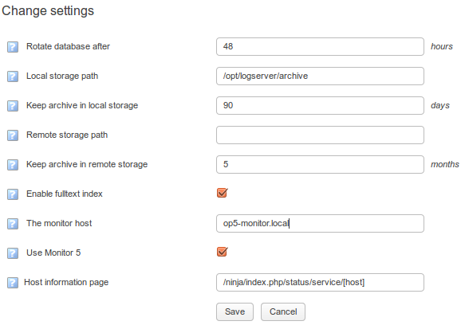

To make this connection between op5 Monitor and logserver we need a couple of filters to use in the check against logserver. I have prepared a few basic ones ready for import

-   auth-fail-ap.xml
-   auth-fail-ap01.xml

These filters is very simple, and you can modify them for your needs in the “Query Builder” in logserver. They can be fetched from [here](attachments/688559/5242975.gz). Unpack this tar.gz-file on your computer and you will have two filters mentioned above ready for import.

To import the filters, go to “Settings -\> import filter” Select your filter to be imported and press “Import”. Be sure that the filter is marked as “Global”. If not this filter will only be available for the user imported it.

To connect your op5 Monitor to this newly imported logserver filter we need to have a user in Logserver to connect with. This user needs to be in the “Filter Administrators” group to have the sufficient privileges to fetch this data from the filter.

Go to: “Settings -\> Users & Groups” Create a new user as show below:

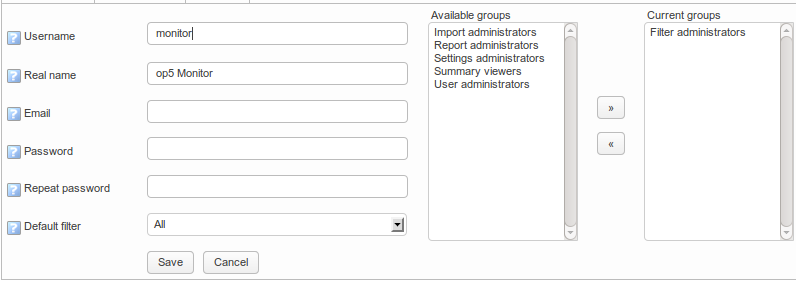

Now when the user is created and filters is imported it is time to make the connection between Monitor and Logserver.

Go back to the configuration page of your host as described earlier: “Search-\> Configuration Wrench -\> Services for host”

This will give you a empty configuration for a new service, and here we will make the connection to the logserver filter we imported earlier.

Fill in the following parameters:

service\_description: Failed Logins on Access Point 01

check\_command: check\_op5\_logserver\_filter

check\_command\_args: auth-fail-ap01!3600!logserver.local!monitor!monitor!https://logserver.local!3!5

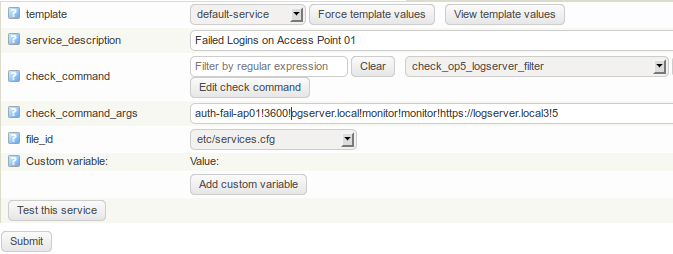

Explanation of check\_command\_args:

“!” Is the separator between options in  check\_command args

“auth-fail-ap01″ is the filter name that we want to call in the logserver

“3600″ is the time-period we want to check for matching of this filter in minutes. This is relevant to the “Rotate database after – hours” option set in the logserver as mentioned earlier.

“monitor!monitor” is the username and password we configured earlier in the logserver

“https://logserver.local" URL of the logserver host to make clickable links in the Service we are creating

“3!5″ – The warning and critical thresholds for the service. How many matches in the given time-period we are checking should return a “Warning” or a “Critical” state.

All this makes more sense in the “Syntax Help” button which explains the parameters is activated. These values are just theoretical and may need to be modified depending on your environments normal value and what is acceptable.

When the above settings is configured, press “Submit” – \> the “floppy” -\> And, “Yes, save”.

Navigate to your host to see the status of your new check.

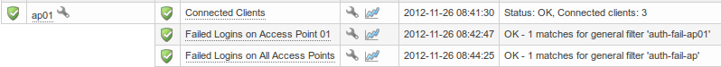

