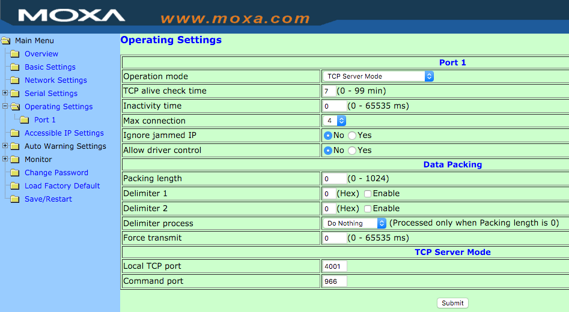

# How to use an SMS gateway via TCP/IP with op5 Appliance System 6 or CentOS 6

This guide explains how to set up serial communication from op5 Appliance System (6.0 and up, and CentOS 6 and up) to an SMS gateway connected to a Moxa NPort 5110, in order to be able to send SMS notifications in situations where the SMS gateway can’t be directly connected to the op5 system via a serial connection, because, for example, the op5 system is a virtual machine or because there is no cellular network coverage in the server room.

## Prerequisites

In this how-to, we’re assuming you’ve got the system set up and working with op5 Monitor installed and have all the prerequisites, i.e. a working SMS gateway connected to the NPort with a SIM card with no PIN inserted.

## Links

Device: <http://www.moxa.com/product/nport_5110.htm>

Manual: <http://www.moxa.com/support/sarch_result.aspx?type=doc&prod_id=237&type_id=7>

Software: <http://www.moxa.com/support/sarch_result.aspx?type=soft&prod_id=237&type_id=9>

Firmware: <http://www.moxa.com/support/sarch_result.aspx?type=soft&prod_id=237&type_id=4>

## Network setup

Make sure that your firewall is open for TCP 80, 4001, 4900, 6000 and UDP 4800 on the machine you’re working from. On the op5 system, you will need to have TCP 4001 open to the NPort.

<table>
<colgroup>
<col width="33%" />
<col width="33%" />
<col width="33%" />
</colgroup>
<tbody>
<tr class="odd">
<td align="left"><strong>Protocol</strong>
<strong>Port #</strong>
<strong>Purpose</strong></td>
<td align="left">TCP
 80
 Web console</td>
<td align="left">TCP
 4001
 TCP Server mode communication</td>
</tr>
</tbody>
</table>

## Device Setup

First, you need to set the IP address of the Moxa NPort. This can be done in several ways, but we have found the easiest is to use the ARP method, where you set a static ARP mapping on your machine and then telnet to a specific port and the NPort then uses that IP address.

This requires that your machine and the NPort are on the same network segment, since it uses ARP, so it will not work over routed connections or VPNs.

If you’re on a Windows machine, first make sure you have the Telnet client installed (it’s under “Programs and Features” -\> “Turn Windows features on or off” in the Control Panel in Windows 7) and then start a command prompt as Administrator (right-click, click “Run as administrator”) and type:

    arp -s newnportip 00-90-E8-XX-XX-XX

where “newnportip” is the IP you wish the NPort to have and “00-90-E8-XX-XX-XX” is the MAC address of your NPort, found on the label on the bottom of the NPort, i.e.:

    arp -s 192.168.1.10 00-90-E8-2C-AD-99

On Unix or MacOS X, the process is the same, but colon is used to separate the MAC address pairs, so the command would instead be:

    arp -s 192.168.1.10 00:90:E8:2C:AD:99

Then, type:

    telnet newnportip 6000

where “newnportip” is the IP you just used in the previous command.

If you’re watching the NPort when you press Enter above, you will notice it restarting. The NPort has now switched and is using the IP address you specified. You can test this by typing its IP into a web browser – if it’s using the correct IP, you should get the NPort Web Console front page. If you cannot use the ARP method above, we refer you to the [manual](http://www.moxa.com/support/sarch_result.aspx?type=doc&prod_id=237&type_id=7 "nPort manual"), which contains a number of other ways to set the IP address.

## Firmware

We recommend that you upgrade the NPort to the latest firmware, which as of publication is 2.4. The firmware can be downloaded from the “Firmware” link at the top of this document. You will also need a Windows machine with a copy of the NPort Administrator software, available from the “Software” link at the top of this document.

Start the NPort Administrator and click on the “Search” button in the toolbar. It should state that it’s found one NPort with the IP and MAC of your NPort. Press “Stop” to stop scanning for more.

Select your NPort in the list, right-click it and press “Upgrade Firmware”. Browse for the firmware file that you downloaded earlier and click OK. Your NPort will now be upgraded – don’t click anything or unplug the NPort until you get an “OK!” status from the upgrade.

## Settings

Now that we’re running the latest firmware, we need to change a setting in the NPort to be able to talk to it the way we want.

1.  Right-click the NPort again, but this time choose “Configure”
2.  Click the tab “Operating Mode”
3.  Check the checkbox “Modify”
4.  Select port 1, and click “Settings”.
5.  Change “Operating Mode” to “TCP Server Mode”
6.  Click OK and then click OK again. Wait while the configuration is uploaded. You should get a “Configuration is applied ok.” confirmation
7.  Click OK and close the NPort Administrator software

We are now done configuring the NPort and can continue on to configure the op5 Appliance System (APS).

## op5 Appliance System Configuration

Use your favorite editor (nano, vi, etc) to edit /etc/smsd.conf. Scroll down to the section [GSM1]. Change device= to:

    device=@newnportip:4001

i.e. if your NPort IP is 192.168.1.10;

    device=@192.168.1.10:4001

You will probably also need to change “baudrate”, which should be:

    baudrate=115200

Save your changes, and then run:

    service smsd restart

Your smsd should now restart and print:

    Starting smsd: [OK]

At this point your configuration is done and your SMSes should now be sent via the NPort to your SMS gateway, but to make sure, let’s test. Run the following command:

    smssend 46709123456 test

where 46709123456 is your phone number in international format (country code+number without leading zero) and test is your test message. You should shortly receive a text message with your test message as the message text.

If you don’t, you can troubleshoot by looking at the log file located at /var/log/smsd/smsd.log where you will find any errors.

## Allow multiple hosts to send notifications via Moxa

If you are using peers and/or pollers that should notify though the same Moxa you need to increase the amount of allowed connections.

### Via Telnet

1.  Connect via telnet to your Moxa
2.  Press **4** for Operating settings
3.  Press **1 **for Port 1
4.  Press **4** for Max connections
5.  Enter the max number of connections
6.  Press any key to continue
7.  Press **m** to go back to main menu
8.  Press **s **Save/Restart. Note that this will restart your device!

### Via Web-UI

1.  Browse to the IP of your Moxa
2.  Expand **Operating Settings**
3.  Select **Port 1**
4.  Change the number of **Max Connection**
5.  Click on **Save/Restart** in the menu. Note that this will restart your device!
     

 

**Congratulations!**

You are now sending your SMS notifications to your SMS gateway via TCP/IP!

