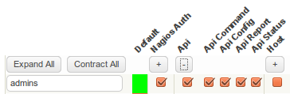
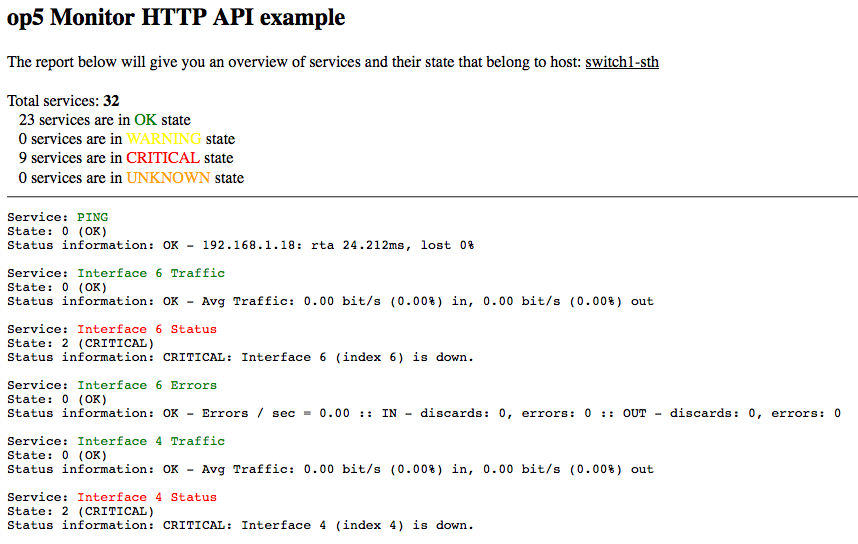

# How to use OP5 Monitor REST API

## Purpose

The purpose of this document is designed for those who want to get started with developing a communication between your own application and the OP5 Monitor REST API.

The REST API was introduced in OP5 Monitor 5.7.0

## Prerequisites

**op5 Monitor 5.7.0 or higher is required**

- The user accessing the API must have sufficient Group Rights enabled for the group that the user is member of. This can be enabled via "Configure -\> Group Rights -\> API"



- Some of the auth\_methods in "/etc/op5/http\_api.yml" must be enabled to be able to access the API.

**/etc/op5/http\_api.yml**

``` {.bash data-syntaxhighlighter-params="brush: bash; gutter: false; theme: Confluence" data-theme="Confluence" style="brush: bash; gutter: false; theme: Confluence"}
---
report:
  limit: 1000
auth_method:
  ninja: true
  basic_auth: true
```

**PHP must be compiled with cURL-support**

- Note: You can verify if PHP is compiled with cURL by running the following in the terminal: php -i | grep "cURL support" (the output should tell you whether cURL is enabled or not)

## The code

In particular, the brief code example below will get a list of all services on a specific host and output their states. The desired result is to list services that are in an OK, WARNING, CRITICAL or an UNKNOWN state.

1. Download and save the file: ([api\_example.php](attachments/688561/4358202.gz))and upload it to a server where you can reach the file with your preferred web browser. Make sure that the server you upload the code to can communicate with the OP5 Monitor server you set in the \$host variable.Please note that you are required to change the following variables in the code, since they need to reflect the settings in your environment:
  - \$username = ””
  - \$password = ””
  - \$uri = “”
  - \$host = “”

2. Once you are done with saving the file, use your browser to navigate to **api\_example.php** file you have uploaded – you will then be presented with a list of all services of the host you entered in step 1.



**WRAP UP**

This is a how-to for users who are new to the OP5 Monitor API. Hopefully this how-to has kick-started your knowledge in regards to how to use the API to your advantage; and we’d love to see more customers using the API and start integrating your own customized solutions with it.
