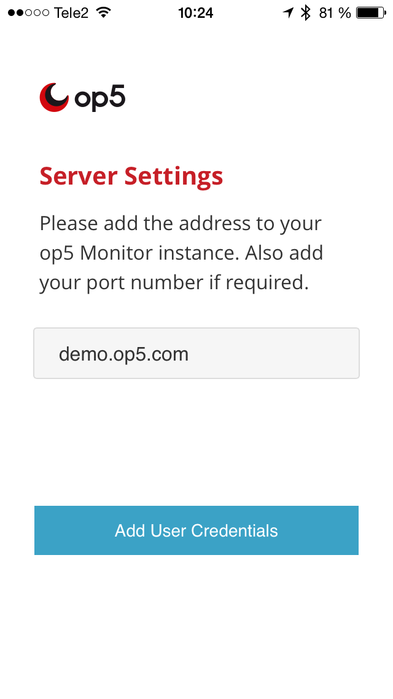
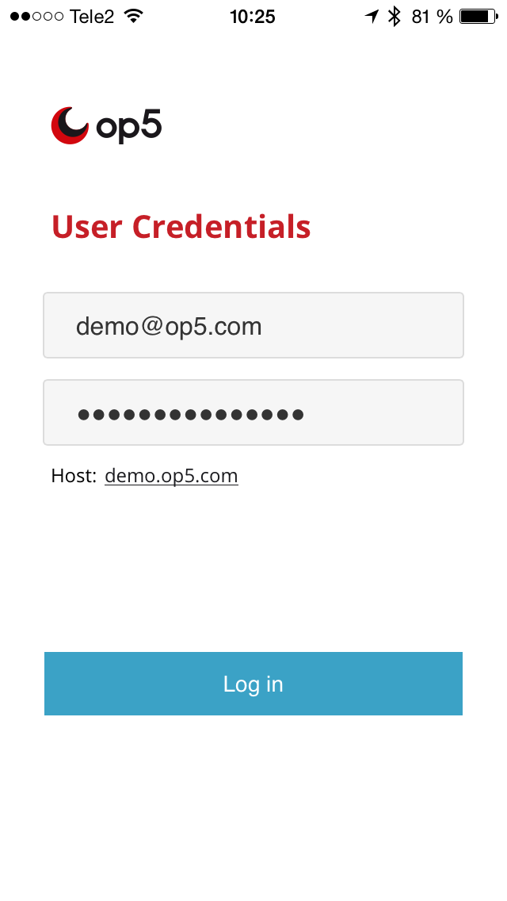
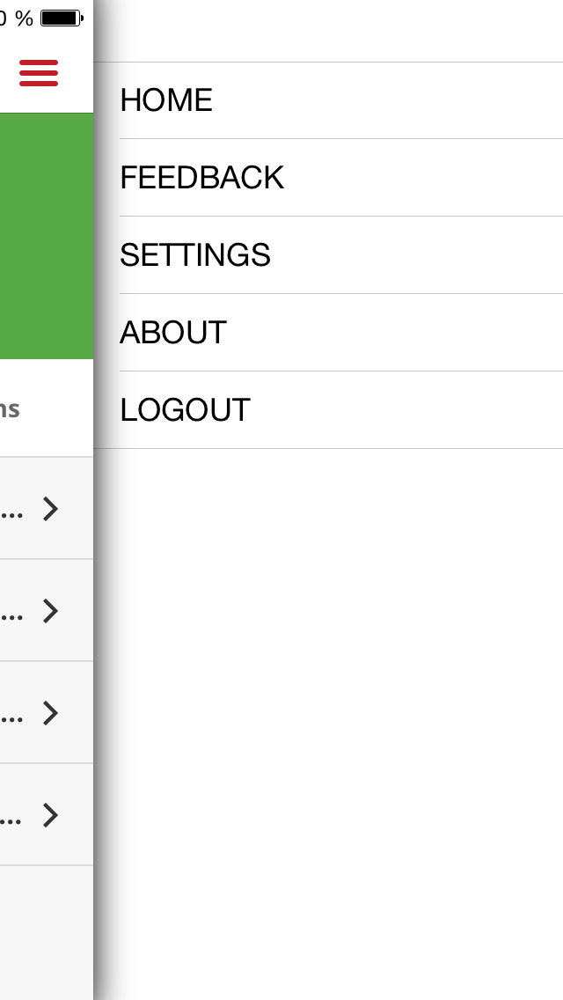
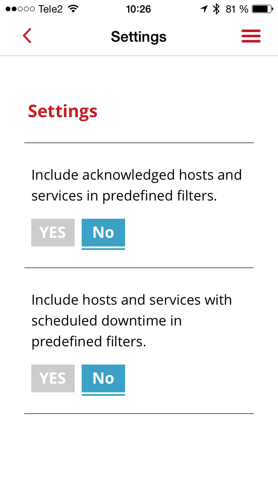
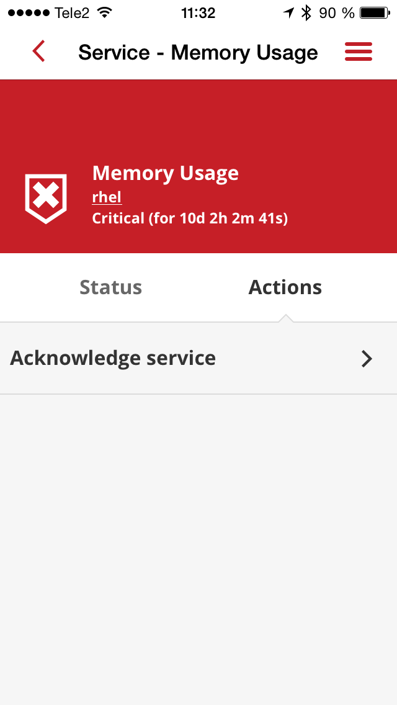
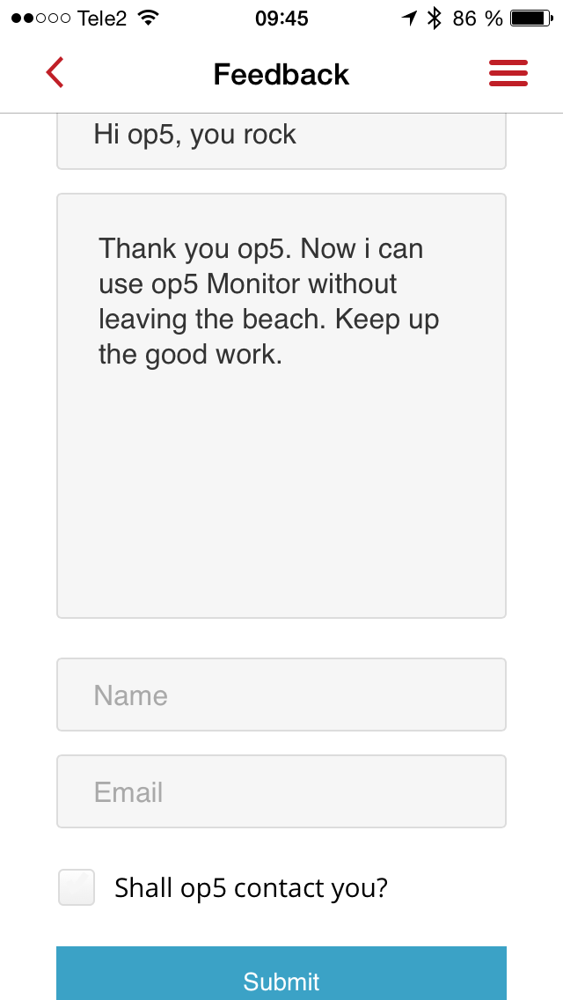

# How to use the op5 Monitor App

# About our apps

The op5 Monitor App works directly towards the op5 Monitor API and your filter settings (based on your username). This enables you to tailor your app to show the list-views you set up in Monitor. For more information on list views, see links at bottom of this page. 

## System requirements

-   op5 Monitor 6.3 or higher
-   API access on op5 Monitor
    -   API "can\_submit\_commands" access if you want to be able to "acknowledge" events in the app.
-   Android 4.x or iOS 7
-   Our mobile app:

 

 

 

* * * * *

 

# Getting started

## Server settings

Enter your hostname in the box. In this example we are using demo.op5.com

 

Note: Advanced users can use another port if needed. Useful if a port forwarding firewall is used to get through NAT. The syntax is :

 

## Add user credentials

Enter the user credentials to access your op5 Monitor APIs. An example (feel free to use for testing) is:

login: <demo@op5.com>

password: MonitorDemo123

Note: When using op5 demo site as demo user, the user has limited access so it is not possible to create own filters, acknowledge problems and so on.
If you have added an auth module to op5 Monitor, such as LDAP. Login with username\$name-of-auth-module as your username. Both are case sensitive.

## Start screen

The start screen shows an overview of hosts and services. Below can the filters defined in the op5 Monitor system be seen.

The rotating arrows are the the refresh button.

 

 

 

 

## Menu actions

Top left there is a meny with the possibility to do different actions:

-   Home, get back to start
-   All the filters
-   Feedback, send feedback to op5 from the op5 Monitor app
-   About, information about op5 and op5 knowledgebase
-   Logout

 

 

 

## Settings

Top right is the settings menu, where it is set whether hosts and services that are acknowledged or hosts and services that are in scheduled downtime should be seen in the home screen.

 

 

## Acknowledge

To acknowledge a host or service problem. Pick the problem and choose top right corner, the acknowledge shows up. Press it.

 

 

 

 

 

## Feedback

If you want to send feedback to op5 about the app, use the feedback function in the app. If you want op5 to contact you, enter your emailadress and check the “should op5 contact you?” checkbox

 

 

 

 

 

# Advanced usage

This chapter describes some hints for more advanced users, it requires that  the user is allowed to create filters and has basic knowledge of how to use op5 Monitor.

## Create filters

The get a list of all hosts, create a filter named: All hosts and has the syntax [hosts] all

The get a list of all services, create a filter named: All services and has the syntax [services] all

To read more about filters, see op5 knowledge base Filters

 

