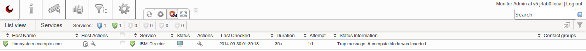
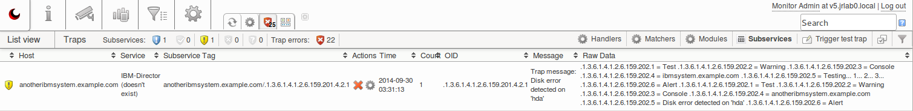

# IBM Director handler for Trapper

## Introduction

The purpose of this document is to describe the inner workings of the "IBM Director" trap handler and show how to use it.
More information about *Trapper* can be found in the [Trapper administration manual](https://kb.op5.com/display/DOC/op5+Trapper+Manual).

## Prerequisites

-   Basic understanding of SNMP-traps and the *Trapper* functionality of *op5 Monitor*
-   Installed the ["IBM Director" trap handler](attachments/11633071/11567175.lua) and configured a matcher for ".1.3.6.1.4.1.2.6.159.201\*"
-   A host in *op5 Monitor* with the same name or alias as the origin system and with a passive service called "IBM-Director"
-   A host in *op5 Monitor* called "IBM-Director" with a passive service called "IBM-Director"

## Configuring SNMP-traps in IBM Director

Before we start to look at the trap handler, we need to configure IBM Director to send SNMP-traps:

1.  Open the IBM Director web console
2.  Open "Automation" in the left side menu
3.  Select  "Event Actions", then click on the "Create" button
4.  Enter the name and IP-address of your *op5 Monitor* host
5.  Open "Event Automation Plans" in the left side menu
6.  Select "Send SNMP Trap" and click the "Edit" button
7.  Add your *op5 Monitor* host from "Event Actions" and save the configuration

## Matching process overview

The trap handler looks at the "managed object name"-field in the trap to determine which system the alert originated from.
It uses this field to map it against a host in *op5 Monitor* with the same name and a service called "IBM-Director".
If it can't find this host, it will instead appear under the "Subservices" section in "SNMP traps".

The trap handler can also try to map the "managed object name"-field against host aliases, see more under the "Advanced usage" section below.


Successful mapping against the host "ibmsystem.example.com" and service "IBM-Director"


*If the host and service mapping was unsuccessful, it can still be found under the "Subservices" section*

## 
Testing the trap handler

You can test the trap handler by sending your own traps with the command line utility "snmptrap", available on the *op5 Monitor* host.

The following command will send a SNMP-trap to 127.0.0.1, which should make the trap handler put the service in a "WARNING" state:

``` {.text data-syntaxhighlighter-params="brush: text; gutter: false; theme: Confluence" data-theme="Confluence" style="brush: text; gutter: false; theme: Confluence"}
$ snmptrap -c public -v 2c 127.0.0.1 "" .1.3.6.1.4.1.2.6.159.201.4.2.1 \
.1.3.6.1.4.1.2.6.159.202.1 s "Test" .1.3.6.1.4.1.2.6.159.202.2 s \
"Warning" .1.3.6.1.4.1.2.6.159.202.3 s "Console" \
.1.3.6.1.4.1.2.6.159.202.4 s "ibmsystem.example.com" \
.1.3.6.1.4.1.2.6.159.202.5 s "Testing warning state... 1... 2... 3..." \
.1.3.6.1.4.1.2.6.159.202.6 s "Alert" 
```

``

This command should put the service back in to a "OK" state:

``` {.text data-syntaxhighlighter-params="brush: text; gutter: false; theme: Confluence" data-theme="Confluence" style="brush: text; gutter: false; theme: Confluence"}
$ snmptrap -c public -v 2c 127.0.0.1 "" .1.3.6.1.4.1.2.6.159.201.4.2.1 \
.1.3.6.1.4.1.2.6.159.202.1 s "Test" .1.3.6.1.4.1.2.6.159.202.2 s \
"Warning" .1.3.6.1.4.1.2.6.159.202.3 s "Console" \
.1.3.6.1.4.1.2.6.159.202.4 s "monitor.foobar.com" \
.1.3.6.1.4.1.2.6.159.202.5 s "Testing recovery... 1... 2... 3..." \
.1.3.6.1.4.1.2.6.159.202.6 s "Resolution"
```

## 
Advanced usage

The trap handler has a function to map the "managed object name"-field against a host alias and remove domains if needed.
This can be very useful if you don't have matching host names or haven't included the FQDN of the host in *op5 Monitor*.
If the mapping still isn't successful, it will put the trap on a generic "catch-all" host called "IBM-Director" - this is done to ensure that you always get notified when alerts are received.

However, this function requires you to use a script called "[gen-mapping.lua](attachments/11633071/11567178.lua)" to create a key-value list of hosts and aliases from the database.
The script should be run every time you add new hosts and the module updated, so we suggest executing it hourly with *cron*:

``` {.text data-syntaxhighlighter-params="brush: text; gutter: false; theme: Confluence" data-theme="Confluence" style="brush: text; gutter: false; theme: Confluence"}
# traped create module alias-mapping
# echo -e '#!/usr/bin/env bash\n/path/to/gen-mapping.lua | traped update alias-mapping' > /etc/cron.hourly/alias-mapping
# chmod 755 /etc/cron.hourly/alias-mapping
```

You will also need to change the "useAliasMapping" variable in the handler to "true".

## Technical description of the mapping process

The following is an example of the content of a trap received from IBM Director:

``` {.text data-syntaxhighlighter-params="brush: text; gutter: false; theme: Confluence" data-theme="Confluence" style="brush: text; gutter: false; theme: Confluence"}
.1.3.6.1.4.1.2.6.159.202.1="MPA.Component.DIMM.PFA"
.1.3.6.1.4.1.2.6.159.202.2="Informational" 
.1.3.6.1.4.1.2.6.159.202.3="134.37.140.59"
.1.3.6.1.4.1.2.6.159.202.4="IBM:7870-A2G-99H2650"
.1.3.6.1.4.1.2.6.159.202.5="A DIMM has reported a correctable ECC error."
.1.3.6.1.4.1.2.6.159.202.6="Alert" 
```

 

This section in the trap handler shows how the mapping of the OIDs is done:

``` {.text data-syntaxhighlighter-params="brush: text; gutter: false; theme: Confluence" data-theme="Confluence" style="brush: text; gutter: false; theme: Confluence"}
local trapType=".1.3.6.1.4.1.2.6.159.202.1"
local trapSeverity=".1.3.6.1.4.1.2.6.159.202.2"
local trapSenderName=".1.3.6.1.4.1.2.6.159.202.3"
local trapManagedObjectName=".1.3.6.1.4.1.2.6.159.202.4"
local trapText=".1.3.6.1.4.1.2.6.159.202.5"
local trapCategory=".1.3.6.1.4.1.2.6.159.202.6"
```

 

The "map" function tries to match "trapManagedObjectName" with a host ** or alias, generated by the "gen-mapping" script.

``` {.text data-syntaxhighlighter-params="brush: text; gutter: false; theme: Confluence" data-theme="Confluence" style="brush: text; gutter: false; theme: Confluence"}
function map(name)
    for i, v in ipairs(mapping) do
        if v[name] then
            return v[name]
                
        else
            local name2 = string.match(name, "^([%w-]+)%.[%w-]+%.[%w-]+")
            if name2 and v[name2] then
                return v[name2]
            
            end
        end
    end
    
    return nil

end
```

 

The following code maps the trap to a service called "IBM-Director" on a host found by the "map" function if it is enabled.
It also sets the status message of the service to the contents of the "trapText" field:

``` {.text data-syntaxhighlighter-params="brush: text; gutter: false; theme: Confluence" data-theme="Confluence" style="brush: text; gutter: false; theme: Confluence"}
if useAliasMapping == true then
        log("useAliasMapping is true - using map function to set host")
        include "alias-mapping"
        result.host = map(trapManagedObjectName) or "IBM-Director"

else
        log("useAliasMapping is false - using trap field to set host")
        result.host = trapManagedObjectName

end

result.service = "IBM-Director"
result.tag     = trapManagedObjectName .. "/" .. trap.oid
result.message = "Trap message: " .. trapText
```

The mapping of service severity status is using the "trapSeverity" field:

``` {.text data-syntaxhighlighter-params="brush: text; gutter: false; theme: Confluence" data-theme="Confluence" style="brush: text; gutter: false; theme: Confluence"}
if trap.fields[trapCategory] == "Resolution" then
    severity = OK

else

    if trap.fields[trapSeverity] == "Informational" then
        severity = OK

    elseif trap.fields[trapSeverity] == "Minor" then
        severity = OK

    elseif trap.fields[trapSeverity] == "Warning" then
        severity = WARNING

    elseif trap.fields[trapSeverity] == "Alert" then
        severity = CRITICAL
    
    elseif trap.fields[trapSeverity] == "Critical" then
        severity = CRITICAL

    elseif trap.fields[trapSeverity] == "Fatal" then
        severity = CRITICAL

    else
        severity = UNKNOWN
    end

end
```

 

## Extend the functionality

You can easily improve and extend the functionality of the trap handler. For example, it currently maps all traps to one service called "IBM-Director.
If you want to separate traps regarding the physical memory status or similar, you can use the "trapType" field and look for "MPA.Component.DIMM":

``` {.text data-syntaxhighlighter-params="brush: text; gutter: false; theme: Confluence" data-theme="Confluence" style="brush: text; gutter: false; theme: Confluence"}
if string.match(trapType,'MPA\.Component\.DIMM.*') then
    result.service = "IBM-Director - Memory status"

else
    result.service = "IBM-Director"

end
```

 

 

