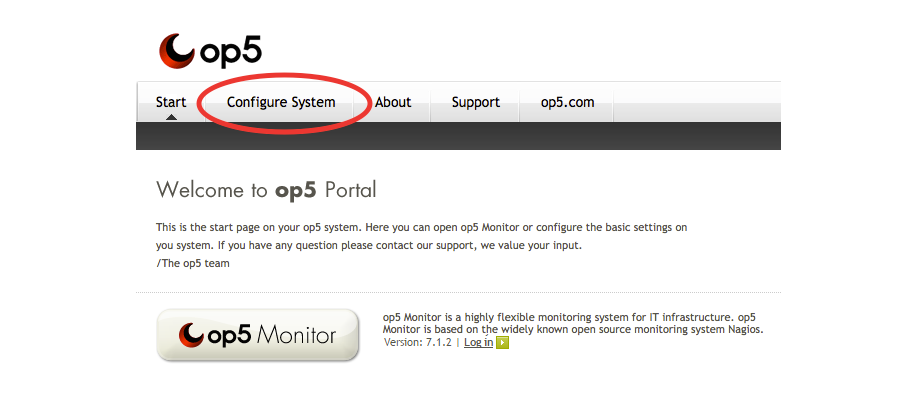

# Install and Get Started with OP5 Monitor

**Related Links:**

op5 Monitor 7.1 User Manual ([PDF](https://kb.op5.com/download/attachments/10944900/op5_Monitor_7.1_user_manual.pdf?version=1&modificationDate=1442999795156&api=v2))

[op5 Monitor 7.1 Admin Manual (PDF)](https://kb.op5.com/pages/viewpageattachments.action?pageId=16482327&highlight=op5_Monitor_7.1_admin_manual.pdf#op5+Monitor+-+PDF-attachment-op5_Monitor_7.1_admin_manual.pdf)

# License

The full, trial version license for OP5 Monitor lets you monitor an unlimited amount of hosts/devices with infinite number of services for 30 days. After 30 days, there will be an opportunity to purchase a permanent license.

# Download and installation of OP5 Monitor

There are three different installation options for OP5 Monitor:  Virtual Appliance, Software, and Cloud Server.

To deploy on a Windows machine without Linux, use the Virtual Appliance option.

All downloads can be found at <https://www.op5.com/download-op5-monitor/>

## Virtual Appliance

The Virtual Appliance is used for hypervisors such as VMware or Virtualbox. Other hypervisors that support ovf-file import might also work.

This includes op5Monitor runs on CentOS 6 with the Virtual Appliance. This is the easiest and quickest way to get started.

After the appliance has been downloaded and started, the server will get a DHCP address that is shown in the console.

For help with installing the Virtual Appliance, please visit

  <https://www.op5.com/how-to-get-started-op5-monitor-virtual-server/>

## Software

To install, you will need a running CentOS 6 or RHEL 6, which is not included with this installation. Look for version 7 to be supported in a future release. Installation

### Installation

1. Download OP5 Monitor to your home directory
2. Unpack the tar.gz file
3. Go to the newly created folder
4. Run ./install.sh

        For additional steps with installing the software, please visit

  <https://www.op5.com/get-started-with-op5-monitor-software-installation/>

## Cloud Server

Cloud servers are available at Amazon, Azure, and CityCloud. Although the OP5 Monitor license is still free,  you will need a subscription for any of the Cloud server providers. Installation instructions can be found on those sites accordingly. However after getting it up and running, there is no appreciable difference between a cloud server and software installation.  After the cloud server installation, OP5 Monitor can be installed using the same steps as the software installation.

# Accessing Your New OP5 Installation

op5's main interface can be easily accessed using any web browser.  In addition to monitoring your network in a unified, single pane of glass, most configuration options can be accessed via the graphical user interface.

1. Using a web browser, navigate to op5’s IP (i.e. 192.168.1.XX) or host name (i.e. localhost) on your network.

2. From the “Start” tab, click the "op5 Monitor" button.

3. You will be prompted to create an account with administrator privileges the first time you access OP5 Monitor.

If you see a warning when first launching the web GUI, don't panic!  This warning is not an issue with the OP5 application, and poses no real risk.  op5 ships by default with self-signed SSL Certificates, a common practice when deploying any new web service that is secured via SSL.  The warning page can safely be skipped using any browser by adding an exception:

Chrome - Click "Advanced," then "Proceed to example.com"

Firefox - Click "I Understand the Risks," then "Add Exception," and finally "Confirm"

Internet Explorer - Click on "Continue to this website (not recommended) to bypass SSL warning in Internet Explorer."

To fix the issue permanently, refer to the following OP5 KB article:  Add or renew an SSL certificate for OP5 Monitor

# Server Configuration

## Virtual Appliance

In the Virtual Appliance version, the web-based system configuration tool can be used to set IP address, hostname, mail gateway etc.

To enter the configuration tool, go to *https://\<op5-ip\>/*  (i.e. 192.168.1.XX) and select "Configure System" from the top menu. The default password is: ***monitor***

Configure IP address, hostname and mail gateway as needed.

## Software

The software version does include the web-based "Configure System" tool, but is limited to license management.
You will need to configure the system settings such as IP address, hostname and mail gateway through Linux.  (Note: This is strictly referring to the "Configure System" tool and not the "op5 Monitor Configuration" tool that is used to configure OP5 Monitor, hosts, services, contact groups, etc.)

Additional information can be found in the manual chapter [Manually from the prompt](https://kb.op5.com/display/DOC/Manually+from+the+prompt).

# Prepare servers or network equipment to be monitored

Before a server or network equipment can be monitored, you may require a particular agent. It can either be NSClient++ for Windows, NRPE for Linux or SNMP for network equipment.

## NSClient++

This can be downloaded from [op5.com](http://www.op5.com/download-op5-monitor/agents/)

Remember to allow your OP5 server to query the agent. This is configured during the installation of the agent.

## NRPE

This can also be downloaded from [op5.com](http://www.op5.com/download-op5-monitor/agents/) or from the repository of your distribution. Our version does contain some pre-configured items.

Remember to allow your OP5 server to query the agent. This is done in */etc/nrpe.conf* under the allowed\_hosts option.

## SNMP

SNMP can be used for both Windows and Linux environments. Enabling SNMP on your equipment may differ from device to device. Please see your device's manual.

# Adding your first server

op5 Monitor includes a "Host Configuration Wizard" for easy deployment and configuration of your network devices.  This wizard includes pre-configured management packs for each device.

We will start off by demonstrating how to deploy a device by using the "Host Configuration Wizard."

First, login in to your OP5 Monitor server at *https://\<op5-ip\>/monitor*

*
*

1. Navigate to the Host Wizard, which is found in the configuration menu.
    
2. Select the type of server/device you will want to monitor.  We will use a Windows Server as an example.
    
3. Click on "Next."

4. Enter server name and the IP address of the server.
    
5. Click on "Next."

6. Click on "Save Configuration and View Added Hosts."
    

Done!
