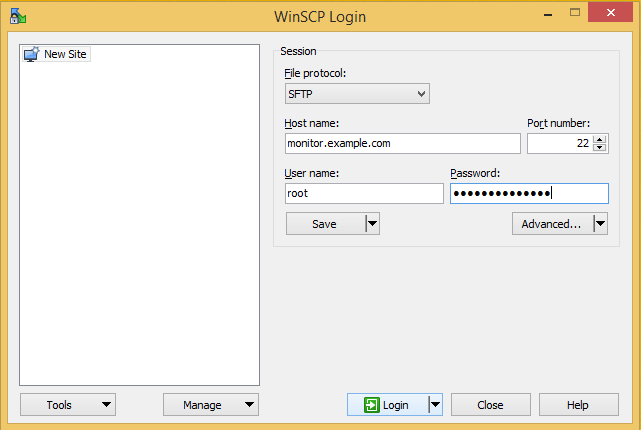
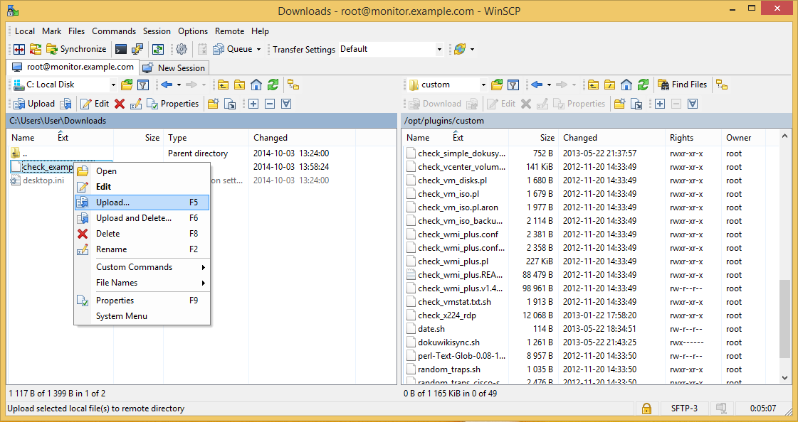
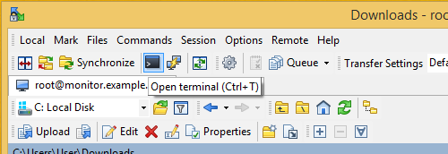
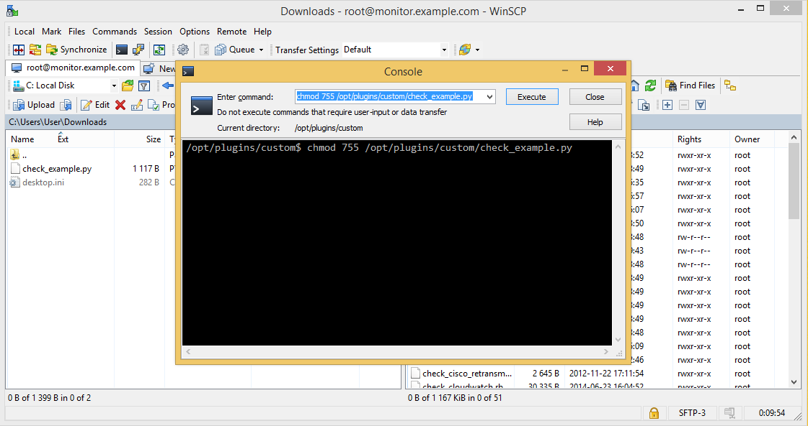
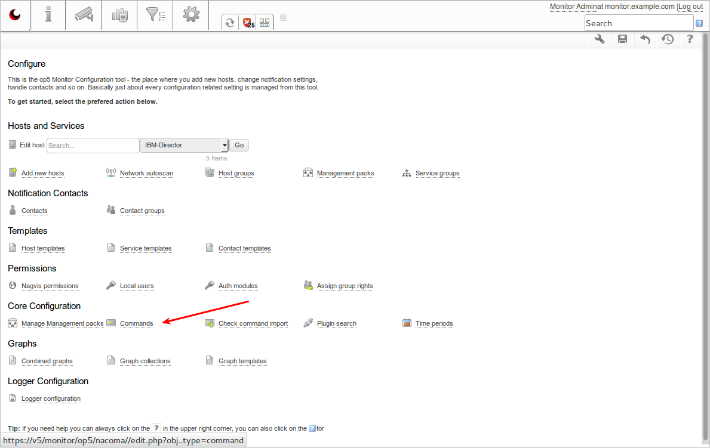
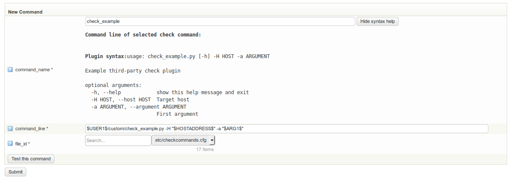
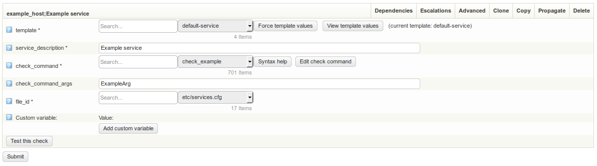
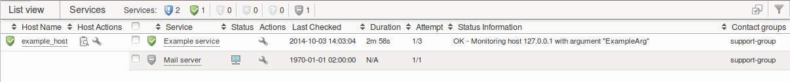
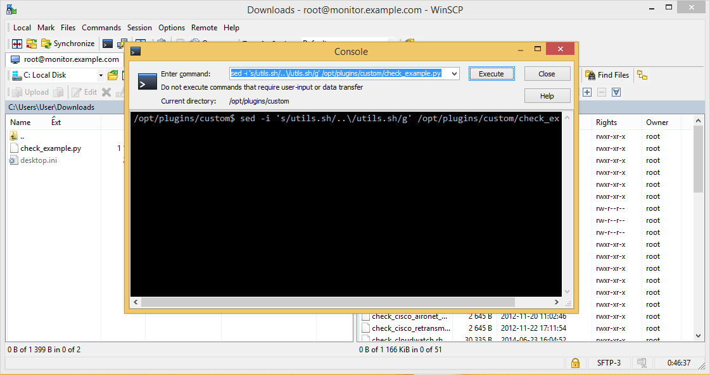

# Installing third-party plugins

Version

This article was written for version 7.0 of OP5 Monitor, it could work on both lower and higher version if nothing else is stated.

Articles in the Community-Space are not supported by OP5 Support.

# Introduction

*op5 Monitor* uses a plugin system to handle things like notifications, restarting crashed services and the actual host and service monitoring.
This means that the system can be easily extended to monitor new kinds of devices or be integrated with third-party ticketing systems.

Developing your own plugins is [really straight forward](https://kb.op5.com/display/DOC/Adding+your+first+plugin+to+op5+Monitor), but there are already heaps available to download from sites like [Monitoring Exchange](https://www.monitoringexchange.org/) or [Nagios Exchange](http://exchange.nagios.org/).

In this how-to we will look at installing a check plugin, cover solutions to common problems and give some general recommendations for using third-party plugins.

Support information

Installing and using third-party plugins **is not** supported by OP5 AB.
If you need help installing, configuring or developing custom plugins, please contact the professional services department

# Prerequisites

- Basic UNIX/Linux knowledge
- Shell access to the host running *op5 Monitor*
- A SSH and SFTP client like *[WinSCP](http://winscp.net/eng/download.php)*
- Basic understanding of service configuration in *op5 Monitor*

# Installation

In this tutorial we will install the check plugin "[check\_example.py](attachments/12189713/12386306.py)" - download it to your local system.
We will use the *WinSCP* client for SSH and SFTP access to the host running *op5 Monitor* in these examples, but any SSH/SFTP client should work.

Security implications

Only install plugins from trusted sources - malicious plugins can execute commands to steal information, crash the system or similar.

Start off by opening *WinSCP* and connect to your monitoring server:



Upload the "check\_example.py" file to the "/opt/plugins/custom" directory on the server.
Storing your custom plugins in this directory protects them from changes during upgrades and include them in backups:



Click the "Open terminal" button in the top left corner:



We now need to run a command that makes the plugin executable -
do this by executing "chmod 755 /opt/plugins/custom/check\_example.py":



# Configuration

The plugin needs to be configured as a "command" to be used with *op5 Monitor*.
Enter the "Commands" section of the "Configure" page:



You will now have to enter a name for the command and usually a few parameters for the plugin.
The plugins are applications or scripts executed on the system shell, so the parameters are set by command line arguments.

In this example we use the [internal macros/variables](http://www.naemon.org/documentation/usersguide/macrolist.html) "\$USER1\$", "\$HOSTADDRESS\$" and "\$ARG1" to configure path, host and service specific arguments.
These will be resolved differently depending on which host in *op5 Monitor* they are executed for.

*
Your plugin might require other arguments - please consult the plugin documentation.*

The check plugin is now ready to be used by services:


*Service configuration*


*Service status in list view*

# Common issues

The following are some common problems an their solutions:

### "-The plugin is complaining about a missing module called utils.pm"

The "utils.pm" Perl module is used by many plugins and is sometimes hard-coded to a specific path in the file system.
This problem can usually be solved by running the following *sed* command:

``` {.text data-syntaxhighlighter-params="brush: text; gutter: false; theme: Confluence" data-theme="Confluence" style="brush: text; gutter: false; theme: Confluence"}
# sed -i 's/utils.sh/..\/utils.sh/g' /opt/plugins/custom/name_of_plugin
```

*
Executing the same command with WinSCP*
