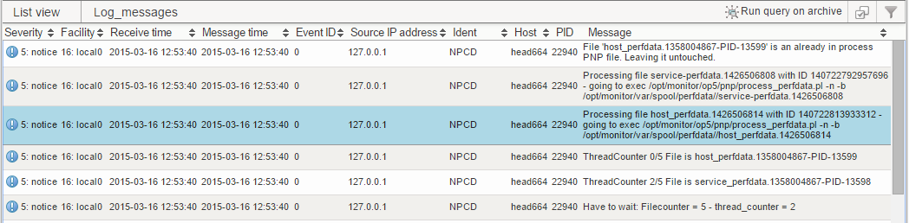
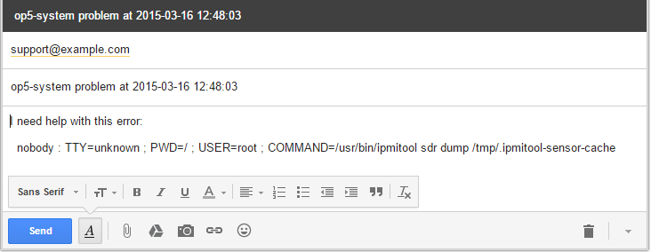

# Instant support ticket creation from Logger using listview columns

The custom columns language in op5 Monitor is a powerful tool. It can access details on the listed objects. This simple example shows how to create a link that auto-generates an email with necessary information when clicked.

The Log messages listing looks like this by default:
 

We'll show how to add a new column "Support" to the far right. The new column will contain a link that, when clicked, will open a pre-filled email form.

1.  Open Configuration-\>My Account
2.  In the box for Log_messages, enter

        default, Support="<a href='mailto:support@example.com?subject=" + urlencode(host) + " problem at " + urlencode(time(rtime)) +"&body=" + urlencode("I need help with this error:\n\n") + urlencode(msg) + "'>Create support ticket</a>" 

3.  Save
4.  Go to Monitoring-\>Log messages. You'll see something like this:
     
5.  Click the link "Create support ticket". Your email program will start with a view like this:
     

For more details, check out [how to use the custom columns language](https://kb.op5.com/display/GUI/Custom+columns+language+reference)

