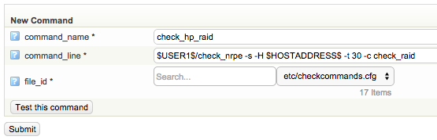
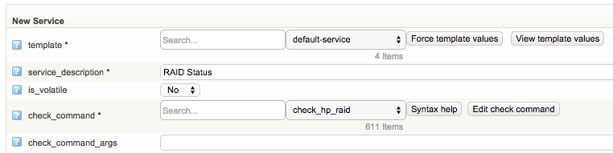

# Monitor HP RAID controller

Monitors HP RAID controller, this is not checked by the normal HP hardware check in op5 Monitor.

# About

This will enable HP RAID monitoring on your HP Proliant server. This how will require that you download an external script to your op5 Agent.

If there is a problem with your RAID the output will tell you the problem, for example say which disk that is failing.

# Prerequisite

1.  HP ACU CLI must be installed, download and install this from HP.

## Step-by-step guide

1.  Download the script [check\_smartarray.vbs](attachments/12189909/12386356.vbs) to your op5 Agent script folder, C:\\Program Files\\op5\\NSClient++\\scripts
2.  Edit custom.ini, located in C:\\Program Files\\op5\\NSClient++\\

    ``` {.bash data-syntaxhighlighter-params="brush: bash; gutter: false; theme: Confluence" data-theme="Confluence" style="brush: bash; gutter: false; theme: Confluence"}
    [NRPE Handlers]
    check_raid=cscript.exe //NoLogo //T:10 scripts/check_smartarray.vbs --hpacucli "C:\Program Files\Compaq\Hpacucli\Bin\hpacucli.exe"
    ```

    Note that you might need to change the path to hpacucli.exe.

3.  Save the file and restart the op5 NSClient++ windows service.
4.  Go to op5 Monitor -\> Configure -\> Commands
5.  Create a new check command with the following settings:
    **command\_name:** check\_hp\_raid
    **command\_line:** \$USER1\$/check\_nrpe -H \$HOSTADDRESS\$ -t 30 -c check\_raid
    
6.  Click on Submit.
7.  Select your HP Server in the configuration and add a new service
    service\_description: RAID Statuscheck\_command: check\_hp\_raid
    
8.  Click on Submit and save your configuration.

This is how it might look when there is a problem with your RAID


## Related articles

-   Page:
    [Setting up Selenium Server on Microsoft Windows](/display/HOWTOs/Setting+up+Selenium+Server+on+Microsoft+Windows)
-   Page:
    [Handling NSClient++ settings in the Windows Registry](../HOWTOs/Handling_NSClient++_settings_in_the_Windows_Registry)
-   Page:
    [Monitoring Dell servers](/display/HOWTOs/Monitoring+Dell+servers)
-   Page:
    [Agentless Monitoring of Windows using WMI](/display/HOWTOs/Agentless+Monitoring+of+Windows+using+WMI)
-   Page:
    [Monitoring the hardware of your op5 server](/display/HOWTOs/Monitoring+the+hardware+of+your+op5+server)

