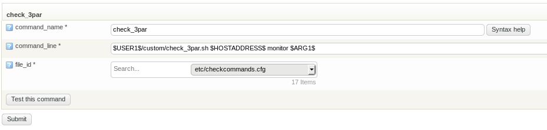
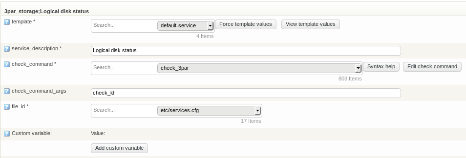

# Monitoring HPE 3PAR StoreServ with op5 Monitor

Version

This article was written for version 7.3.9 of op5 Monitor, it could work on both lower and higher version if nothing else is stated.

Articles in the Community-Space are not supported by op5 Support.

 

## Introduction

*HPE 3PAR StoreServ storage* is Tier 1 all-flash array data storage that can scale midsize to the largest enterprises and service providers, for instant application provisioning and high levels of service – at a fraction of the cost.

This how-to will show you how to setup monitoring with couple easy steps.

Plugin is tested against HPE 3PAR simulator running on version 3.2.2 (MU2).

 

Support information

3PAR check plugin and it's dependencies are third-party products, not supported by op5 AB

## Prerequisites

-   Admin level access to 3PAR
-   Basic knowledge of service configuration in *op5 Monitor*
-   SSH access from op5 Monitor to 3PAR

## Software download

Download check\_3par.sh ([download](https://exchange.nagios.org/directory/Plugins/Hardware/Storage-Systems/SAN-and-NAS/3PAR-check-script/details)) and store it to op5 Monitor /opt/plugins/custom and make it executable.

Please note, that there are more recent update to that script mentioned in comments (which supports SSD drives as well). 

You may want to upgrade to that (copy content from comment field, paste to editor and save it as check\_3par.sh)

Also some other 3par related scripts are available (one at GitHub as check\_3par\_perf)

 

 

## Create SSH key for monitor user

Login to op5 Monitor as **monitor** user and create SSH key if not yet created

Check files under /opt/monitor/.ssh

If you have id\_rsa and id\_rsa.pub then you may skip SSH key creation

-bash-4.2\$ ssh-keygen

(press Enter to accept default settings)

 

Check SSH key and copy it to clipboard (it's long line, make sure to copy all the content)

-bash-4.2\$ cat id\_rsa.pub

ssh-rsa AAAAB3NzaC1yc2EAAAADAQABAAABAQDXjsVdIT08KXEbiaaAI/WFJhM31CFSmtYW8j3qKTOLAwYH6o/2kTYJR2vA28H/rwNqsjq9dAqMRNW4GGWXFvLbau4jOkm/a6s6dNgTS2M+P1VqhSwBHNL9J/dODYQDid2xMv7trvNHsYvoXl96gjuelU8jfZZTPSei7yEiQs9OPu+nWXzlRmq+gbtdDvUVOeVl1PU/+jJBLsBfy5F5Gviu4z9n8nOPxvzKvbeEdt4uzpycOgAVkuwAj8lcVDmqpqIrp1PA+ifh+0j2eaWUyQNcy2YJ5xJyXhkJkHFqJaH6VF2J90s7s9EzHuI4n monitor@op5\_7

-bash-4.2\$

 

## Login to 3PAR as administrative level user

(in this case 3paradm)

[root@localhost \~]\# ssh <3paradm@192.168.8.50>
Password:
3par cli%

## Create monitor user and set password

(use better password than this in example)

3par cli% createuser -c q1w2e3r4t5 monitor all browse

User created

3par cli% exit

 

## Login to 3PAR as monitor user

(use the password created in previous step)

[root@localhost \~]\# ssh <monitor@192.168.8.50>
Password:
3par cli%

 

## Setup passwordless SSH 

(enter the command and then copy&paste SSH key from op5 server to here)... Remember to press "Enter" twice

 

3par cli% setsshkey

Please enter the SSH public key below.  When finished, press enter twice.

The key is usually long.  It's better to copy it from inside an editor

and paste it here.  (Please make sure there are no extra blanks.)

The maximum number of characters used to represent the SSH key

(including the "from" option, key type, and additional comments) is 4095.

 

ssh-rsa AAAAB3NzaC1yc2EAAAADAQABAAABAQDXjsVdIT08KXEbiaaAI/WFJhM31CFSmA28H/rwNqsjq9dAqMRNW4GGWXFvLbau4vCPJp1AA60TRhjOkm/a6s6dNgTS2M+P1VqhSwBHNL9J/dODYQDid2xMv7trvNHsYvoXl96gjuelU8jfZZTPSei7yEiQs9OPu+nWXzlRmq+gbtdDvUVOeVl1PU/+jJBLsBfy5F5Gviu4z9n8nOPxvzKvbeEdt4uzpycOgAVkuwAj8lcVDyXhkt8UNM3MnDMC28zJkHFqJaH6VF2J90s7s9EzHuI4n monitor@op5\_7

 

SSH public key successfully set.

3par cli%

 

## Test few commands as monitor user

3par cli% showversion

Release version 3.2.2 (MU2)

Patches:  None

 

Component Name                   Version                         

CLI Server                       3.2.2 (MU2)                     

CLI Client                       3.2.2                           

System Manager                   3.2.2 (MU2)                     

Kernel                           3.2.2 (MU2)                     

TPD Kernel Code                  3.2.2 (MU2)                     

3par cli%

 

3par cli% shownode

                                                            Control    Data        Cache

Node --Name--- -State-- Master InCluster -Service\_LED -LED- Mem(MB) Mem(MB) Available(%)

   0 1699678-0 Degraded Yes    Yes       Off          Green    2048     512            0

   1 1699678-1 Degraded No     Yes       Off          Amber    2048     512            0

3par cli%

## Test check\_3par.sh script

-bash-4.2\$ cd /opt/plugins/custom

-bash-4.2\$ ./check\_3par.sh 192.168.8.50 monitor check\_pd

OK : All PDs have normal status

-bash-4.2\$

 

 

## Configuring check command

Go to the "Commands" configuration page in *op5 Monitor* and create a new check command with the following options:

``` {.text data-syntaxhighlighter-params="brush: text; gutter: false; theme: Confluence" data-theme="Confluence" style="brush: text; gutter: false; theme: Confluence"}
    command_name                   check_3par
    command_line                   $USER1$/custom/check_3par.sh $HOSTADDRESS$ monitor $ARG1$
    
```



 

## Monitoring test cases

Create a new service on your target host in op5 Monitor and select the "check\_3par" command.
The check command requires one argument:
 

Argument

Description

\$ARG1\$

check type

 

Example:



Other check\_command arguments to be used:

-   check\_cap\_fc
-   check\_cap\_nl
-   check\_cap\_ssd
-   check\_port\_fc
-   check\_node
-   check\_pd
-   check\_ps\_cage
-   check\_ps
-   check\_vv

 

## Additional information

-   [Nagios Exchange](https://exchange.nagios.org)[(External)](http://www.seleniumhq.org/docs/)
-   [HPE 3PAR StoreServ presentation](https://www.hpe.com/us/en/storage/3par.html)[(External)](https://kb.op5.com/h)

 

 

