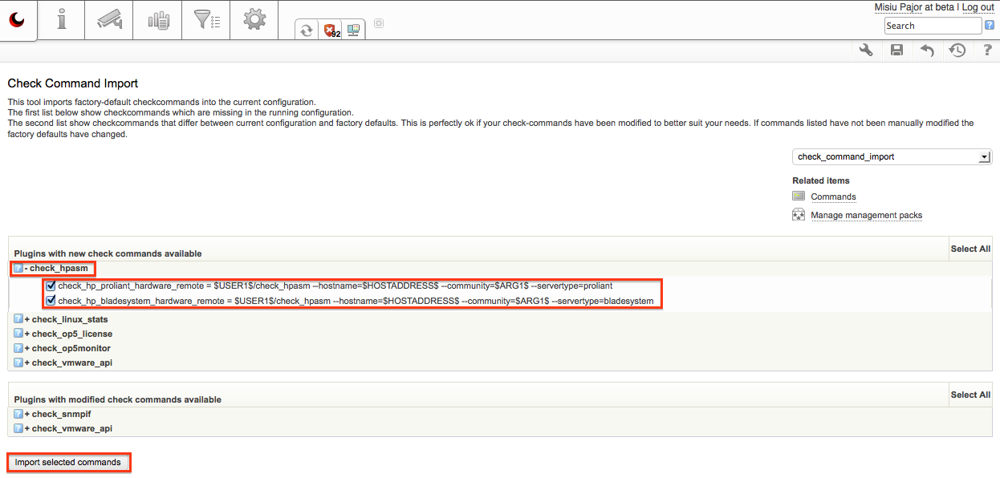
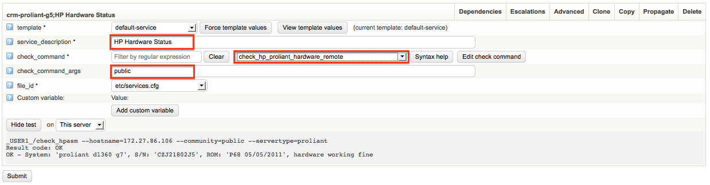

# Monitoring HP/Compaq servers

Are you using op5 monitor version 6.3 or newer?

The first steps of this how-to is for op5 monitor version 6.2 or older. if you have upgraded to version 6.3 of op5 monitor the check\_hpasm plugin is shipped with the product, please follow the [instructions](#MonitoringHP/Compaqservers-instructions6.3) to start using check\_hpasm. If you have a fresh installation of op5 monitor 6.3 or newer the new commands are already configured and ready to use. The [new check\_commands](#MonitoringHP/Compaqservers-new-services) can be viewed at the bottom of this page.

# Instructions for op5 monitor 6.2 or older:

**Monitoring HP/Compaq servers with check\_hpasm**

HP and Compaq server hardware can be remotely monitored via SNMP. The plugin check\_hpasm is used for this. These plugin will monitor the Insight Management agents system status and other, more specific parts, like:

-   Processors
-   Power supplies
-   Memory modules
-   Fans
-   CPU- and board-temperatures
-   Raids (IDE and SaS only when using SNMP)

## **Prerequisites**

Before you begin you need to have some functions enabled on your HP/Compaq server.

-   SNMP must be enabled and configured on the target host
-   Use HP Insight Management Agent 7.60, 7.80 or newer, NOT 7.70.

## **Install check\_hpasm**

1.  Download it from  <http://labs.consol.de/lang/en/nagios/check_hpasm/>
2.  Unpack the tarball

    ``` {.bash data-syntaxhighlighter-params="brush: bash; gutter: false; theme: Confluence" data-theme="Confluence" style="brush: bash; gutter: false; theme: Confluence"}
    tar xzvf check_hpasm-4.2.1.1.tar.gz
    ```

3.  Configure and compile

    ``` {.bash data-syntaxhighlighter-params="brush: bash; gutter: false; theme: Confluence" data-theme="Confluence" style="brush: bash; gutter: false; theme: Confluence"}
    cd check_hpasm-4.2.1.1
    ./configure --prefix=/opt/plugins/custom/hp-insight --with-nagios-user=monitor --with-nagios-group=users --enable-perfdata
    make
    make install
    ```

4.  Test

    ``` {.bash data-syntaxhighlighter-params="brush: bash; gutter: false; theme: Confluence" data-theme="Confluence" style="brush: bash; gutter: false; theme: Confluence"}
    /opt/plugins/custom/hp-insight/libexec/check_hpasm -H "hostname or IP" -C public
    ```

<!-- -->

    Answer example:CRITICAL – powersupply 2 needs attention (failed), System: ‘proliant dl380 g2′, S/N:    ’8224KQS91045′, ROM: ‘P24 05/01/2004′ | fan_1=50% fan_2=50% fan_3=50% fan_4=50% fan_5=50% fan_6=50% fan_7=50% fan_8=50% temp_1_cpu=38;62;62 temp_2_cpu=41;69;69 temp_3_ioBoard=37;63;63 temp_4_cpu=40;69;69 temp_5_powerSupply=35;54;54

## **Check commands**

Create a check\_command for the new plugin.

1.  Go to ‘Configure’ → ‘Commands’ and fill in as following:
    command\_name: check\_hpasm
    command\_line: \$USER1\$/custom/hp-insight/libexec/check\_hpasm -H \$HOSTADDRESS\$ -C \$ARG1\$
2.  Save the new command. Click on button ‘Apply Changes’, ‘Save submitted changes’ and ‘Save objects i have changed’

## **Service example**

Configure a new service for your HP/Compaq server.

1.  Go to ‘ Configure’ → chose your HP/Compaq server → ‘go’. Show the server services, click on ‘Services for host  HP/Compaq’ and ‘Add new service’ → ‘go’
2.  Fill in as following
    service\_description: Insight Manager
    check\_command: check\_hpasm
    check\_command\_args: public
3.  Save the new service. Click on button ‘Apply Changes’, ‘Save submitted changes’ and ‘Save objects i have changed’

# Instructions for op5 monitor 6.3 or newer:

Instructions for upgrade of monitor

Note that these instructions are only for if you have upgraded from op5 monitor version 6.2 or older. If you have a fresh installation of op5 monitor 6.3 or newer the new commands are already configured and ready to use.

The check commands for monitoring hp proliant and hp bladesystem have been changed in op5 monitor 6.3. To configure them correctly follow these instructions.

1.  Go to Configure -\> Check command import -\> Expand check\_hpasm and mark the checkboxes -\> import selected commands
    
2.  Go to Configure -\> Choose the host you want to add the hp monitoring on -\> Go -\> Press services for host [host] -\> Type in a proper service description -\> search for the correct check command for you system depending on if it's a proliant system or a bladesystem -\> add the correct SNMP community string in the "check\_command\_args" box. 

    

    The new check\_commands that are configured are named "check\_hp\_proliant\_hardware\_remote" and "check\_hp\_bladesystem\_hardware\_remote". You add these commands on your HP devices depending on if it's a proliant server or a bladesystem.

