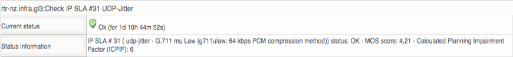
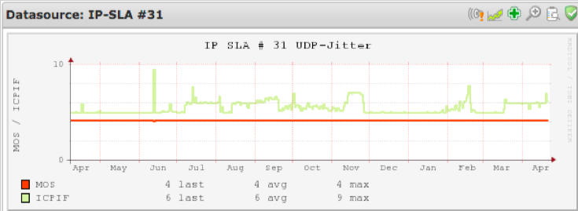
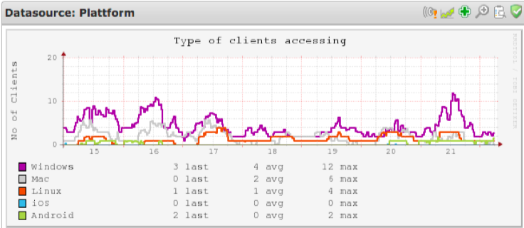
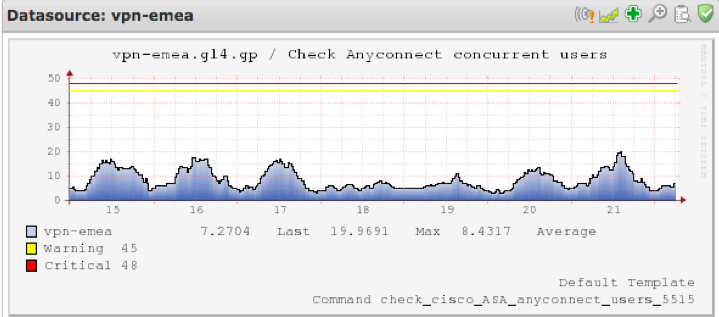
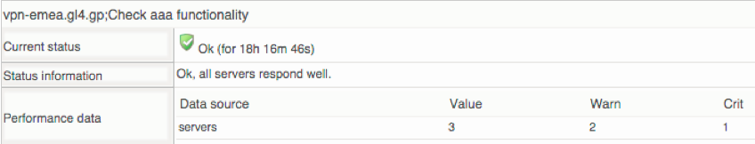
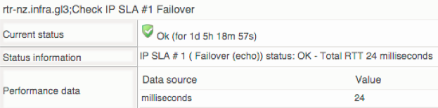

# Monitoring Networks, traffic and other details

 

 

This is an inspirational how-to aiming to show some examples of information and graphs that you can configure in your op5 Monitor system. It contains is a mix of standard op5 Monitor checks and more advanced options to enhance monitoring of specifically networks, links, VPN's and network devices. If you are interested to implement the more advanced features and lack time or resources, please feel free to contact us for more information or that one of our partners can assist you. Note, all graphs and checks used below are based on free to use checks or plugins. 

 

* * * * *

# OP5 Monitor - Network monitoring

As the business IT services are getting more distributed with multiple datacenters and the utilization of SaaS services continues to grow rapidly within Enterprise IT - the need for great working networks is essential. These shifts have direct impact on application performance, response times and overall user experience. OP5 Monitor has multiple built in ready to use checks to enable detailed monitoring of your network status and by that giving you early warnings before a major problem occurs. All performance data can be configured with thresholds to trigger alarms. It is also possible to generate trend graphs showing how your performance data xwill evolve over time based on historical data. The purpose of this paper is to show a few examples of what is possible to configure and monitor with op5 Monitor. 

Big Thanks to 33K Communications for sharing graphs and content 

If you are interested in knowing more about about the features and possibilities of monitoring your network - please don´t hesitate to contact us.

 

 

 

 

 

### [Download op5 Monitor Free](https://www.op5.com/download-op5-monitor/)

 

 

 

 

Interface statistics

### Basic IP traffic In and Out for specific ports

*Command reference: check\_traffic*

*
*

### Errors and discarded packets

 

-   The output also contains - Current, Average and Max values during the time period.
-   This graph shows discarded packages in/out and Error packages in/out over time.

*Command reference: check\_iferrors*

*
*

## Environmental status (IOS)

### Environmental general status of an IOS device

-   Fan, Power Supply, Voltage and Temp - all ok

*Command reference: check\_snmp\_environment*

**

### Memory check for both CPU and I/O

-   Graph showing CPU over last 4 years.

 

-   Graph showing I/O over last 3 years

### Uptime and reason for restart

-   Check showing how long the device have been running without at stop and also the reason for the last restart, hence if it was “crash” or like in this case a reload.
-   In case of failure messages such as "Warning, last reload was because of  error - a Software forced crash, PC 0x30E7265C! System has been online for 0:07:40.92" would be displayed in the output. 

 

-   Graph showing uptime over time.

 

## Visualizing links and utilization

### Weathermap

-   OP5 Monitor supports both google maps and offline options. It has built support for visualizing a local office or WAN links showing the current traffic loads with dynamic color schemes that makes it easy to see potential bottlenecks.

### EIGRP** Neighbour**

-   Check** ISAKMP SA (IOS)**
-   In a dynamic configured VPN network all routers can connect to each other and automatically create VPN tunnels based on current need. In this case we have a threshold with a minimum requirements of two concurrent VPNs from each site, this check represents one of the two tunnels needed to ensure EIGRP neighbours are working properly. 

 

 

## Cisco specific checks that requires a little bit of hands on configuration on the Cisco IOS side

 

 

### Interface duplex (IOS) (Metrics fetched using SSH and CLI commands)

 

-   This check ensures no interface is working in half duplex impacting performance and stability.

 

### Temperature (IOS) (Metrics fetched using SSH and CLI commands)

-   This check uses an SSH key to login and run the commands.
-   It shows:
    -   In temp

    -   Out temp

    -   CPU temp

 

### IP SLA FTP (IOS) (SNMP)

-   Cisco has a special “IP-SLA” feature that can report status based upon a user configuration.  It basically transmits a file to/from an FTP server and measure the transaction and creates a quality value.  For detail [see here.](http://goo.gl/y5JHCs) 

 

### IP SLA HTTP (IOS)

-   Similar function but now measuring SLA for HTTP traffic, for details check [here.](http://goo.gl/i6OVRh) 
-   This monitors DNS, TCP and http response times. All OIDs are matched to SLA-ID.

### UDP-Jitter (IOS)

To get a better understanding on quality on a specific link a Cisco router can act as both a client and a server. This enables you to monitor Jitter on a specific route and also by using a variety of different codecs. For more details see here.

 

IPSLA configuration example used in this example

*udp-jitter 192.168.31.14 16800 source-ip 192.168.86.7 codec g711ulaw*

*tos 184*

*frequency 300*

*ip sla schedule 31 life forever start-time now* 

mos=\$(snmpget -v 3 -u snmpuser -l authPriv -a SHA -A \<pass\> -x AES128 -X \<pass\> \$1 1.3.6.1.4.1.9.9.42.1.5.2.1.42.\$2 | awk '{ print \$4 }' | sed 's/\\B[0-9]\\{2\\}\\\>/,&/')

echo "IP SLA \# \$2 ( udp-jitter - G.711 mu Law (g711ulaw: 64 kbps PCM compression method)) status: OK - MOS score: \$mos - Calculated Planning Impairment Factor (ICPIF): \$icpif | mos=\$mos;icpif=\$icpif"

 

 

-   Graph showing SLA \#31 in MOS value over 1 year

 

## What type of client is accessing the SSLVPN? (ASA)

 

### Clients (OS / Device) connected

 

-   This output is telling us how many VPN clients are connected and also what type of client is using the SSLVPN over time

 

### Anyconnect Concurrent Users (ASA)

 

-   There is normally a limit to how many clients a system can support. It can be limitations in hardware, software or licenses.
-   This graphs shows all current connected to an VPN with a warning on 45 concurrent users.

 

 

 

### Check aaa functionality (ASA)

 

-   This checks if it is possible to authenticate to three different services. 

 

 

 

### Check IP-SLA Failover (IOS)

 

-   A common set-up is to use IPSEC tunnels across the internet to interconnect offices. In order the assure uptime dual links and auto fail over is the preferred method. This check tells you in what mode the Cisco Router is currently running so that you know if your connected over the primary or backup link. 

 

 

 

 

 

 

### [Download op5 Monitor Free](https://www.op5.com/download-op5-monitor/)

 

