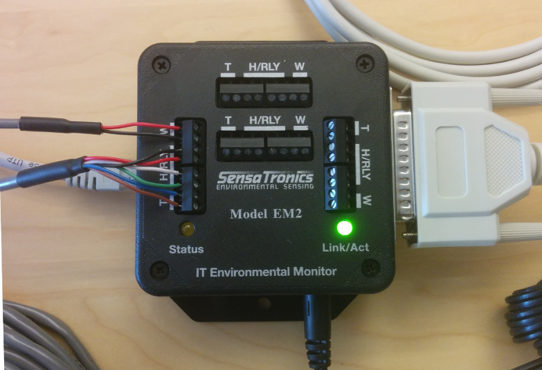
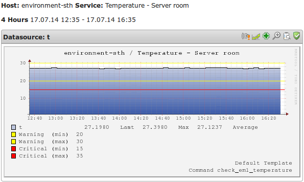

# Monitoring Sensatronics environmental sensors

# Introduction

If you want to monitor temperature, humidity or wetness op5 recommends the *[Sensatronics](http://www.sensatronics.com/)E* series of environmental monitors.
In this how-to we will configure the *EM2* model, connect the sensor probes and add relevant services in *op5 Monitor*.
Many of the following steps can be used for other *Sensatronics* products, but be aware of minor differences and consult the included manuals.

# Prerequisites

-   Sensatronics EM2 environmental monitor with included accessories
-   Computer with serial port or USB-to-serial converter
-   Terminal emulator like Minicom, HyperTerminal or similar for serial access
-   Needle-nose pliers are recommended for mounting of probe connections

# Instructions

## Connecting probes and cables

Read the included "*Quick start guide*" and follow the instructions covering connecting your probes, serial, network and PSU cables.
In this example we are using the combined humidity and temperature probe in combination with the wetness sensor.

## IP, hostname and SNMP configuration

1.   Connect the serial cable to a serial port or converter and connect the power to device
2.   Launch a terminal emulator like Mincom or HyperTerminal
3.   Connect to the device with the following settings:

-   -    BPS: 9600
    -    Data Bits: 8
    -    Parity: None
    -    Stop Bits: 1
    -    Flow Control: None

Use the keyboard to configure IP Address (A), Hostname (B), SNMP Community and Temperature Units (C).Make sure to set "Temperature Units" to your desired measurement system, since this will be used for thresholds and graphing.If you need more help please consult the product manual found on the Sensatronic website.

You should now be able to ping the device and access the internal web server.

## Service configuration in op5 Monitor

Add the device as a new host in Monitor. The following services will use the check\_em1 which is included with op5 Monitor.

### Temperature

Create a new service and give it a describing name, in this example we will use "Temperature sensor - Server room".The pre-configured check command check\_em1\_temperature needs three arguments:

\$ARG1\$

\$ARG2\$

\$ARG3\$

**Environment zone -**
In this example we use zone number 3,
so the first argument should simply be "3"

**Warning threshold -**
In this example we will use 26 degrees celsius,
therefore the second argument should be "26"

**Critical threshold -**
In this example we will use 30 degrees celsius,
therefore the third argument should be "30"

This configuration looks something like this in the configuration dialog:

Submit and save the configuration. When the first service check has been run you should hopefully see something like this on the status detail page:

### Humidity

Create a new service and give it a describing name, in this example we will use "Humidity sensor - Server room".The pre-configured check command check\_em1\_humidity needs three arguments:

\$ARG1\$

\$ARG2\$

\$ARG3\$

**Environment zone -**
In this example we use zone number 3,
so the first argument should simply be "3"

**Warning threshold -**
In this example we will use 52% humidity,
therefore the second argument should be "52"

**Critical threshold -**
In this example we will use 60% humidity,
therefore the third argument should be "60"

This configuration looks something like this in the configuration dialog:

Submit and save the configuration. When the first service check has been run you should hopefully see something like this on the status detail page:

### Wetness

Create a new service and give it a describing name, in this example we will use "Wetness sensor - Server room".The pre-configured check command check\_em1\_wetness needs three arguments:

\$ARG1\$

\$ARG2\$

\$ARG3\$

**Environment zone -**
In this example we use zone number 3,
so the first argument should simply be "3"

**Warning threshold -**
In this example we will use 25 Senturion,
therefore the second argument should be "25"

**Critical threshold -**
In this example we will set use 30 Senturion,
therefore the third argument should be "30"

This configuration looks something like this in the configuration dialog:

Submit and save the configuration. When the first service check has been run you should hopefully not see something like this on the status detail page:

If you see something like this you should probably stop reading this guide and run to the server room

Note on thresholds

In the examples above we configure upper warning and critical thresholds, but double valued thresholds can also be used.
If you would configure the warning threshold to be 10:40 and the critical threshold to be -5:66 the plugin will change status accordingly when the values goes outside of the defined limits.

 

# Graphing

The *check\_em1* plugin also generates performance data which can be used for graphing - here is an example from one of our server rooms:

