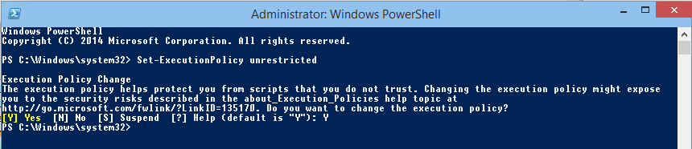
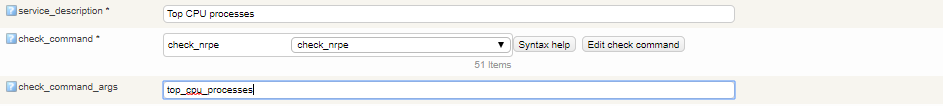

# Monitoring high cpu processes on Windows

Version

This article was written for version 7.3.14 of OP5 Monitor or later.

Articles in the Community-Space are not supported by OP5 Support.

# Introduction

This how-to will guide you to monitor top high cpu processes on Windows using Powershell.

# Prerequisites

- Working installation of OP5 Agent
- Working installation of OP5 Monitor

# Create Powershell script

This script is intended to be placed on your Windows server and executed over NSClient++. The script that we will use is seen below:

**top\_cpu\_processes.ps1**

``` {.powershell data-syntaxhighlighter-params="brush: powershell; gutter: false; theme: Confluence" data-theme="Confluence" style="brush: powershell; gutter: false; theme: Confluence"}
$Threshold = -100 // $args.get(0);
$Counter = "\Process(*)\% Processor Time";
$Data = Get-Counter $Counter;
$Cores = (Get-WmiObject -class win32_processor -Property numberOfCores).numberOfCores;
$CPUUsage = [math]::Round(($Data.CounterSamples | Where-Object {$_.InstanceName -eq "idle"} | Select-Object @{Name="Total";Expression={100 - $_.CookedValue / $Cores}}).Total,2);
If($CPUUsage -gt $Threshold) {
    $Processes = $Data.CounterSamples | Where-Object {$_.InstanceName -ne "idle" -and $_.InstanceName -ne "_Total"} | Sort-Object -Descending -Property CookedValue | Select-Object -First 10 -Property InstanceName, @{Name="Usage";Expression={[math]::Round(($_.CookedValue / $Cores),2)}};
    $Message = "Processes with high CPU: ";
    ForEach ($Process in $Processes) {
        $ProcName = $Process.InstanceName;
        $Usage = $Process.Usage;
        if ($Usage -gt 0) {
            $Message = $Message + "$ProcName($Usage%) ";
        }
    }
    # Append performance data
    $Message = $Message + "| "
    ForEach ($Process in $Processes) {
        $ProcName = $Process.InstanceName;
        $Usage = $Process.Usage;
        if ($Usage -gt 0) {
            $Message = $Message + "$ProcName=$Usage% ";
        }
    }
    Write-Host "$Message";
}
```

This will be placed in the script folder within the agent installation folder, in this case in: C:\\Program Files\\op5\\NSClient++\\scripts\\custom

Save the script as top\_cpu\_processes.ps1

# Add the script to OP5 Agent

To make the OP5 Agent aware of the script and how it should be executed we need to add a handler for it in the agent configuration.

Open the file custom.ini (or op5.ini) located in C:\\Program Files\\op5\\NSClient++\\ and add the following rows:

``` {.bash data-syntaxhighlighter-params="brush: bash; gutter: false; theme: Confluence" data-theme="Confluence" style="brush: bash; gutter: false; theme: Confluence"}
[NRPE Handlers]
top_cpu_proceses = cmd /c echo scripts\custom\top_cpu_processes.ps1 ; exit($lastexitcode) | powershell.exe -command -
```

#
Set ExecutionPolicy

Due to restrictions in powershell we are not allowed to run this file without changing the execution policy for powershell scripts.

In this example we will change the policy to unrestricted but this is not recommended for normal use. For more information about Execution Policy see <http://technet.microsoft.com/library/hh847748.aspx>.

Open powershell prompt as administrator and run

``` {.bash data-syntaxhighlighter-params="brush: bash; gutter: false; theme: Confluence" data-theme="Confluence" style="brush: bash; gutter: false; theme: Confluence"}
PS C:\Windows\system32> Set-ExecutionPolicy unrestricted
```

Answer Y on the question.



# Run script from OP5 Monitor console

This step is not necessary, but can be good before continuing just to make sure everything is working before change the configuration.

Log in to OP5 Monitor via console or SSH.

Run the following command to test the powershell script

``` {.bash data-syntaxhighlighter-params="brush: bash; gutter: false; theme: Confluence" data-theme="Confluence" style="brush: bash; gutter: false; theme: Confluence"}
# /opt/plugins/check_nrpe -H <ip to windows server> -c top_cpu_processes
```

If everything is working you should get the response saying:

Processes with high CPU: dwm(6.23%) syntpenh(1.56%) svchost(1.56%) svchost(1.56%) chrome(0.78%) msmpeng(0.78%) capiws(0.78%)  |'dwm'=6.23% 'syntpenh'=1.56% 'svchost'=1.56% 'svchost'=1.56% 'chrome'=0.78% 'msmpeng'=0.78% 'capiws'=0.78%

# Adding script to a host

Go to the configuration of a host in OP5 Monitor and add a new service.

1. Enter a Service Description of you choice
2. Select *check\_nrpe* as check\_command
3. Enter *top\_cpu\_processes* as check\_command\_args
    
4. Save the configuration.
