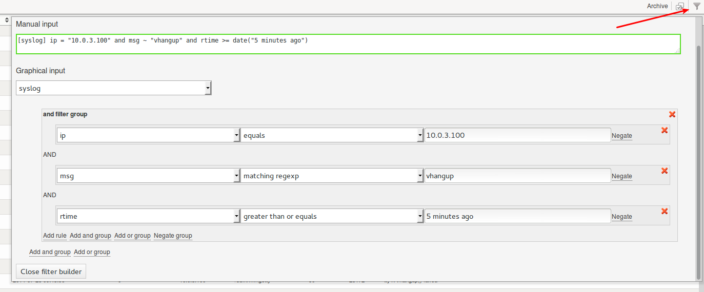

# Monitoring log filters in Monitor 7.0 or higher

Version

This article was written for version 7.0 of op5 Monitor, it could work on both lower and higher version if nothing else is stated.

 

# Introduction

Since version 7.0 of *op5 Monitor*, the log server functionality has been integrated in the main product and can be accessed from Monitor's GUI and HTTP API .
In this how-to we will use the *check\_op5\_filter* plugin and look at some different configurations for log filter monitoring.

# Prerequisites

-   *op5 Monitor* version 7.0 or higher
-   A dedicated user with adequate permissions to query the API log messages

# Building filter queries

In the following examples we will use filter queries to extract a list of objects that we can count and set alert limits for.
If you need help creating queries you can use the graphical filter builder found in the top right corner of any list view:

 

# Using the check plugin

We will use the predefined check command *check\_op5\_listview\_log\_messages\_filter* in the examples below.
The check command requires seven arguments to be provided:

\$ARG1\$

\$ARG2\$

\$ARG3\$

\$ARG4\$

\$ARG5\$

\$ARG6\$

\$ARG7\$

**User -**

User used for authentication
against the HTTP API

**Password -**

Password used for authentication
against the HTTP API

**Filter -**

Filter query,
like one constructed by
the "Filter Builder"

**Status text -**

Output message of
check plugin

**Label -**

Used to specify
unit for performance data

**Warning threshold -**

Warning threshold.
Supports threshold ranges.

**Critical threshold -**

Critical threshold.
Supports threshold ranges.

 

A configured service can look something like this in the graphical configuration utility:

 

# Examples

## Counting all error messages from a specific host

In this example we will count all error messages (See a list of syslog severity levels [here](http://en.wikipedia.org/wiki/Syslog#Severity_levels)) from the host 10.0.3.100 within the last five minutes.
We also set alert thresholds for the number of messages - 10 for warning alerts and 15 for critical alerts:

\$ARG1\$

\$ARG2\$

\$ARG3\$

\$ARG4\$

\$ARG5\$

\$ARG6\$

\$ARG7\$

loguser

mysecret

[log\_messages] ip = "10.0.3.100" and severity \<= 3 and rtime \>= date("5 minutes ago")

Last error message:

count

10

15

 

If the critical threshold was exceeded, it would look something like this in the service detail:

## 
Monitoring web server access logs

This example is similar to the previous one, except we use threshold ranges to define our warning and critical limits.
We use the log\_messages ident and a string from the log itself ("GET") to only extract the HTTPD access log data:

\$ARG1\$

\$ARG2\$

\$ARG3\$

\$ARG4\$

\$ARG5\$

\$ARG6\$

\$ARG7\$

loguser

mysecret

[log\_messages] ip = "10.0.3.101" and ident = "apache" and msg \~ "GET" and rtime \> date("15 minutes ago")

Web server access last 15 minutes. Last log:

count

300:2000

100:4000

 

If the warning threshold was outside the specified range, it would look something like this in the service detail:

 

## Monitoring a pre-defined filter

In this example we will monitor a pre-defined filter called "Failed logins last 10 minutes", created and saved in the web UI.
We also set alert thresholds for the number of failed logins - 3 for warning alerts and 5 for critical alerts:

 

\$ARG1\$

\$ARG2\$

\$ARG3\$

\$ARG4\$

\$ARG5\$

\$ARG6\$

\$ARG7\$

loguser

mysecret

[log\_messages] in "Failed logins last 10 minutes"

Last failed login:

count

3

5

 

If the warning threshold was exceeded, it would look something like this in the service detail:

 

Saved filters are only available to the user who created them, unless you select the option "Make Global" in the filter query builder.

# Graphing

The *check\_op5\_filter* plugin generates performance data for graphing. This is a graph from our *"Monitoring web server access logs"* example above:

# Issued with self-signed certificates in python

If you run in to this issue:

**FILTER UNKNOWN - URL Error: \<urlopen error [SSL: CERTIFICATE\_VERIFY\_FAILED] certificate verify failed (\_ssl.c:579)\>**

You may need to set

*verify=disable*

in */etc/python/cert-verification.cfg*

