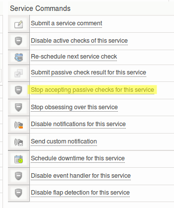

# Security hardening your Monitor installation

Version

This article originally addressed OP5 Monitor version 6.3. We are in the process of revising for version 7.3.20. We still expect these steps as presented now to work as we move forward.

Articles in the Community Space are not supported by OP5 Support.

# Table of contents

-   [Table of contents](#SecurityhardeningyourMonitorinstallation-Tableofcontents)
-   [About](#SecurityhardeningyourMonitorinstallation-About)
-   [Prerequisites](#SecurityhardeningyourMonitorinstallation-Prerequisites)
-   [Disable TRACE](#SecurityhardeningyourMonitorinstallation-DisableTRACE)
-   [Disable weak encryption ciphers and older SSL versions](#SecurityhardeningyourMonitorinstallation-DisableweakencryptionciphersandolderSSLversions)
-   [Minimize server tokens](#SecurityhardeningyourMonitorinstallation-Minimizeservertokens)
-   [Disable PHP easter eggs](#SecurityhardeningyourMonitorinstallation-DisablePHPeastereggs)
-   [Set X-FRAME-OPTIONS](#SecurityhardeningyourMonitorinstallation-SetX-FRAME-OPTIONS)
-   [Disable mysql networking support](#SecurityhardeningyourMonitorinstallation-Disablemysqlnetworkingsupport)
-   [Install SSL certificates from a trusted CA](#SecurityhardeningyourMonitorinstallation-InstallSSLcertificatesfromatrustedCA)
-   [Configure a firewall on the host system](#SecurityhardeningyourMonitorinstallation-Configureafirewallonthehostsystem)
-   [Disable passive check information on services that don't need it](#SecurityhardeningyourMonitorinstallation-Disablepassivecheckinformationonservicesthatdon'tneedit)
-   [Configure sudo for privileges separation](#SecurityhardeningyourMonitorinstallation-Configuresudoforprivilegesseparation)
-   [Configure a different port for SSH access](#SecurityhardeningyourMonitorinstallation-ConfigureadifferentportforSSHaccess)
-   [Develop a password policy](#SecurityhardeningyourMonitorinstallation-Developapasswordpolicy)
-   [Audit the plugins you install](#SecurityhardeningyourMonitorinstallation-Auditthepluginsyouinstall)

# About

This how-to will cover some configuration changes that can help you secure your Monitor installation and host system.

Please preserve notes of any hardening steps that you perform on your Monitor server. Please also mention a summary of those steps when you open any issues to OP5 Support, as this will expedite resolution.

# Prerequisites

-   Basic Linux and/or UNIX knowledge
-   Apache (httpd) configuration skills

# Disable TRACE

## About

This directive overrides the behavior of [TRACE](http://www.cgisecurity.com/questions/httptrace.shtml) for both the core server and mod\_proxy. The default TraceEnable on permits TRACE requests per RFC 2616, which disallows any request body to accompany the request. TraceEnable off causes the core server and mod\_proxy to return a 405 (Method not allowed) error to the client.

## How-to

Edit the file */etc/httpd/conf/httpd.conf* and add *TraceEnable off*

# Disable weak encryption ciphers and older SSL versions

## About

It is vital to disable old and insecure encryption ciphers and Secure Socket Layer (SSL) versions in OP5's web server. Their disabling could cause problems for users with outdated web browsers, so check the guidelines for your infrastructure's supported browsers.

## How-to

Edit the file '/etc/httpd/conf.d/ssl.conf' to replace the existing SSLCipherSuite and SSLProtocol string values with the latest entries from the Intermediate Compatibility section of Mozilla's guide for Security on server side side TLS. It is even easier to pass the values from the OP5 server to Mozilla's SSL Configuration Generator page, which will print the right values for you.

# Minimize server tokens

## About 

ServerTokens display information about the web server version, the host system and various other things.
Disabling [ServerTokens](http://httpd.apache.org/docs/2.2/mod/core.html#servertokens) makes it harder for an attacker to gain information about the system running Monitor. 

## How-to

Edit the file /etc/httpd/conf/httpd.conf

Change the value *"ServerTokens* *Min*" to "*ServerTokens Prod"*

# Disable PHP easter eggs

## About

This does not mitigate any known attacks, but can limit the amount of information available to an attacker and might thus slow down potential attacks.

This easter egg will show a picture if you add for example the following string to the end of the URL ?=PHPE9568F36-D428-11d2-A769-00AA001ACF42

Here is the pictures that can be shown: 

## How-to

Set the expose\_php = Off in /etc/php.ini

# Set X-FRAME-OPTIONS

Add the following to /etc/httpd/conf.d/ssl.conf to mitigate [clickjacking attacks](https://www.owasp.org/index.php/Clickjacking). Note: This will break the external widgets feature.

    Header always append X-Frame-Options SAMEORIGIN

# Disable mysql networking support

Add

``` {.bash data-syntaxhighlighter-params="brush: bash; gutter: false; theme: Confluence" data-theme="Confluence" style="brush: bash; gutter: false; theme: Confluence"}
skip-networking
```

to the [mysqld] section of /etc/my.cnf

# Install SSL certificates from a trusted CA

## About 

op5 Monitor ships with a self signed certificate for HTTPS, it's recommended to either install this CA on your computers or install a new certificate that's signed by a trusted CA.

## How-to

Read the "SSL Certificate" paragraph in the server configuration chapter of the manual if you are using the APS or consult the Apache httpd documentation

# Configure a firewall on the host system

## About 

The Monitor installer currently disables the built in Linux firewall, iptables. A list of ports used by Monitor and LogServer can be found in chapter in the "*[Installation preparation guide](http://www.op5.com/manuals/extras/op5_installation_preparation_guide.pdf)*", paragraph 3.5**
**

## How-to

Insert desired rules in the iptables configuration file, /etc/sysconfig/iptables, and reload the firewall

 

# Disable passive check information on services that don't need it

## About 

The standard behavior in Monitor is that all services will accept passive check information.
This could result in tampered check results if an attacker would get access to a host which is trusted to submit passive results via NSCA or similar.

## How-to

Select the *"Stop accepting passive checks for this service"* on the status detail page for desired services



 

# Configure sudo for privileges separation

## About 

If multiple users need shell-access to the host system and root-privileges, the *sudo* utility is recommended for traceability and credential separation.

You can find more information about configuring *sudo* [here](http://www.cyberciti.biz/tips/allow-a-normal-user-to-run-commands-as-root.html).

# Configure a different port for SSH access

## About 

Changing the default port for SSH access to host system might protect/obscure you from automated network scanners and brute-force scripts.

## How-to

Change "*\#Port 22*" to "*Port your-desired-port*" in the sshd configuration file, */etc/ssh/sshd\_config*, and restart the service.
Further you need to configure the default ssh port for the root and monitor users. Create a file named "config" in /root/.ssh/ and
/opt/monitor/.ssh/. It should contain entries for every peer and poller that doesn't use the default port:

>         Host "Peer or poller name"
>              HostName "Peer or poller name"
>              port "*Port your-desired-port*"

Please remember that your remote session will get disconnected and firewalls and similar might need to be reconfigured.

# Develop a password policy

## About 

As of today, op5 Monitors (internal) authentication system does not support a password policy system. It's recommended to connect op5 Monitor to a directory service (e.g. Microsoft Active Directory) that supports password policy routines.

# Audit the plugins you install

## About 

Plugins in the op5 Monitor system are actually programs and scripts that are executed locally on the host system as the *monitor* user.
If you use third-party or internally developed plugins you should try to audit the code, verify that argument handling is being properly escaped and similar.

