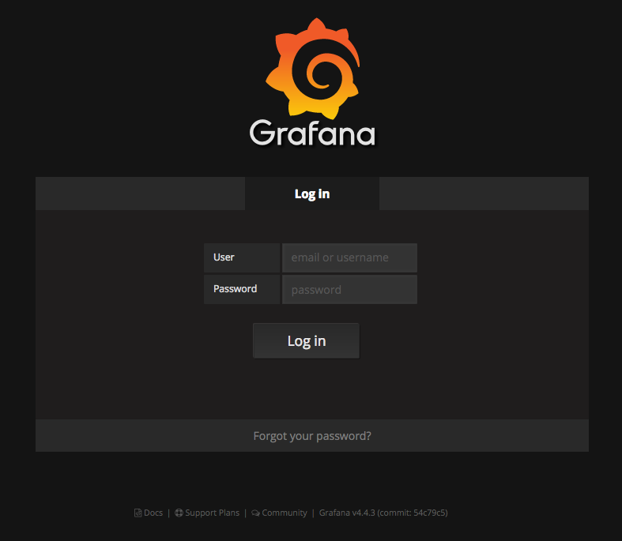
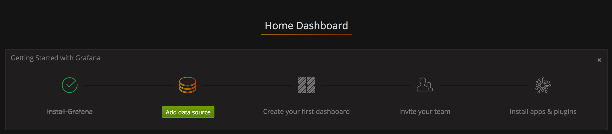
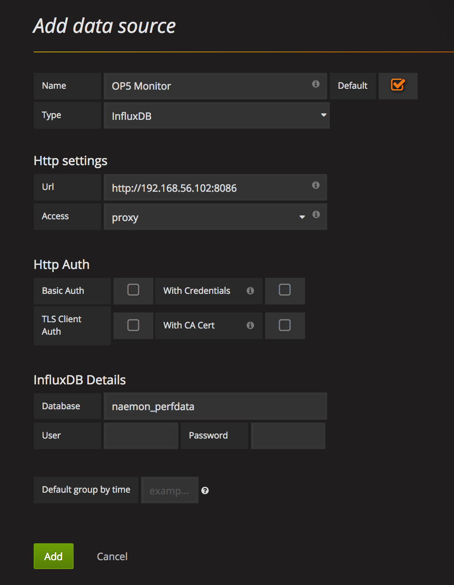
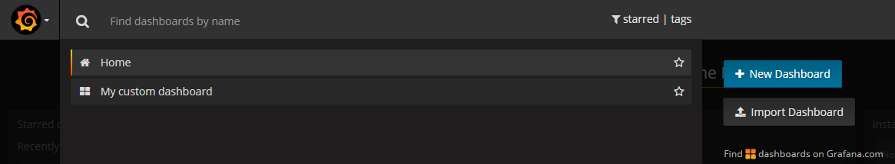
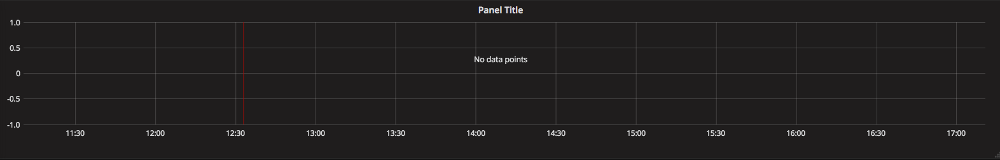
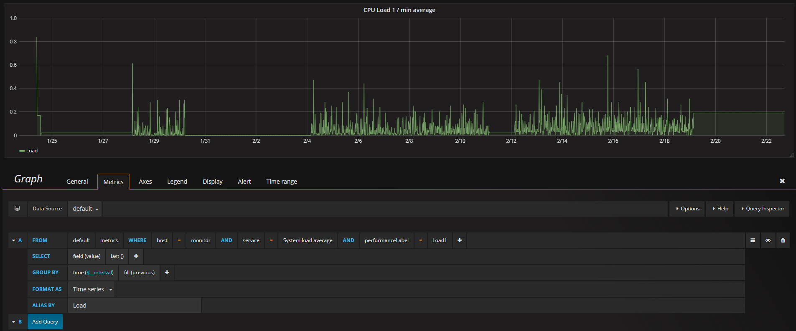
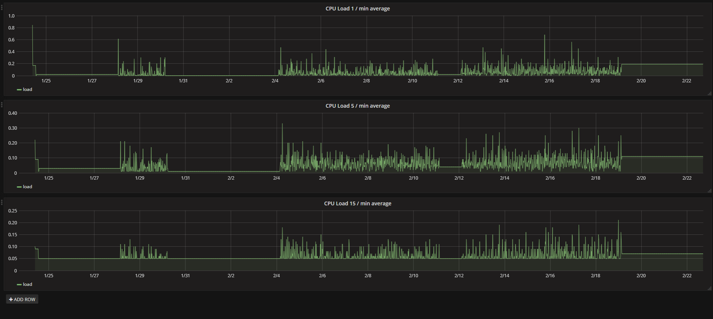

# Sending metrics to Grafana

OP5 does not take any responsibility for this solution.

This article was written for *version 7.3.20* of OP5 Monitor or later and *requires CentOS/RedHat 7*.

Articles in the Community-Space are not supported by OP5 Support.

-   [Introduction](#SendingmetricstoGrafana-Introduction)
-   [Before you start](#SendingmetricstoGrafana-Beforeyoustart)
    -   [OP5 Grafana guidelines](#SendingmetricstoGrafana-OP5Grafanaguidelines)
    -   [OP5 Grafana prerequisites](#SendingmetricstoGrafana-OP5Grafanaprerequisites)
-   [Installation](#SendingmetricstoGrafana-Installation)
    -   [Installing Grafana](#SendingmetricstoGrafana-InstallingGrafana)
    -   [Installing InfluxDB](#SendingmetricstoGrafana-InstallingInfluxDB)
    -   [Installing NagFlux](#SendingmetricstoGrafana-InstallingNagFlux)
-   [Configuration](#SendingmetricstoGrafana-Configuration)
-   [Logging in to Grafana Web GUI](#SendingmetricstoGrafana-LoggingintoGrafanaWebGUI)
    -   [Add a new Data Source to Grafana](#SendingmetricstoGrafana-AddanewDataSourcetoGrafana)
-   [Create your first Grafana dashboard](#SendingmetricstoGrafana-CreateyourfirstGrafanadashboard)
-   [FAQ](#SendingmetricstoGrafana-FAQ)

# Introduction

Metrics ("performance data") are a fundamental part of OP5 Monitor. Collecting and exploring metrics will give you insight of how your environment behaves over time. Visualizing metrics in near-realtime can also help you identify problems as they occur. In this article we will focus on how to forward your metrics to InfluxDB, which is an accepted datasource for Grafana. Nagflux is the key component in this solution to export performance data (i.e. metrics) from OP5 Monitor.

# Before you start

## OP5 Grafana guidelines

-   OP5 recommends that Grafana and InfluxDB is running on a separate server. And not on the same server as OP5 Monitor runs.
    This is mainly due to performance reasons, so that Grafana runs as smoothly as possible, without disturbing your monitoring
-   OP5 recommends that the Grafana service is running on CentOS or Red Hat Enterprise Linux (EL) version 7

## OP5 Grafana prerequisites

Make sure the following is in place

-   OP5 Monitor installed and running (version 7.3.20 or higher and on CentOS/RedHat 7)
-   Grafana and [InfluxDB](https://portal.influxdata.com/downloads) (version 1.2.0 or higher) is installed and running - on a dedicated server (below refered to as the "visualisation server")
-   SSH- and root-access to your server

# Installation

## Installing Grafana

The instructions in this section are intended to be executed on your *visualisation server.*

**1)** If you're not already running a Grafana instance, execute the following two commands as root to install the service:

``` {.bash data-syntaxhighlighter-params="brush: bash; gutter: false; theme: Confluence" data-theme="Confluence" style="brush: bash; gutter: false; theme: Confluence"}
curl -s https://packagecloud.io/install/repositories/grafana/stable/script.rpm.sh | sudo bash
yum install grafana -y
```

**2)** Start Grafana and make it launch at boot

``` {.bash data-syntaxhighlighter-params="brush: bash; gutter: false; theme: Confluence" data-theme="Confluence" style="brush: bash; gutter: false; theme: Confluence"}
systemctl start grafana-server.service
systemctl enable grafana-server.service
```

**
3)** If required, configure your local firewall

``` {.bash data-syntaxhighlighter-params="brush: bash; gutter: false; theme: Confluence" data-theme="Confluence" style="brush: bash; gutter: false; theme: Confluence"}
firewall-cmd --permanent --zone=public --add-port=3000/tcp
firewall-cmd --reload
```

## **Installing InfluxDB**

The instructions in this section are intended to be executed on your *visualisation server.*

**1)** If you're not already running a Influx database, execute the following command to use the yum package manager for installation:

``` {.bash data-syntaxhighlighter-params="brush: bash; gutter: false; theme: Confluence" data-theme="Confluence" style="brush: bash; gutter: false; theme: Confluence"}
cat <<EOF | sudo tee /etc/yum.repos.d/influxdb.repo
[influxdb]
name = InfluxDB Repository - RHEL \$releasever
baseurl = https://repos.influxdata.com/rhel/\$releasever/\$basearch/stable
enabled = 1
gpgcheck = 1
gpgkey = https://repos.influxdata.com/influxdb.key
EOF
```

**
2) **Once repository is added to the yum configuration, install and start the InfluxDB service by running:

``` {.bash data-syntaxhighlighter-params="brush: bash; gutter: false; theme: Confluence" data-theme="Confluence" style="brush: bash; gutter: false; theme: Confluence"}
yum install influxdb -y
systemctl start influxdb
```

## Installing NagFlux

The instructions in this section are intended to be executed on your ***OP5 server.***

**1)** SSH to your OP5 Monitor installation. Make sure to replace **\<influxdb\_host\_ip\>** with the actual IP address to your InfluxDB server and **\<influx\_database\_name\> **with the name you want for your database.

``` {.bash data-syntaxhighlighter-params="brush: bash; gutter: false; theme: Confluence" data-theme="Confluence" style="brush: bash; gutter: false; theme: Confluence"}
# Install dependencies
yum install golang git

# Install and build nagflux binary
go get -u github.com/griesbacher/nagflux
go build github.com/griesbacher/nagflux
 
# Copy the nagflux binary and create the folders we need
cp nagflux /usr/bin/
mkdir /etc/nagflux
mkdir /var/log/nagflux
mkdir /var/nagflux
mkdir -p /opt/monitor/var/nagfluxspool/perfdata && chown -R monitor:apache /opt/monitor/var/nagfluxspool

# Create Nagflux configuration file
cat <<EOF | sudo tee /etc/nagflux/config.gcfg
[main]
NagiosSpoolfileFolder = "/opt/monitor/var/nagfluxspool/perfdata"
NagiosSpoolfileWorker = 1
InfluxWorker = 2
MaxInfluxWorker = 5
DumpFile = "/var/log/nagflux/nagflux.dump"
NagfluxSpoolfileFolder = "/var/nagflux"
FieldSeparator = "&"
BufferSize = 1000
FileBufferSize = 65536
DefaultTarget = "all"
 
[Log]
LogFile = "/var/log/nagflux/nagflux.log"
MinSeverity = "INFO"
 
[InfluxDBGlobal]
CreateDatabaseIfNotExists = true
NastyString = ""
NastyStringToReplace = ""
HostcheckAlias = "hostcheck"
 
[InfluxDB "<influx_database_name>"]
Enabled = true
Version = 1.0
Address = "http://<influxdb_host_ip>:8086"
Arguments = "precision=ms&db=<influx_database_name>&u=admin&p=admin"
StopPullingDataIfDown = true
 
[Livestatus]
#tcp or file
Type = "file"
#tcp: 127.0.0.1:6557 or file /var/run/live
Address = "/opt/monitor/var/rw/live"
MinutesToWait = 3
Version = ""
EOF
 
# Create service file
cat <<EOF | sudo tee /etc/systemd/system/nagflux.service
[Unit]
Description=A connector which transforms performancedata from Nagios/Icinga(2)/Naemon to InfluxDB/Elasticsearch
Documentation=https://github.com/Griesbacher/nagflux
After=network-online.target
 
[Service]
User=root
Group=root
ExecStart=/usr/bin/nagflux -configPath /etc/nagflux/config.gcfg
Restart=on-failure
 
[Install]
WantedBy=multi-user.target
Alias=nagflux.service
EOF

# Delete current perfdata commands
sed -i '/process-host-perfdata/,+4d' /opt/monitor/etc/misccommands.cfg
sed -i '/process-service-perfdata/,+4d' /opt/monitor/etc/misccommands.cfg

# Add new perfdata commands
cat >> /opt/monitor/etc/misccommands.cfg << 'EOF'

# command 'process-host-perfdata'
define command{
    command_name                   process-host-perfdata
    command_line                   /bin/cp -p /opt/monitor/var/host-perfdata /opt/monitor/var/spool/perfdata/host_perfdata.$TIMET$ && /bin/mv /opt/monitor/var/host-perfdata /opt/monitor/var/nagfluxspool/perfdata/host_perfdata.$TIMET$
    }

# command 'process-service-perfdata'
define command{
    command_name                   process-service-perfdata
    command_line                   /bin/cp -p /opt/monitor/var/service-perfdata /opt/monitor/var/spool/perfdata/service_perfdata.$TIMET$ && /bin/mv /opt/monitor/var/service-perfdata /opt/monitor/var/nagfluxspool/perfdata/service_perfdata.$TIMET$
    }
EOF

# Restart monitor
mon restart
```

**2)** Start Nagflux

``` {.bash data-syntaxhighlighter-params="brush: bash; gutter: false; theme: Confluence" data-theme="Confluence" style="brush: bash; gutter: false; theme: Confluence"}
# To run in existing instance
nagflux -configPath /etc/nagflux/config.gcfg &
 
 
# To run as a service
systemctl daemon-reload
systemctl enable nagflux
systemctl start nagflux
```

# **Configuration**

# Logging in to Grafana Web GUI

Start by launching your web browser and go to [http://\<your-visualisation-server\>:3000/](http://your-grafana-server:3000/). You'll now be prompted with the login page.



Default user and password is: *admin / admin*.

## Add a new Data Source to Grafana

First thing to do when logged in is to add a new data source, which will be the InfluxDB we installed above and configured Nagflux to use.



Click "*Add data source*".

Field

Value

Name

\<your-OP5-instance-name\> (e.g. OP5 Monitor)

Type

InfluxDB

URL

http://\<your-visulisation-server\>:8086

Access

Proxy

Database

\<influxdb\_database\_name\>

If you have configured your InfluxDB with user & password, please do provide that as well. If not, leave the fields empty.

Click "*Add*" when finished.
If the connection was successful Grafana will respond with a green message.



Grafana is now successfully connected to InfluxDB!
This means that you can start configuring your dashboards and view your graphs.

You now have a working OP5 Monitor with Grafana.

# Create your first Grafana dashboard

Dashboards is the place where you can place all your graphs. In the Grafana language a graph is presented through a *panel*.
A dashboard can consist of multiple panels, which is the key function to make your dashboard contain all the information you need for making your perfect view.

In this example we are going to create a dashboard that consists of three graphs presenting the average CPU load on the OP5 Monitor server.

Start by navigating to the Grafana start page and click "*New dashboard*".



You'll now be presented with an empty space, which is a *panel *where in this example we will add our first graph.

In the above section you can see multiple different panels types, e.g. *graph*, *singelstat*, *table*, *heatmap* and *text*.
All of these are different ways to present your data in Grafana, to make your dashboard look exactly like you want to.

In this example we are going to use "*Graph*".

We now have an empty panel that we are going to fill with CPU load performance data from InfluxDB.



To start editing this panel, click the "*Panel Title*" and choose *"Edit"*.

This will start an interface where you can specify your query against InfluxDB to show the data you want.

Start by choosing the "*General*" tab and give your panel a title. In this example: "CPU Load 1 / min average".
Move over to the "*Metrics*" tab, where we setup the query.

In the *FROM* field we can choose which *Data Source*, *Host* and *Service* to pick data from.
In this example we use host "*monitor*" and service "*System load average*", which performance data is typed as *"Load1, Load5, Load15".*

See the below image for example usage.



SQL-syntax for the above is: `SELECT last("value") FROM "Load1" WHERE "host" = 'monitor' AND $timeFilter GROUP BY time($__interval) fill(previous)`

Our first panel in Grafana is now filled with a beautiful graph. Time to setup the next two graphs for *Load5* and *Load15*, to complete this dashboard.

Click "*X*" to exit the edit-mode and click "*+ Add row*" to add a new panel.

Repeat the above steps starting from setting a name on your new panel and switch *Load1* to *Load5* and *Load15 *in the following two panels.

The result should look something like this:



To finalize this, hit the save icon.  
Give your dashboard a name and your first dashboard is now ready, and found under the Grafana home page.

# FAQ

**Is this a supported solution?**

Please get in touch with us to get OP5 professional services to tailor it for your environment and needs.

**Can OP5 install and configure this for me?**

Yes, Please get in touch with us to get OP5 professional services to tailor it for your environment and needs.

**Will this replace the existing graphs for all host/services in OP5 Monitor?**

No. Your graphs will continue to work as before. This solution will only forward your performance data to Grafana, stored in InfluxDB.

**Can I export historical data in OP5 Monitor to InfluxDB?**

No. Historical data is not exported to InfluxDB.

**How do I automatically generate graphs in Grafana for host/services?**

Please get in touch with us to get OP5 professional services to tailor it for your environment and needs.

**How do I send metrics from multiple OP5 monitor instances (peer, pollers) to Grafana?**

Please get in touch with us to get OP5 professional services to tailor it for your environment and needs.

**We are using the Naemon InfluxDB Broker Module, is this still a working solution?**

The naemon influxdb broker is no longer functional and is therefore deprecated in favour for the solution in this article.

