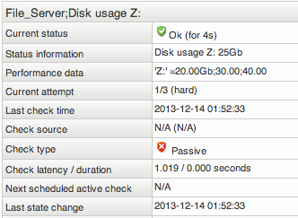

# Sending results using query handler

Version

This article was written for version 6.2 of Monitor, it could work on both lower and higher version if nothing else is stated.

Articles in the Community-Space are not supported by OP5 Support.

# Table of Contents

-   [About](#Sendingresultsusingqueryhandler-About)
-   [Service](#Sendingresultsusingqueryhandler-Service)
-   [Host](#Sendingresultsusingqueryhandler-Host)

# About

This article describes how to use the query handler to send passive results to OP5 Monitor. These types of passive results can be used for scrips that is not scheduled by OP5 Monitor to perform checks.

To send a passive result to OP5 Monitor we use the command 'mon qh query command run' or writing directly to the socket. Both methods are described in this how-to. Using the mon-command is a debugging tool. For implementations where passive results are sent to the monitor server using the socket is the preferred way.

# Service

To send a passive result for a service using the query handler the command looks like this:

**mon command**

``` {.bash data-syntaxhighlighter-params="brush: bash; gutter: false; theme: Confluence" data-theme="Confluence" style="brush: bash; gutter: false; theme: Confluence"}
$ mon qh query command run "[$(date +%s)] PROCESS_SERVICE_CHECK_RESULT;monitor;some_service;0;output"
```

**Socket**

``` {.bash data-syntaxhighlighter-params="brush: bash; gutter: false; theme: Confluence" data-theme="Confluence" style="brush: bash; gutter: false; theme: Confluence"}
printf "@command run [$(date +%s)] PROCESS_SERVICE_CHECK_RESULT;monitor;some_service;0;output\0" | unixcat /opt/monitor/var/rw/nagios.qh
```

 

Where 

-   \$(date +%s) generates a timestamp. Note that the space between the timestamp and the name of the command is significant. Leaving it out will result in an error
-   PROCESS\_SERVICE\_CHECK\_RESULT is the name of the command
-   'monitor' is the host for which to submit a passive check
-   'some\_service' is the name of the service on the host.
-   '0' is the check result
-   'output' is the plugin output
-   The \\0 after output when using the socket must be there.

In this example we will send a result to the service 'Disk usage Z:' on host 'File\_server'. The check result is 'OK' with "Disk usage Z: 25Gb" as output and "'Z:' =20.00Gb;30.00;40.00" as performance output<sup>1</sup> for building graphs.

**mon-command**

``` {.bash data-syntaxhighlighter-params="brush: bash; gutter: false; theme: Confluence" data-theme="Confluence" style="brush: bash; gutter: false; theme: Confluence"}
mon qh query command run "[$(date +%s)] PROCESS_SERVICE_CHECK_RESULT;File_Server;Disk usage Z:;0;Disk usage Z: 25Gb|'Z:' =20.00Gb;30.00;40.00"
```

**Socket**

``` {.bash data-syntaxhighlighter-params="brush: bash; gutter: false; theme: Confluence" data-theme="Confluence" style="brush: bash; gutter: false; theme: Confluence"}
printf "@command run [$(date +%s)] PROCESS_SERVICE_CHECK_RESULT;File_Server;Disk usage Z;0;Disk usage Z: 25Gb|'Z:' =20.00Gb;30.00;40.00\0" | unixcat /opt/monitor/var/rw/nagios.qh
```

 

The command output if everything is ok is

``` {.bash data-syntaxhighlighter-params="brush: bash; gutter: false; theme: Confluence" data-theme="Confluence" style="brush: bash; gutter: false; theme: Confluence"}
OK:No error
```

This result will look like this in OP5 Monitor:



## Multiline

It is possible to send in passive results with multiline support. To do this we need to change the *escape\_html\_tags=1* to *escape\_html\_tags=0* in the file */opt/monitor/etc/cgi.cfg*

To send a multiline result to OP5 Monitor use the \<br\> tag in the output. Example:

**mon-command**

``` {.bash data-syntaxhighlighter-params="brush: bash; gutter: false; theme: Confluence" data-theme="Confluence" style="brush: bash; gutter: false; theme: Confluence"}
mon qh query command run "[$(date +%s)] PROCESS_SERVICE_CHECK_RESULT;File_Server;Disk usages;0;Disk usage Z: 25Gb<br>Disk usage S: 20Gb<br>Disk usage I: 10Gb"
```

**Socket**

``` {.bash data-syntaxhighlighter-params="brush: bash; gutter: false; theme: Confluence" data-theme="Confluence" style="brush: bash; gutter: false; theme: Confluence"}
printf "@command run [$(date +%s)] PROCESS_SERVICE_CHECK_RESULT;File_Server;Disk usages;0;Disk usage Z: 25Gb<br>Disk usage S: 20Gb<br>Disk usage I: 10Gb\0" | unixcat /opt/monitor/var/rw/nagios.qh
```

 

## Footnote

1.  The performance output for the service check uses semicolon as a separator for separating results with warning and critical threshold , same as the query handler uses to separate it's input values. This is not an issue due to that the query handler stops looking at semicolons after the output starts.

 

# Host

It is also possible to do this for a host check then we replace PROCESS\_SERVICE\_CHECK\_RESULT with PROCESS\_HOST\_CHECK\_RESULT and we do not need to specify a service.

**mon-command**

``` {.bash data-syntaxhighlighter-params="brush: bash; gutter: false; theme: Confluence" data-theme="Confluence" style="brush: bash; gutter: false; theme: Confluence"}
mon qh query command run "[$(date +%s)] PROCESS_HOST_CHECK_RESULT;File_Server;0;Server is UP"
```

**Socket**

``` {.bash data-syntaxhighlighter-params="brush: bash; gutter: false; theme: Confluence" data-theme="Confluence" style="brush: bash; gutter: false; theme: Confluence"}
printf "@command run [$(date +%s)] PROCESS_HOST_CHECK_RESULT;File_Server;0;Server is UP\0" | unixcat /opt/monitor/var/rw/nagios.qh
```

 

 

