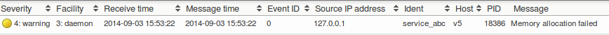

# Sending test messages to op5 Logger/LogServer

Version

This article was written for version 7.0 of op5 Monitor, it could work on both lower and higher version if nothing else is stated.

Articles in the Community-Space are not supported by op5 Support.

# Introduction

When creating a filter for log monitoring it can sometimes be useful to test these by sending your own log messages.
In this short how-to we will use the command line utility *logger* (not to be confused with the *Logger* feature in *op5 Monitor*),
to create our own *syslog* messages and send them to our *op5 Monitor* server.

# Prerequisites

-   Shell access to a Linux system
-   Remote logging configured - read [this](http://LÄNkA%20HEREEE) manual page for more information
-   The *logger* command line utility

# Example

A typical *logger* command looks something like this:

``` {.text data-syntaxhighlighter-params="brush: text; gutter: false; theme: Confluence" data-theme="Confluence" style="brush: text; gutter: false; theme: Confluence"}
$ logger -i -t "service_abc" -p "daemon.warning" "Memory allocation failed"
```

The *-i* argument includes the process ID in the message, *-t* sets the ident and *-p* sets the syslog priority based on the provided [facility](http://en.wikipedia.org/wiki/Syslog#Facility_levels) and [severity levels](http://en.wikipedia.org/wiki/Syslog#Severity_levels).

 

When the command above is executed it should result in something like this in the "Log messages" view:



 

 

