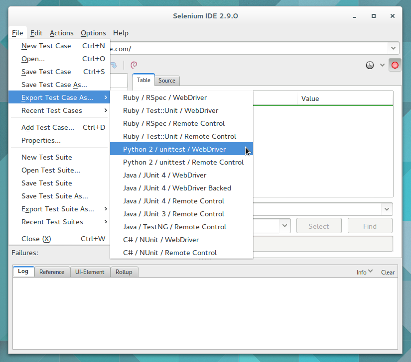
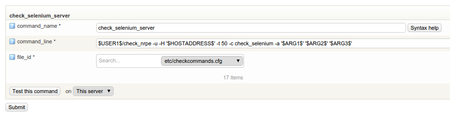
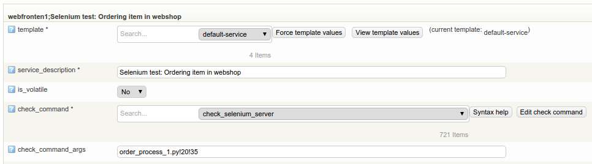
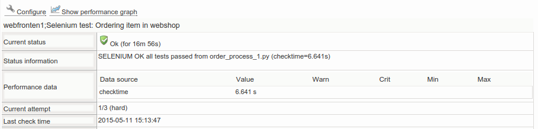

# Setting up Selenium Server on Microsoft Windows

Version

This article was written for version 7.0.4 of OP5 Monitor, it could work on both lower and higher version if nothing else is stated.

Articles in the Community-Space are not supported by OP5 Support.

## Introduction

*[Selenium](http://www.seleniumhq.org/)* is browser automation framework used for testing web pages and applications.
It is similar to the *[WebInject](Monitoring_websites_with_webinject)* application included in *op5 Monitor*, but includes an IDE which allows the user to build complex test cases executed by browsers like *Google* *Chrome* and *Internet Explorer*.

This how-to will show you how to setup *Selenium Server* on *Microsoft Windows* with *Mozilla Firefox* and configure test case monitoring.

Support information

Selenium Server, the check plugin and it's dependencies are third-party products, not supported by OP5 AB

## Prerequisites

- Basic knowledge in Windows server administration
- The *[Selenium IDE](http://www.seleniumhq.org/projects/ide/)* installed in your web browser
- A working Internet connection for downloading dependencies
- Basic knowledge of service configuration in *op5 Monitor*
- A directory called "C:\\selenium" and C:\\selenium\\testcases"
- The "NSClient++" monitoring agent installed on the target system

Note: Firefox Plugin "Selenium IDE" is not supported in the Firefox browser beginning from version 55.  (<https://www.ghacks.net/2017/08/21/selenium-ide-firefox-add-on-end-of-live/>) webdriver should be used.

## Software dependencies

Selenium Server requires some additional applications and runtimes:

### Mozilla Firefox -

The *Firefox* web browser will be used as the web driver in this how-to and can be downloaded from the [M*ozilla foundation's* website](https://www.mozilla.org/en-US/firefox/new/).

### Oracle Java -

Selenium Server requires the Java runtime environment, which can be downloaded from *[Oracle's website](https://java.com/en/download/).*

The "Ask toolbar" provided in the Java installation wizard is not required by Selenium Server, but might be *nice* addition depending on your preferences

### Python interpreter -

The check plugin for *Selenium* test cases requires the *Python interpreter*, version 2.X.
You can download it from the [*Python software foundations* website](https://www.python.org/downloads/).
Make sure to enable the "Add Python.exe to path" option in the installation wizard.

### NSSM -

*Selenium server* does not include any service management out-of-the-box.
*NSSM* is an application which turns Windows and Java executables into system services.

You can download NSSM via [their official website](https://nssm.cc/download) or via [Chocolatey](https://chocolatey.org/packages/NSSM).

## Installing Selenium Server

Download *Selenium Server* version 2.x from the *[SeleniumHQ](http://www.seleniumhq.org/download/)* and move the JAR-file to "C:\\selenium".
Open the command prompt as administrator in extracted *NSSM* directory and execute the following commands to install the service:

``` {.text data-syntaxhighlighter-params="brush: text; gutter: false; theme: Confluence" data-theme="Confluence" style="brush: text; gutter: false; theme: Confluence"}
.\nssm.exe install selenium-server java -jar C:\selenium\selenium-server-standalone-2.45.0.jar -interactive
.\nssm.exe start selenium-server
```

It's highly recommended to create a dedicated user for the Selenium Server service to minimize security risks

You will also need to install the Selenium Python module for the test cases.
Open the command prompt as administrator and execute the following PIP command:

``` {.text data-syntaxhighlighter-params="brush: text; gutter: false; theme: Confluence" data-theme="Confluence" style="brush: text; gutter: false; theme: Confluence"}
pip.exe install selenium
```

##
Preparing the monitoring agent

Create a directory in "C:\\Program Files\\op5\\NSClient++\\scripts" called "custom" and copy the "[check\_selenium\_win-APLHA](attachments/12977331/13271391.py)" plugin to it.
Open a text editor as administrator and add the following lines to  "C:\\Program Files\\op5\\NSClient++\\custom.ini":

``` {.text data-syntaxhighlighter-params="brush: text; gutter: false; theme: Confluence" data-theme="Confluence" style="brush: text; gutter: false; theme: Confluence"}
[NRPE Handlers]
check_selenium=python.exe scripts\custom\check_selenium_win-ALPHA.py -s "$ARG1$" -w "$ARG2$" -c "$ARG3$"
```

Restart the *NSClient++* system service to reload the configuration.

## Exporting *Selenium* *IDE* test cases

Once you have created a test case, open "Export Test Case As..." in the "File" menu and select "Python 2 / unittest / WebDriver".
Save the file and copy it to the "C:\\selenium\\testcases" directory on your target system.



## Configuring check command

Go to the "Commands" configuration page in *op5 Monitor* and create a new check command with the following options:

``` {.text data-syntaxhighlighter-params="brush: text; gutter: false; theme: Confluence" data-theme="Confluence" style="brush: text; gutter: false; theme: Confluence"}
command_name:   check_selenium_server
command_line:   $USER1$/check_nrpe -u -H '$HOSTADDRESS$' -t 50 -c check_selenium -a '$ARG1$' '$ARG2$' '$ARG3$'
```



## Monitoring test cases

Create a new service on your target host in OP5 Monitor and select the "check\_selenium\_server" command.
The check command requires three arguments:

Argument

Description

\$ARG1\$

File name of Selenium test case in Python unittest format

\$ARG2\$

Warning threshold in seconds for test execution time

\$ARG3\$

Critical threshold in seconds for test execution time

Threshold levels

It can take a few seconds for Selenium Server to start and the delay may differ depending on server load

Enter appropriate values and the save the configuration.



Once the service check has been executed, the status detail page should show something like this:



# OP5 Monitor: Open Source Network Monitoring

[OP5 ](https://www.op5.com/)is the preferred Open Source Networking & Server Monitoring tool for large multi-national companies in over 60 markets. If you would like to experience OP5 Monitor you can get started here, alternatively, if you prefer to get more hands on you can Download OP5 Monitor for free.

## Additional information

- [Official Selenium documentation](http://www.seleniumhq.org/docs/) (External)
- [Udemy: Learn Automated Testing with Selenium IDE](https://blog.udemy.com/selenium-ide-tutorial/) (External)
