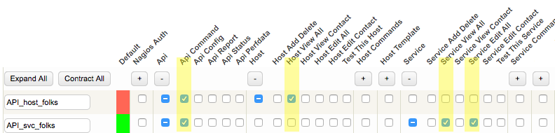
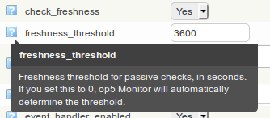
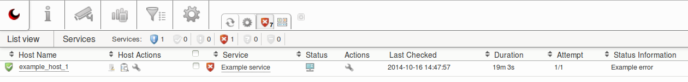

# Submitting status updates through the HTTP API

Version

This article was written for version 7.0 of OP5 Monitor, it could work on both lower and higher version if nothing else is stated.

Articles in the Community-Space are not supported by OP5 Support.

# Introduction

*op5 Monitor* supports submitting status updates for services and hosts via the [HTTP API](https://kb.op5.com/display/DOC/HTTP-API) - known as passive checks in the Nagios/Naemon context.
This enables you to update a service status when a backup job is completed, integrated *op5 Monitor* with your in-house applications or send updates from the system shell.

In this how-to we will look at updating a service via the command line utility *cURL* and show you how to integrate something similar in scripts or applications.

# Prerequisites

-   Basic Linux/UNIX knowledge
-   Knowledge of service configuration in *op5 Monitor*
-   A *op5 Monitor* user with permission to submit commands
-   Shell access to a system with the *cURL* utility installed

# Privilege Recommendations

It is a very good idea to create a dedicated group with only the minimum required privileges for each major type of API request, then create a user for each group. This makes it easier to control how much damage could be done by a script or process calling the API. Each group will need any particular API privileges, as well as all the usual privileges to do a task in the web browser. Here are a couple examples, with a screen shot of both afterward:

1.  Querying hosts -- this is a read-only task. Thus:
    1.  API Command
    2.  Host View All

2.  Changing services -- this will write changes, so it will require:
    1.  API Command
    2.  Service View All
    3.  Service Edit All



It's also recommended to create a new service template with active checks disabled for passive usage.
The "check\_freshness" option can be enabled to run a check command (like "check\_dummy" with critical status) if the service/host haven't been updated during the defined time frame:



*Runs the check actively if it hasn't been updated during the last hour.*

 

# Usage examples

## Submitting service status updates with cURL

The [*cURL*](http://curl.haxx.se/) command line utility can be used to retrieve and submit information to *op5 Monitor*'s HTTP API.
Using *cURL* for this purpose is a great fit, since it's installed or available for installation on most operating systems.

The command below will do the following:

1.  Log in to the HTTP API with the user "status\_update" and the password "mysecret"
2.  Update a service called "Example service" on the host "example\_host\_1"
3.  Set the status message to "Example issue has occurred" and the service status to "CRITICAL".
    More information about "plugin interface" and status codes can be found [here
    ](https://kb.op5.com/display/DOC/The+plugin+interface)

``` {.text data-syntaxhighlighter-params="brush: text; gutter: false; theme: Confluence" data-theme="Confluence" style="brush: text; gutter: false; theme: Confluence"}
$ curl -u 'status_update:mysecret' -H 'content-type: application/json' \
-d '{"host_name":"example_host_1","service_description":"Example service",\
"status_code":"2","plugin_output":"Example issue has occurred"}' \
'https://monitorserver/api/command/PROCESS_SERVICE_CHECK_RESULT'
```

After executing the command above, you should hopefully retrieve the following message:

``` {.js data-syntaxhighlighter-params="brush: js; gutter: false; theme: Confluence" data-theme="Confluence" style="brush: js; gutter: false; theme: Confluence"}
{"result":"Successfully submitted PROCESS_SERVICE_CHECK_RESULT"}% 
```

If not, verify that you have entered the correct user name and password, have been given adequate permissions and the the service/host name is spelled/capitalized correctly.
When self-signed SSL certificates are used on the *op5 Monitor* server, you must include the "–insecure" argument - this however **not** recommended.

The service should now be updated in OP5 Monitor:



 

## Including service status updates in a backup script

There are many cases where active monitoring might not be suitable - examples are long running backup and batch jobs.

In this example we will use it in a shell script that's executed by *cron*, every day at midnight.
It uses a small Python program called "[update-status.py](attachments/12189807/12386342.py)", which works similar to the *cURL* command above, but with some more error handling :

``` {.bash data-syntaxhighlighter-params="brush: bash; gutter: false; theme: Confluence" data-theme="Confluence" style="brush: bash; gutter: false; theme: Confluence"}
#!/usr/bin/env bash

# Fancy example backup script written in bash

DATE=$(date +'%F')
echo "Creating backup directory for $DATE..."

# Creating a directory for backup and copying files
mkdir -p /path/to/backups/archive-$DATE
cp -r /path/to/source /path/to/backups/archive-$DATE

# Checking the return code of the "cp" command
if [ "$?" == "0" ]; then
        echo "Backup was successful - updating service..."

        # Executing the status update script
        /path/to/update-status.py -M "monitorserver" \
                -u "status_update" -p "my_secret" \
                -H "$(hostname -f)" -S "Example service" \
                -m "Backup for $DATE was successful" \
                -s "OK" --insecure

        if [ "$?" == "0" ]; then
                echo "Status update successful"
                exit 0

        else
                echo "Status update failed"
                exit 2

        fi

else
        echo "Backup failed - updating service..."

        # Executing the status update script
        /path/to/update-status.py -M "monitorserver" \
                -u "status_update" -p "my_secret" \
                -H "$(hostname -f)" -S "Example service" \
                -m "Backup for $DATE failed" \
                -s "CRITICAL" --insecure

        if [ "$?" == "0" ]; then
                echo "Status update successful"
                exit 0

        else
                echo "Status update failed"
                exit 2

        fi

fi
```

