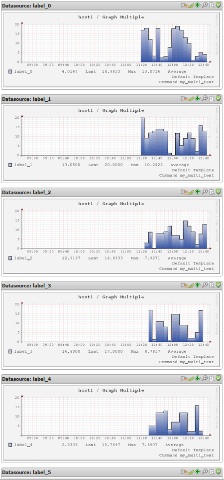

# Use RRD in MULTIPLE mode for separate check commands

Version

This article was written for version 6.2.2 of op5 Monitor, it could work on both lower and higher version if nothing else is stated.

Articles in the Community-Space are not supported by op5 support.

Most plugins shipped with op5 Monitor will always print the same number of labels in the performance data part of the check result, making the default storage type for rrd files single. This means that each service will have one rrd file containing a static amount of data sources, which is determined either by a special template for the particular check command used, or by the default template the first time the check runs.

You could compare it to creating a MySQL table for each check, with a fixed number of columns because you know that the number of columns will never increase.

The result is one rrd file per service, for example a simple HTTP check, which in this case would contain two data sources (one for time, and one for size):

**HTTP\_Server.rrd**

``` {.bash data-syntaxhighlighter-params="brush: bash; gutter: false; theme: Confluence" data-theme="Confluence" style="brush: bash; gutter: false; theme: Confluence"}
ds[1].index = 0
ds[1].type = "GAUGE"
ds[1].minimal_heartbeat = 8460
...
ds[2].index = 1
ds[2].type = "GAUGE"
ds[2].minimal_heartbeat = 8460
```

 

There are however situations where this can become a problem. More specifically, when you use a check plugin that for whatever reason have a variable amount of labels in its performance output. For example, a check plugin that checks the size of all databases, which returns a separate performance data label for every found database. The number of databases could both increase and decrease, which also applies to the number of resulting performance data labels (data sources).

What then happens is that the number of data sources the rrd file will hold is determined the first time the check runs, and if this later changes due to the dynamic nature of the response from the plugin, the result will be an error message in the system logs, and the rrd file is left without updates. The log messages as seen below are related to these type of rrd issues:

`rrdcached[1708]: queue_thread_main: rrd_update_r (/opt/monitor/op5/pnp/perfdata/host/service.rrd) failed with status -1. (/opt/monitor/op5/pnp/perfdata/host/service.rrd: expected 3 data source readings (got 1) from 1397107364)`

`rrdcached[1708]: queue_thread_main: rrd_update_r (/opt/monitor/op5/pnp/perfdata/host/service.rrd) failed with status -1. (/opt/monitor/op5/pnp/perfdata/host/service.rrd: found extra data on update argument: 0:0)`

 

The solution is to enable *RRD\_STORAGE\_TYPE MULTIPLE*, which means that instead of storing a fixed amount of data sources in one rrd, the system will create one rrd file per data source, allowing for a dynamic scaling. This would be comparable to creating a new MySQL table for each data point, allowing for greater flexibility in dynamically growing or decreasing labels in the performance data output.

Using the same example as above, this would result in the following two rrd files, extended by label name:

**HTTP\_Server\_time.rrd**
**HTTP\_Server\_size.rrd**

Each only containing one data source.

Enabling *RRD\_STORAGE\_TYPE MULTIPLE* can be done on a per check command basis. For the purpose of this exercise, the dummy check plugin script found below demonstrates the behavior of a plugin with a dynamic number of performance data labels. This script will generate a random number of data points (0-9) each time it runs and then simply output a check output of OK, followed by the random number of data points, each containing a value between 0 and 19.

**/opt/plugins/custom/generate\_multiple.sh**

``` {.bash data-syntaxhighlighter-params="brush: bash; gutter: false; theme: Confluence" data-theme="Confluence" style="brush: bash; gutter: false; theme: Confluence"}
#!/bin/bash

echo -n "OK | "
for (( c=0; c<=$((RANDOM % 10)); c++ ))
do
    echo -n "label_$c=$((RANDOM % 20));"
done
echo ""
 
exit 0
```

 

The check command object configuration:

Parameter

Value

command\_name

my\_multi\_test

command\_line

\$USER1\$/custom/generate\_multiple.sh

 

And most importantly, the PNP configuration file corresponding to this particular check command using the same name as the command, followed by *.cfg*:

**/opt/monitor/etc/pnp/check\_commands/my\_multi\_test.cfg**

``` {.bash data-syntaxhighlighter-params="brush: bash; gutter: false; theme: Confluence" data-theme="Confluence" style="brush: bash; gutter: false; theme: Confluence"}
CUSTOM_TEMPLATE = 1
RRD_STORAGE_TYPE = MULTIPLE
```

 

Now it is simply a matter of creating a service check that use the *my\_multi\_test* check command. In this case the service is called *Graph Multiple*:

Parameter

Value

service\_description

Graph Multiple

check\_command

my\_multi\_test

 

The result after the check running for a while, ten different rrd files, each containg the data for one data point allowing data to be populated into each graph when available, without problems or interruptions.

``` {.bash data-syntaxhighlighter-params="brush: bash; gutter: false; theme: Confluence" data-theme="Confluence" style="brush: bash; gutter: false; theme: Confluence"}
-rw-rw-r-- 1 monitor apache 384952 Apr 8 12:25 Graph_Multiple_label_0.rrd
-rw-rw-r-- 1 monitor apache 384952 Apr 8 12:25 Graph_Multiple_label_1.rrd
-rw-rw-r-- 1 monitor apache 384952 Apr 8 12:25 Graph_Multiple_label_2.rrd
-rw-rw-r-- 1 monitor apache 384952 Apr 8 12:20 Graph_Multiple_label_3.rrd
-rw-rw-r-- 1 monitor apache 384952 Apr 8 12:20 Graph_Multiple_label_4.rrd
-rw-rw-r-- 1 monitor apache 384952 Apr 8 12:20 Graph_Multiple_label_5.rrd
-rw-rw-r-- 1 monitor apache 384952 Apr 8 12:20 Graph_Multiple_label_6.rrd
-rw-rw-r-- 1 monitor apache 384952 Apr 8 12:20 Graph_Multiple_label_7.rrd
-rw-rw-r-- 1 monitor apache 384952 Apr 8 12:09 Graph_Multiple_label_8.rrd
-rw-rw-r-- 1 monitor apache 384952 Apr 8 12:09 Graph_Multiple_label_9.rrd
```

 

And, the resulting graphs created:



It may take some time before all graphs become available, due to the xml file for the service being updated every 15 minutes, so be patient and allow the check to run for a while.

