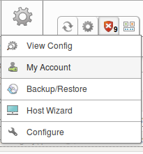
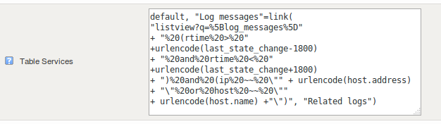
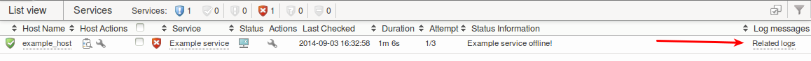
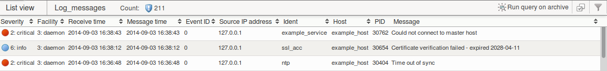

# Using Logger and custom columns for root cause analysis

Version

This article was written for version 7.0 of OP5 Monitor, it could work on both lower and higher version if nothing else is stated.

Articles in the Community-Space are not supported by OP5 Support.

 

# Introduction

During investigations of issues, application and system logs are often a powerful tool to help determine the root cause of a problem.
In this how-to we will look at using features in *op5 Monitor* like custom columns, filter queries and *Logger* to create a work flow that can help you quickly perform your root cause analysis.

The tricks learned in this how-to can be easily modified to solve other problems or create interesting new use cases - see this guide as inspiration.

# Configuration

To add a custom table column, hover over the configuration menu and select "My Account":



Scroll down to "Table Services" and replace the content of the column configuration with:

``` {.text data-syntaxhighlighter-params="brush: text; gutter: false; theme: Confluence" data-theme="Confluence" style="brush: text; gutter: false; theme: Confluence"}
default, "Log messages"=link( "listview?q=%5Blog_messages%5D" 
+ "%20(rtime%20>%20" 
+ urlencode(last_state_change-1800) 
+ "%20and%20rtime%20<%20" 
+ urlencode(last_state_change+1800) 
+ ")%20and%20(ip%20~~%20\"" + urlencode(host.address) + "\"%20or%20host%20~~%20\"" 
+ urlencode(host.name) +"\")", "Related logs")
```

 

The configuration above adds an extra column to the services table with encoded links to the following filter query:

``` {.text data-syntaxhighlighter-params="brush: text; gutter: false; theme: Confluence" data-theme="Confluence" style="brush: text; gutter: false; theme: Confluence"}
[log_messages] (rtime > date("\@$LASTSTATECHANGE$ - 30 minutes") and rtime < date("\@$LASTSTATECHANGE$ + 30 minutes")) and (ip ~~ "\@$HOSTADDRESS$" or host ~~ "\@$HOSTNAME$")
```

### What it does

The query filters for all log messages received 30 minutes before and after the service changed state from a host with the matching host address or host name.

 

 

The configuration looks something like this in the user interface:



 

# Usage

If you open the "Status detail" page of a host, you should now see a column called "Log messages" for each service.
Click the "Related logs" link for the service you want to investigate:



This brings you to a list view that hopefully helps you understand the root cause of the problem:



 

 

 

 

