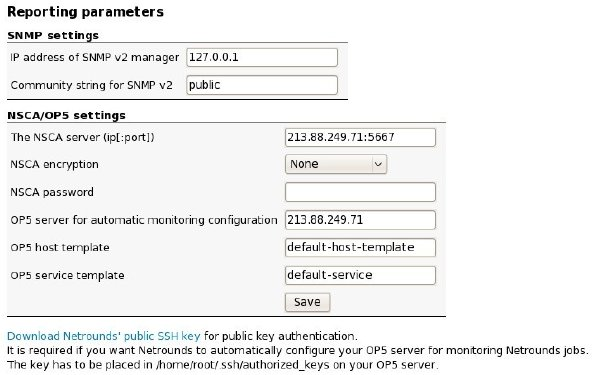
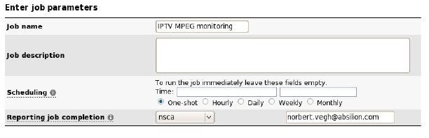
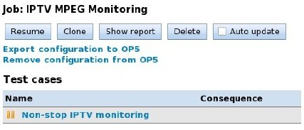
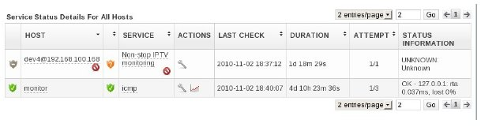

# Using op5 Monitor with Netrounds

Deprecation notice

This feature in NetRouds is now deprecated

## **Introduction**

[Netrounds](http://netrounds.com/ "Absilion Netrounds") is Absilion’s cloud-based test service designed with a central web and database server, and a number of distributed measurement probes. The system is capable of various measurements with active traffic between the probes and also supports the passive monitoring of services like IPTV.

[op5 Monitor](http://www.op5.com/network-monitoring/op5-monitor/ "op5 network monitor") is op5′s monitoring application for supervising network and service availability. The op5 Monitor system sends requests to IP services periodically and maintains network health status based on the responses.

op5 Monitor provides a comprehensive view of the network, and it is a natural requirement to visualize test results and alarms from Netrounds within the op5 Monitor system. The benefit of this is that the IT department, or the Network Operation Center has to use only a single system interface to supervise the network status and locate errors. Also, a op5 customer might have their reporting and trouble ticketing system build around op5 Monitor. In this case op5 Monitor can make use of Netrounds.

## **Implementation**

### **Transferring configuration**

The first step is to create the necessary configuration in op5 Monitor related to the Netrounds’ jobs. This includes the host and the service configuration. This step is done with op5 Monitor Nacoma API, which is a PHP script located under /opt/monitor/op5/nacoma/api/monitor.php. This script can create and delete hosts and services in op5 Monitor. A Netrounds probe can have multiple test interfaces connected to different networks, so a probe is mapped to a host in op5 Monitor in the following way:

    @

The Netrounds test name (i.e. “Non-stop IPTV monitoring”) is used for the service\_description parameter in op5 Monitor.

The Nacoma script is executed on the Monitor server by the Netrounds web server through an SSH session, using public key authentication. The following op5 Monitor settings are used.

Host Settings

Value

host\_name

@

alias

@

address

 

template

default-host-template (can be changed in the Settings page)

contacts

monitor

active\_checks\_enabled

0

notes\_url

A URL to the probe in Netrounds

Service Settings

Value

template

default-service (can be changed in the Settings page)

host\_name

@

service\_description

 

check\_command\_args

3!Unknown

active\_checks\_enabled

0

passive\_checks\_enabled

1

check\_freshness

1

freshness\_threshold

two times of the reporting interval configured for the test job

notes\_url

A URL to the the job in Netrounds

### **Transferring status information**

The second aspect is the transfer of status information for configured services from Netrounds to op5 Monitor. This is done by the NSCA protocol, which is a standard plug-in for Nagios. A running Netrounds job for which NSCA reporting has been selected will send NSCA messages to the op5 Monitor system periodically, be them OK messages, or alarms upon error conditions. The periodicity of the messages can be configured upon job creation.

## **
 Steps to be done in Netrounds**

### **1. Configuring reporting under Netrounds settings**

This step has to be done only once. Under the “Settings/Reporting parameters” page there is a section for NSCA/OP5 settings.

Setting

Description

The NSCA server (ip:[port])

The IP-address and TCP port for the server receiving the NSCA messages.

NSCA encryption

The encryption used for the NSCA protocol. It can None for no encryption.

NSCA password

The password used for encryption. Can be blank for no
 encryption.

op5 Monitor server for automatic configuration

The IP-address of the OP5 server where the configuration has to be created.

Under this page there is also a link to the web server’s public SSH key, that has to be downloaded and placed into the /home/root/.ssh/authorized\_keys file on the op5 server. This ensures that the web server can log onto the op5 server with public key authentication.

### **2. Creating the test job**

The job can be created the usual way under the “New job” tab. Make sure to select “nsca” for the “Reporting” parameter.

### **3. Exporting the configuration for the job to op5 Monitor**

Immediately after job creation, or later at the job details page click on the “Export configuration to op5” button. This will create all necessary host and service configuration for the test job in op5 Monitor. Any previous host configuration for the probes will be overwritten during the process. If any time the configuration needs to be removed from op5 Monitor, then it can be done by clicking on the “Remove configuration from op5” button.

In op5 Monitor the new service will look like in the diagram below.

 

 

