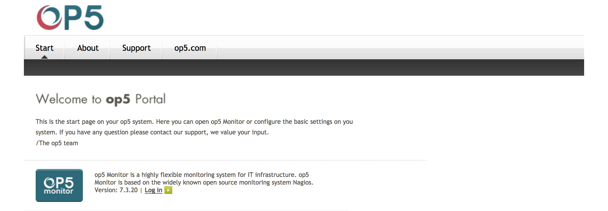
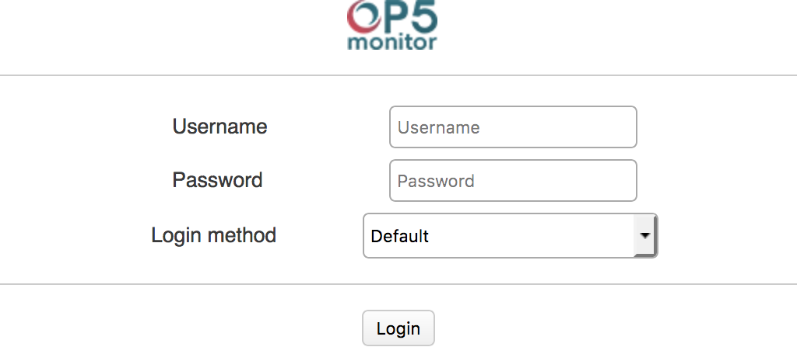
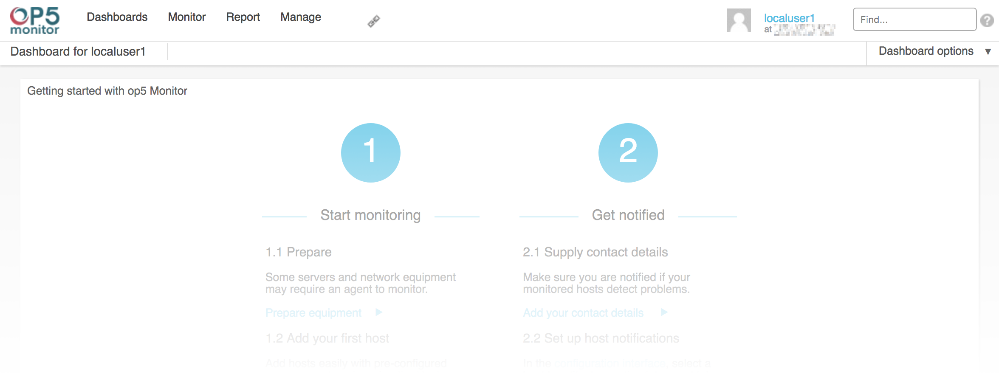
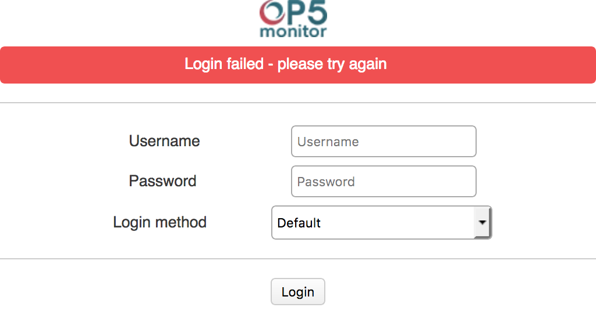

# First Contact

## About

This is the initial overview of OP5 Monitor, and it's meant to get people familiar with the parts of OP5 Monitor. No prior knowledge is assumed.

## Welcome Page

The *Welcome* page is the initial landing point for people accessing OP5 Monitor. The default *Welcome* page is shown below, but it can be customized to suit the client.

 \

There are four links at the top of the *Welcome* page:

- *Start*
- *About*
- *Support*
- *op5.com*

*Start* is the initial landing page, and it has a link to the login page.
*About* displays the currently installed version of OP5 Monitor, and it details how to get support for OP5 Monitor, where a request for enhancement (RFE) can be filed, and it details software licensing information.
*Support* is a link to the *OP5 Support* page. Clicking on it opens a new browser tab, or new browser window, with the *OP5 Support* page in it.
*op5.com* is a link the OP5 website. Clicking on it opens a new browser tab, or new browser window, with the OP5 landing page in it.

## Initial Login

Like many applications, the first step is to get logged in. An account should already have been created by an OP5 Monitor administrator, and the account credentials should be readily available.

1. Start a web browser.
2. Enter the URL for the OP5 Monitor installation.
3. On a fully stock installation of OP5 Monitor, the *Welcome* page below should be displayed. OP5 Monitor can be customized, so different installations could display different *Welcome* pages.

 \

4. Click on the *Log in* link to open the login page.
5. Once the login page has loaded, fill in the Username and Password fields with the provided credentials.

 \

6. Next, click on the Login method drop down menu to select the correct authentication method. OP5 Monitor can support multiple authentication mechanisms, and the correct mechanism needs to be selected for account credential verification to succeed.
7. Finally, click the Login button to submit the credentials for authentication.
8. If authentication was successful, the *Dashboard* for the account will be displayed, and if authentication was unsuccessful, a red banner stating the login failed will appear above the username, password, and login method fields.

    - Account *Dashboard* after successful credential authentication.

     \

    - Login page after unsuccessful credential authentication.

     \

9. Once authentication succeeds, the account preferences can be adjusted, if needed, and OP5 Monitor can be put to work.

